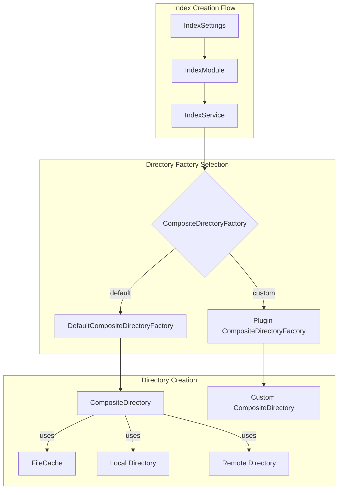

---
tags:
  - domain/core
  - component/server
  - indexing
---
# Composite Directory Factory

## Summary

OpenSearch v3.1.0 introduces a pluggable Composite Directory Factory that enables custom implementations of composite directories for warm indices. This enhancement allows plugins to provide their own composite directory implementations, giving users flexibility in how data locality is managed between local and remote storage.

## Details

### What's New in v3.1.0

The Composite Directory Factory provides a standardized interface for creating composite directories that abstract data locality (local vs. remote storage) using FileCache. Previously, the `CompositeDirectory` was instantiated directly in `IndexService.java` without any factory pattern, limiting extensibility.

### Technical Changes

#### Architecture Changes



#### New Components

| Component | Description |
|-----------|-------------|
| `IndexStorePlugin.CompositeDirectoryFactory` | New interface for creating composite directories per shard |
| `DefaultCompositeDirectoryFactory` | Default implementation using the existing `CompositeDirectory` |
| `INDEX_COMPOSITE_STORE_TYPE_SETTING` | New index setting to select composite directory factory type |

#### New Configuration

| Setting | Description | Default |
|---------|-------------|---------|
| `index.composite_store.type` | Specifies which composite directory factory to use | `default` |

#### API Changes

New plugin extension point in `IndexStorePlugin`:

```java
interface CompositeDirectoryFactory {
    Directory newDirectory(
        IndexSettings indexSettings,
        ShardPath shardPath,
        DirectoryFactory localDirectoryFactory,
        Directory remoteDirectory,
        FileCache fileCache
    ) throws IOException;
}

default Map<String, CompositeDirectoryFactory> getCompositeDirectoryFactories() {
    return Collections.emptyMap();
}
```

### Usage Example

Plugins can register custom composite directory factories:

```java
public class MyPlugin extends Plugin implements IndexStorePlugin {
    @Override
    public Map<String, CompositeDirectoryFactory> getCompositeDirectoryFactories() {
        return Map.of("my-custom", new MyCustomCompositeDirectoryFactory());
    }
}
```

Then configure an index to use the custom factory:

```json
PUT /my-warm-index
{
  "settings": {
    "index.composite_store.type": "my-custom"
  }
}
```

### Migration Notes

- Existing warm indices continue to work with the default composite directory factory
- No migration required for existing deployments
- Custom implementations can be added via plugins without modifying core OpenSearch

## Limitations

- Currently only applicable to warm indices (requires `WRITABLE_WARM_INDEX_SETTING` feature flag)
- Hot indices do not yet support composite directories
- The `CompositeDirectory` class fields were changed from private to protected to enable extension

## References

### Documentation
- [Remote-backed storage documentation](https://docs.opensearch.org/3.1/tuning-your-cluster/availability-and-recovery/remote-store/index/)

### Pull Requests
| PR | Description |
|----|-------------|
| [#17988](https://github.com/opensearch-project/OpenSearch/pull/17988) | Add composite directory factory |

### Issues (Design / RFC)
- [Issue #17982](https://github.com/opensearch-project/OpenSearch/issues/17982): Need for Composite Directory Factory
- [Issue #12809](https://github.com/opensearch-project/OpenSearch/issues/12809): Writable Warm feature
- [Issue #12781](https://github.com/opensearch-project/OpenSearch/issues/12781): Composite Directory

## Related Feature Report

- [Full feature documentation](../../../features/opensearch/opensearch-composite-directory-factory.md)
