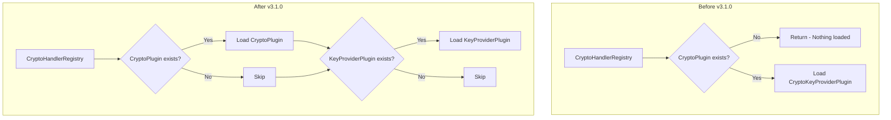

---
tags:
  - security
---

# Crypto/KMS Plugin

## Summary

OpenSearch v3.1.0 includes two important improvements to the crypto-kms plugin: decoupling the initialization of CryptoPlugin and CryptoKeyProviderPlugin in the CryptoHandlerRegistry, and upgrading dependencies to AWS SDK v2.x. These changes fix critical issues that prevented the crypto-kms plugin from loading on server startup.

## Details

### What's New in v3.1.0

#### 1. Decoupled Plugin Initialization

Previously, the `CryptoHandlerRegistry` required both a `CryptoPlugin` and a `CryptoKeyProviderPlugin` to be present for either to load. Since no `CryptoPlugin` implementation existed yet, the crypto-kms plugin (which is a `CryptoKeyProviderPlugin`) would fail to load even after successful installation.

The fix modifies the `CryptoHandlerRegistry` constructor to allow independent loading of each plugin type:

```java
// Before: Early return if no CryptoPlugin present
if (cryptoPlugins == null || cryptoPlugins.size() == 0) {
    return;
}

// After: Independent initialization
if (cryptoPlugins != null && !cryptoPlugins.isEmpty()) {
    if (cryptoPlugins.size() > 1) {
        throw new IllegalStateException("More than 1 implementation of crypto plugin found.");
    }
    cryptoHandlerPlugin.set(cryptoPlugins.get(0));
}

if (cryptoKeyProviderPlugins != null && !cryptoKeyProviderPlugins.isEmpty()) {
    registry.set(loadCryptoFactories(cryptoKeyProviderPlugins));
}
```

#### 2. AWS SDK v2.x Dependency Upgrade

The crypto-kms plugin dependencies were updated to include missing AWS SDK v2.x components that caused `NoClassDefFoundError` during KMS client initialization:

| New Dependency | Purpose |
|----------------|---------|
| `http-auth-aws` | AWS authentication scheme (AwsV4AuthScheme) |
| `http-auth` | HTTP authentication support |
| `checksums` | Checksum validation |
| `checksums-spi` | Checksum SPI |
| `retries` | Retry logic |
| `aws-crt` | AWS Common Runtime |

### Technical Changes

#### Architecture Changes



#### Modified Files

| File | Change |
|------|--------|
| `server/src/main/java/org/opensearch/crypto/CryptoHandlerRegistry.java` | Decoupled plugin initialization logic |
| `plugins/crypto-kms/build.gradle` | Added missing AWS SDK v2.x dependencies |

### Error Fixed

The following error no longer occurs when using the crypto-kms plugin:

```
java.lang.NoClassDefFoundError: software/amazon/awssdk/http/auth/aws/scheme/AwsV4AuthScheme
    at software.amazon.awssdk.services.kms.DefaultKmsBaseClientBuilder.authSchemes
    at org.opensearch.crypto.kms.KmsService.buildClient
    at org.opensearch.crypto.kms.KmsService.createMasterKeyProvider
```

## Limitations

- Only one `CryptoPlugin` implementation is supported at a time
- The crypto-kms plugin still requires proper AWS credentials configuration

## References

### Documentation
- [PR #17396](https://github.com/opensearch-project/OpenSearch/pull/17396): Previous AWS SDK v2.x migration (missing dependencies)

### Pull Requests
| PR | Description |
|----|-------------|
| [#18270](https://github.com/opensearch-project/OpenSearch/pull/18270) | Decouple the init of Crypto Plugin and KeyProvider in CryptoRegistry |
| [#18268](https://github.com/opensearch-project/OpenSearch/pull/18268) | Upgrade crypto kms plugin dependencies for AWS SDK v2.x |

### Issues (Design / RFC)
- [Issue #12472](https://github.com/opensearch-project/OpenSearch/issues/12472): Original feature request to decouple CryptoPlugin and CryptoKeyProviderPlugin

## Related Feature Report

- [Full feature documentation](../../../features/opensearch/opensearch-crypto-kms-plugin.md)
