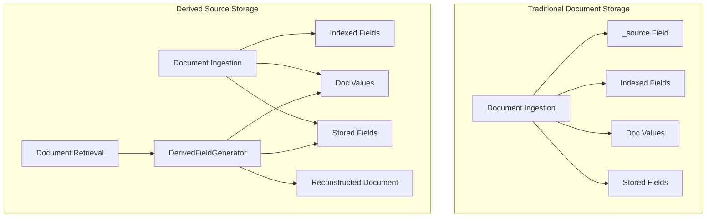

# Derived Source

## Summary

Derived Source is a storage optimization feature that eliminates the need to store the `_source` field during document ingestion. Instead of duplicating data in the `_source` field, OpenSearch dynamically reconstructs documents from `doc_values` and stored fields on demand. This can reduce storage costs by up to 2x while maintaining full search functionality and supporting operations like reindexing, updates, and recovery.

## Details

### What's New in v3.1.0

This release introduces the foundational support for deriving source from field mappers. The implementation adds interfaces and methods to `FieldMapper` that enable building source from `doc_values` and stored fields for various field types.

### Technical Changes

#### Architecture Changes



#### New Components

| Component | Description |
|-----------|-------------|
| `DerivedFieldGenerator` | Generates derived source field based on field mapping and storage type |
| `FieldValueFetcher` | Base class for fetching field values from doc values or stored fields |
| `SortedNumericDocValuesFetcher` | Fetches values from sorted numeric doc values |
| `SortedSetDocValuesFetcher` | Fetches values from sorted set doc values (for keyword/IP fields) |
| `StoredFieldFetcher` | Fetches values from stored fields |
| `FieldValueType` | Enum indicating the type of field value (DOC_VALUES or STORED) |

#### Supported Field Types

| Field Type | Doc Values Support | Stored Field Support |
|------------|-------------------|---------------------|
| Date (millis/nanos) | ✓ | ✓ |
| Number (integer, long, float, double, etc.) | ✓ | ✓ |
| Scaled Float | ✓ | ✓ |
| Boolean | ✓ | ✓ |
| IP | ✓ | ✓ |
| Constant Keyword | N/A | ✓ |
| Geo Point | ✓ | ✓ |
| Keyword | ✓ | ✓ |
| Text | N/A | ✓ |
| Wildcard | ✓ | N/A |

#### New Configuration

| Setting | Description | Default |
|---------|-------------|---------|
| `index.derived_source.enabled` | Enable derived source for the index | `false` |
| `index.derived_source.translog.enabled` | Enable derived source for translog operations | `true` (when derived_source enabled) |

### Usage Example

```json
PUT sample-index
{
  "settings": {
    "index": {
      "derived_source": {
        "enabled": true
      }
    }
  },
  "mappings": {
    "properties": {
      "timestamp": { "type": "date" },
      "host": { "type": "keyword" },
      "cpu": { "type": "float" },
      "message": { "type": "text", "store": true }
    }
  }
}
```

### Migration Notes

- Derived source is an index-level setting that must be configured at index creation time
- Cannot be changed after index creation to prevent mixed behavior
- All fields must be of supported types for derived source to be enabled
- Fields with `copy_to` parameter are not supported for derived source

## Limitations

- Fields with `copy_to` parameter cannot derive source
- Keyword fields with `ignore_above` or `normalizer` are not supported
- Text fields require `store: true` to derive source
- Multi-value fields may have different ordering (sorted) compared to original
- Date fields use the first format from the format list for output
- Geo point values always output in `{"lat": lat_val, "lon": lon_val}` format
- Some precision loss may occur for geo point and half_float fields

## Related PRs

| PR | Description |
|----|-------------|
| [#17759](https://github.com/opensearch-project/OpenSearch/pull/17759) | Adding support for derive source feature and implementing it for various type of field mappers |

## References

- [Issue #17073](https://github.com/opensearch-project/OpenSearch/issues/17073): Add support for deriving source field in FieldMapper
- [Issue #9568](https://github.com/opensearch-project/OpenSearch/issues/9568): Optimizing Data Storage and Retrieval for Time Series data
- [Blog: Save up to 2x on storage with derived source](https://opensearch.org/blog/save-up-to-2x-on-storage-with-derived-source/)
- [Documentation: Derived source](https://docs.opensearch.org/latest/field-types/metadata-fields/source/#derived-source)

## Related Feature Report

- [Full feature documentation](../../../features/opensearch/derived-source.md)
