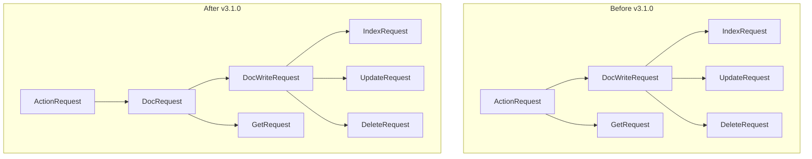

---
tags:
  - domain/core
  - component/server
  - indexing
  - security
---
# DocRequest Refactoring

## Summary

This release introduces a new `DocRequest` interface that provides a generic abstraction for ActionRequests that operate on a single document. This refactoring creates a cleaner hierarchy for document-related requests and enables the Security plugin to implement fine-grained resource-level access control for plugin-defined resources.

## Details

### What's New in v3.1.0

The `DocRequest` interface is introduced as a superset of `DocWriteRequest`, providing a common abstraction for all requests that target a single document. This change:

- Creates a new `DocRequest` interface with `index()` and `id()` methods
- Updates `DocWriteRequest` to extend `DocRequest`
- Updates `GetRequest` to implement `DocRequest`
- Adds a `type()` method for resource sharing context

### Technical Changes

#### Architecture Changes



#### New Components

| Component | Description |
|-----------|-------------|
| `DocRequest` | Generic interface for requests operating on a single document |
| `DocRequest.index()` | Returns the index that the request operates on |
| `DocRequest.id()` | Returns the document ID for the request |
| `DocRequest.type()` | Returns the resource type for sharing context (default: "indices") |

#### API Changes

The new `DocRequest` interface:

```java
@PublicApi(since = "3.1.0")
public interface DocRequest {
    /**
     * Get the index that this request operates on
     * @return the index
     */
    String index();

    /**
     * Get the id of the document for this request
     * @return the id
     */
    String id();

    /**
     * Get the type of the request for resource sharing context
     * @return the type (default: "indices")
     */
    default String type() {
        return "indices";
    }
}
```

### Usage Example

Plugins can now implement `DocRequest` to enable resource-level access control:

```java
// Plugin-defined request for a sharable resource
public class GetReportDefinitionRequest extends ActionRequest implements DocRequest {
    private final String index;
    private final String reportId;
    
    @Override
    public String index() {
        return index;
    }
    
    @Override
    public String id() {
        return reportId;
    }
    
    @Override
    public String type() {
        return "report_definition";  // Custom resource type for sharing
    }
}
```

### Migration Notes

This is a non-breaking change. Existing code using `DocWriteRequest` or `GetRequest` will continue to work without modification. Plugin developers can optionally implement `DocRequest` to enable resource sharing capabilities.

## Limitations

- The `DocRequest` interface is primarily designed for single-document operations
- Resource sharing functionality requires the Security plugin with resource sharing enabled
- The `type()` method default value is "indices" for backward compatibility

## References

### Blog Posts
- [Blog: Introducing resource sharing](https://opensearch.org/blog/introducing-resource-sharing-a-new-access-control-model-for-opensearch/): A new access control model for OpenSearch

### Pull Requests
| PR | Description |
|----|-------------|
| [#18269](https://github.com/opensearch-project/OpenSearch/pull/18269) | Create generic DocRequest to better categorize ActionRequests |

### Issues (Design / RFC)
- [Issue #4500](https://github.com/opensearch-project/security/issues/4500): Resource Permissions and Sharing (Security plugin)

## Related Feature Report

- [Full feature documentation](../../../../features/opensearch/opensearch-docrequest-refactoring.md)
