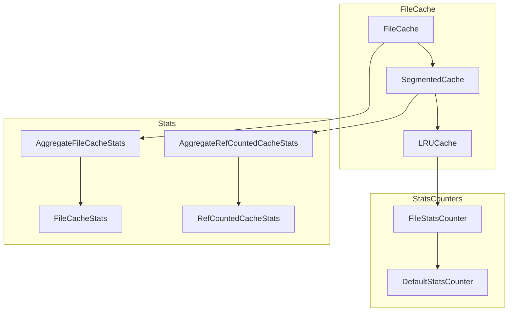

# File Cache

## Summary

OpenSearch v3.1.0 introduces significant enhancements to the File Cache system, adding file pinning support and more granular statistics. These improvements enable better control over cache eviction behavior and provide deeper visibility into cache performance for both Writable Warm indices and Remote Snapshots.

## Details

### What's New in v3.1.0

This release adds two major capabilities to the File Cache:

1. **File Cache Pinning**: Ability to pin files in the cache to prevent eviction until explicitly unpinned
2. **Enhanced File Cache Statistics**: Granular statistics broken down by file type (full file vs block) and pinning status

### Technical Changes

#### Architecture Changes



#### New Components

| Component | Description |
|-----------|-------------|
| `AggregateFileCacheStats` | Top-level statistics container aggregating overall, full-file, block-file, and pinned stats |
| `FileCacheStats` | Statistics for a specific cache type (overall, full file, block, or pinned) |
| `AggregateRefCountedCacheStats` | Internal cache statistics aggregating multiple `RefCountedCacheStats` |
| `RefCountedCacheStats` | Detailed statistics including usage, active usage, pinned usage, hits, misses, evictions |
| `FileStatsCounter` | Stats counter that tracks metrics separately for full files vs block files |
| `FileCacheStatsType` | Enum defining stats types: `OVER_ALL_STATS`, `FULL_FILE_STATS`, `BLOCK_FILE_STATS`, `PINNED_FILE_STATS` |

#### New APIs

**File Cache Pinning Methods**:

```java
// Pin a file to prevent eviction
fileCache.pin(Path key);

// Unpin a file to allow eviction
fileCache.unpin(Path key);

// Get pinned usage
fileCache.pinnedUsage();
```

**Enhanced Statistics**:

```java
// Get aggregate file cache stats
AggregateFileCacheStats stats = fileCache.fileCacheStats();

// Access different stat types
stats.getUsed();           // Overall used bytes
stats.getActive();         // Active (referenced) bytes
stats.getPinnedUsage();    // Pinned bytes
stats.getCacheHits();      // Hit count
stats.getCacheMisses();    // Miss count
```

#### Statistics Response Structure

The node stats API now returns enhanced file cache statistics:

```json
{
  "aggregate_file_cache": {
    "timestamp": 1234567890,
    "active": "100mb",
    "active_in_bytes": 104857600,
    "total": "1gb",
    "total_in_bytes": 1073741824,
    "used": "500mb",
    "used_in_bytes": 524288000,
    "pinned": "50mb",
    "pinned_in_bytes": 52428800,
    "evictions": "200mb",
    "evictions_in_bytes": 209715200,
    "active_percent": 20,
    "used_percent": 50,
    "hit_count": 1000,
    "miss_count": 100,
    "over_all_stats": { ... },
    "full_file_stats": { ... },
    "block_file_stats": { ... },
    "pinned_file_stats": { ... }
  }
}
```

### Usage Example

File pinning is used internally by the Composite Directory for Writable Warm indices:

```java
// When caching a file for writable warm
protected void cacheFile(String name) throws IOException {
    Path filePath = getFilePath(name);
    
    // Add file to cache
    fileCache.put(filePath, new CachedFullFileIndexInput(...));
    
    // Pin the file to prevent eviction until uploaded to remote
    fileCache.pin(filePath);
    
    // Decrease ref count (file stays due to pinning)
    fileCache.decRef(filePath);
}

// After file is uploaded to remote store
public void afterSyncToRemote(String file) {
    final Path filePath = getFilePath(file);
    
    // Unpin to allow eviction
    fileCache.unpin(filePath);
}
```

### Migration Notes

- The `FileCacheStats` class has been refactored and is now part of `AggregateFileCacheStats`
- The `CacheUsage` class has been removed; use `usage()` and `activeUsage()` methods directly
- Node stats API response structure for file cache has changed to include nested statistics

## Limitations

- File pinning is currently used internally by Composite Directory; no public API for manual pinning
- Pinned files count against cache capacity but cannot be evicted, which may impact cache efficiency if many files are pinned

## References

### Documentation
- [Searchable Snapshots Documentation](https://docs.opensearch.org/3.0/tuning-your-cluster/availability-and-recovery/snapshots/searchable_snapshot/)

### Pull Requests
| PR | Description |
|----|-------------|
| [#17538](https://github.com/opensearch-project/OpenSearch/pull/17538) | Added File Cache Stats - Block level and full file level stats |
| [#17617](https://github.com/opensearch-project/OpenSearch/pull/17617) | Added File Cache Pinning support |

### Issues (Design / RFC)
- [Issue #17479](https://github.com/opensearch-project/OpenSearch/issues/17479): More refined stats in FileCache
- [Issue #13648](https://github.com/opensearch-project/OpenSearch/issues/13648): File Pinning support in FileCache
- [Issue #13149](https://github.com/opensearch-project/OpenSearch/issues/13149): META - Writable Warm Index

## Related Feature Report

- [Full feature documentation](../../../features/opensearch/file-cache.md)
