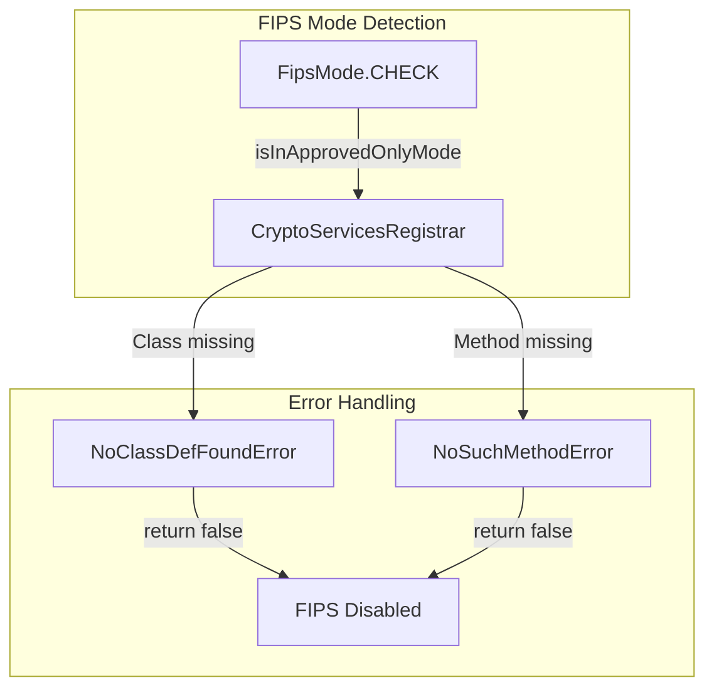

---
tags:
  - domain/core
  - component/server
  - security
---
# FIPS Support

## Summary

This release improves FIPS (Federal Information Processing Standards) compatibility by updating the FipsMode detection logic in OpenSearch core. The change fixes an error that occurred when the security plugin hadn't yet converted to BC-FIPS jars due to OpenSAML incompatibility issues.

## Details

### What's New in v3.1.0

The `FipsMode` check in the test framework has been updated to catch `NoSuchMethodError` in addition to `NoClassDefFoundError`. This resolves a timing issue where the security plugin uses reflection to detect FIPS mode, but the method signature differs between standard BouncyCastle and BC-FIPS libraries.

### Technical Changes

#### Architecture Changes



#### Code Change

The `FipsMode` class now handles both error types:

```java
public static Check CHECK = () -> {
    try {
        return CryptoServicesRegistrar.isInApprovedOnlyMode();
    } catch (NoClassDefFoundError | NoSuchMethodError e) {
        return false;
    }
};
```

### Background

The security plugin has been transitioning to BC-FIPS libraries as part of the broader FIPS 140-2/140-3 compliance initiative. However, OpenSAML (used for SAML authentication) has [incompatibility issues](https://github.com/opensearch-project/security/issues/4915) with BC-FIPS, requiring a shadow JAR approach to isolate the conflicting dependencies.

During this transition period, the security plugin may have the BC-FIPS classes available but with different method signatures than expected, causing `NoSuchMethodError` instead of `NoClassDefFoundError`.

### Usage Example

The FipsMode check is used in tests to conditionally skip or modify test behavior:

```java
if (FipsMode.CHECK.isFipsEnabled()) {
    // Use FIPS-compliant algorithms
} else {
    // Use standard algorithms
}
```

## Limitations

- This is a test framework change; production FIPS mode detection is handled separately
- Full FIPS compliance requires additional configuration and BC-FIPS libraries

## References

### Documentation
- [Security Plugin CI Failure](https://github.com/opensearch-project/security/actions/runs/15408478290/job/43355642640?pr=5370): Original error that prompted this fix

### Pull Requests
| PR | Description |
|----|-------------|
| [#18427](https://github.com/opensearch-project/OpenSearch/pull/18427) | Update FipsMode check to catch NoSuchMethodError |

### Issues (Design / RFC)
- [Issue #4915](https://github.com/opensearch-project/security/issues/4915): OpenSAML incompatibility with BC-FIPS
- [Issue #3420](https://github.com/opensearch-project/security/issues/3420): RFC - Proposal for supporting FIPS 140-2 enforced mode
- [Issue #4254](https://github.com/opensearch-project/security/issues/4254): RFC - FIPS-140 Compliance Roadmap for OpenSearch

## Related Feature Report

- [Cryptography & Security Libraries](../../../features/opensearch/opensearch-cryptography-security-libraries.md)
