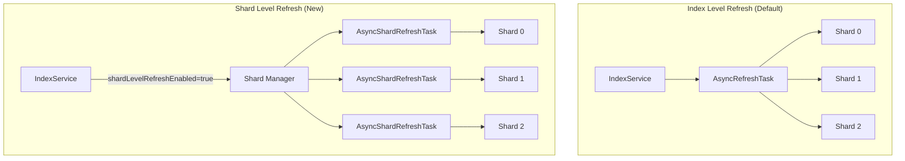

---
tags:
  - domain/core
  - component/server
  - indexing
---
# Parallel Shard Refresh

## Summary

OpenSearch v3.1.0 introduces parallel shard-level refresh capability, enabling individual shards within an index to refresh independently rather than at the index level. This experimental feature improves data freshness for remote store indexes by allowing more granular control over refresh operations and better resource utilization through parallel execution.

## Details

### What's New in v3.1.0

This release introduces a new cluster setting `cluster.index.refresh.shard_level.enabled` that enables shard-level refresh scheduling. When enabled, each shard manages its own refresh task independently, allowing for parallel refresh operations across shards.

### Technical Changes

#### Architecture Changes



#### New Components

| Component | Description |
|-----------|-------------|
| `AsyncShardRefreshTask` | New task class in `IndexShard` that handles shard-level refresh operations independently |
| `refreshMutex` | Synchronization object in `IndexService` for safe transitions between refresh modes |
| `shardLevelRefreshEnabled` | Flag tracking current refresh mode at index and shard level |

#### New Configuration

| Setting | Description | Default |
|---------|-------------|---------|
| `cluster.index.refresh.shard_level.enabled` | Enables parallel shard-level refresh when set to `true`. Dynamic setting that can be changed at runtime. | `false` |

### Usage Example

Enable parallel shard refresh cluster-wide:

```json
PUT /_cluster/settings
{
  "persistent": {
    "cluster.index.refresh.shard_level.enabled": true
  }
}
```

Disable parallel shard refresh:

```json
PUT /_cluster/settings
{
  "persistent": {
    "cluster.index.refresh.shard_level.enabled": false
  }
}
```

### Migration Notes

1. The feature is disabled by default for backward compatibility
2. Enabling/disabling the setting triggers automatic rescheduling of refresh tasks
3. The transition between index-level and shard-level refresh is handled safely with proper synchronization
4. No index restart required - changes take effect dynamically

## Limitations

- Marked as experimental (`@ExperimentalApi`) - API may change in future releases
- Part of a larger initiative to improve data freshness for remote store indexes
- Performance benefits are most noticeable with indexes having multiple shards

## References

### Documentation
- [Refresh Index API](https://docs.opensearch.org/3.0/api-reference/index-apis/refresh/): Official documentation on refresh operations

### Pull Requests
| PR | Description |
|----|-------------|
| [#17782](https://github.com/opensearch-project/OpenSearch/pull/17782) | Implement parallel shard refresh behind cluster settings |

### Issues (Design / RFC)
- [Issue #17776](https://github.com/opensearch-project/OpenSearch/issues/17776): META - Improve Data Freshness for Remote Store Indexes

## Related Feature Report

- [Full feature documentation](../../../features/opensearch/opensearch-parallel-shard-refresh.md)
