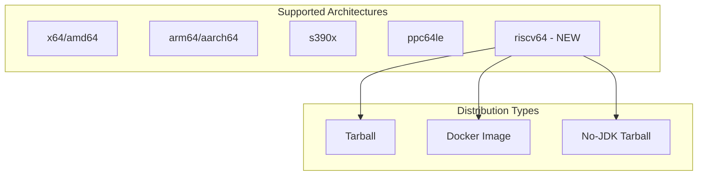

# Platform Support - Linux RISC-V 64

## Summary

OpenSearch v3.1.0 adds support for the Linux RISC-V 64-bit (riscv64) architecture, expanding the platform compatibility to include this emerging open-source instruction set architecture. This enables users to run OpenSearch on RISC-V hardware, supporting the growing ecosystem of RISC-V devices and servers.

## Details

### What's New in v3.1.0

This release introduces full build and distribution support for the Linux riscv64 platform, making OpenSearch available on RISC-V 64-bit systems.

### Technical Changes

#### Architecture Changes



#### New Components

| Component | Description |
|-----------|-------------|
| `Architecture.RISCV64` | New architecture enum value in build system |
| `linux-riscv64-tar` | Tarball distribution for riscv64 |
| `no-jdk-linux-riscv64-tar` | No-JDK tarball for users providing their own JDK |
| `docker-riscv64-export` | Docker image export for riscv64 |
| `SystemCallFilter.Arch` | Seccomp filter support for riscv64 syscalls |

#### Build System Changes

| File | Change |
|------|--------|
| `Architecture.java` | Added `RISCV64` enum and detection for `riscv64` arch string |
| `DistributionDownloadPlugin.java` | Added classifier mapping for riscv64 |
| `JavaVariant.java` | Added `riscv64` to allowed architectures |
| `VersionProperties.java` | Added `bundledJdkLinux_riscv64` property |
| `SystemCallFilter.java` | Added seccomp syscall numbers for riscv64 |

### Usage Example

```bash
# Download the riscv64 tarball
wget https://artifacts.opensearch.org/releases/bundle/opensearch/3.1.0/opensearch-3.1.0-linux-riscv64.tar.gz

# Extract
tar -xvf opensearch-3.1.0-linux-riscv64.tar.gz

# Run OpenSearch
cd opensearch-3.1.0
./bin/opensearch
```

For users who want to provide their own JDK:

```bash
# Download the no-jdk tarball
wget https://artifacts.opensearch.org/releases/bundle/opensearch/3.1.0/opensearch-3.1.0-no-jdk-linux-riscv64.tar.gz

# Set JAVA_HOME to your JDK installation
export JAVA_HOME=/path/to/your/jdk

# Run OpenSearch
./bin/opensearch
```

### Migration Notes

- Users on RISC-V hardware can now use official OpenSearch distributions
- Cross-building on x86_64 Linux is supported
- Building directly on riscv64 requires users to provide their own `protoc` executable (Maven repository does not ship prebuilt protoc for riscv64)

## Limitations

- **Protoc dependency**: When building from source directly on riscv64, users must provide their own protoc executable
- **JDK availability**: Bundled JDK availability depends on upstream JDK distributions supporting riscv64
- **Testing coverage**: As an emerging platform, testing coverage may be less comprehensive than x64/arm64

## References

### Documentation
- [OpenSearch Installation Guide](https://docs.opensearch.org/3.1/install-and-configure/): Official installation documentation

### Pull Requests
| PR | Description |
|----|-------------|
| [#18156](https://github.com/opensearch-project/OpenSearch/pull/18156) | Add support for linux riscv64 platform |

### Issues (Design / RFC)
- [Issue #2341](https://github.com/opensearch-project/OpenSearch/issues/2341): Original feature request for RISC-V 64 support

## Related Feature Report

- [Full feature documentation](../../../features/opensearch/platform-support.md)
