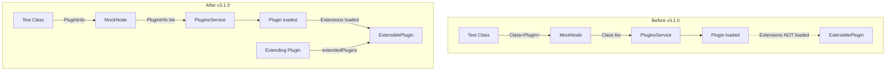

# Plugin Testing Framework

## Summary

This release enables testing for ExtensiblePlugins using classpath plugins in OpenSearch's integration test framework. Previously, it was impossible to test an extensible plugin and its extension simultaneously in the `internalClusterTest` framework because extensions could not be loaded for classpath plugins. This enhancement allows plugin developers to properly test plugin extension mechanisms.

## Details

### What's New in v3.1.0

The test framework now accepts `Collection<PluginInfo>` instead of `Collection<Class<? extends Plugin>>`, enabling configuration of additional settings like `extendedPlugins` for classpath plugins.

### Technical Changes

#### Architecture Changes



#### Modified Components

| Component | Change |
|-----------|--------|
| `Node.java` | Constructor now accepts `Collection<PluginInfo>` instead of `Collection<Class<? extends Plugin>>` |
| `PluginsService.java` | New constructor accepting `Collection<PluginInfo>`, moved `loadExtensions()` call to after all plugins loaded |
| `MockNode.java` | Updated to work with `PluginInfo` collections, added backward-compatible constructor |
| `OpenSearchIntegTestCase.java` | Added `additionalNodePlugins()` method returning `Collection<PluginInfo>` |
| `OpenSearchSingleNodeTestCase.java` | Updated to use `PluginInfo` for plugin configuration |
| `InternalTestCluster.java` | Combines `nodePlugins()` and `additionalNodePlugins()` for full plugin configuration |
| `ExternalTestCluster.java` | New constructor accepting `Collection<PluginInfo>` |
| `NodeConfigurationSource.java` | Added `additionalNodePlugins()` method |

#### New API

```java
// In OpenSearchIntegTestCase
protected Collection<PluginInfo> additionalNodePlugins() {
    return Collections.emptyList();
}
```

### Usage Example

```java
@OpenSearchIntegTestCase.ClusterScope(scope = OpenSearchIntegTestCase.Scope.TEST, numDataNodes = 0)
public class ClasspathPluginIT extends OpenSearchIntegTestCase {

    // Define an extension interface
    public interface SampleExtension {}

    // Define an extensible plugin
    public static class SampleExtensiblePlugin extends Plugin implements ExtensiblePlugin {
        @Override
        public void loadExtensions(ExtensiblePlugin.ExtensionLoader loader) {
            for (SampleExtension e : loader.loadExtensions(SampleExtension.class)) {
                // Extensions are now properly loaded
            }
        }
    }

    // Define an extending plugin
    public static class SampleExtendingPlugin extends Plugin implements SampleExtension {}

    @Override
    protected Collection<PluginInfo> additionalNodePlugins() {
        return List.of(
            new PluginInfo(
                SampleExtensiblePlugin.class.getName(),
                "classpath plugin",
                "NA",
                Version.CURRENT,
                "1.8",
                SampleExtensiblePlugin.class.getName(),
                null,
                Collections.emptyList(),  // No extended plugins
                false
            ),
            new PluginInfo(
                SampleExtendingPlugin.class.getName(),
                "classpath plugin",
                "NA",
                Version.CURRENT,
                "1.8",
                SampleExtendingPlugin.class.getName(),
                null,
                List.of(SampleExtensiblePlugin.class.getName()),  // Extends SampleExtensiblePlugin
                false
            )
        );
    }

    public void testPluginExtensionWithClasspathPlugins() throws IOException {
        internalCluster().startNode();
        // Extensions are now loaded and available
    }
}
```

### Migration Notes

1. **Existing tests**: Tests using `nodePlugins()` continue to work unchanged (backward compatible)
2. **New extensible plugin tests**: Override `additionalNodePlugins()` to return `PluginInfo` objects with `extendedPlugins` configured
3. **Service file**: Create `META-INF/services/<ExtensionInterface>` file listing extending plugin classes

## Limitations

- Requires creating `META-INF/services` files for extension discovery via Java ServiceLoader
- Only applicable to integration tests using `OpenSearchIntegTestCase` or `OpenSearchSingleNodeTestCase`

## References

### Documentation
- [PR #16908](https://github.com/opensearch-project/OpenSearch/pull/16908): Main implementation

### Blog Posts
- [OpenSearch Plugin Development](https://opensearch.org/blog/plugins-intro/): Introduction to OpenSearch plugins
- [Backwards Compatibility Testing](https://opensearch.org/blog/bwc-testing-for-opensearch/): BWC testing framework for plugins

### Pull Requests
| PR | Description |
|----|-------------|
| [#16908](https://github.com/opensearch-project/OpenSearch/pull/16908) | Enable testing for ExtensiblePlugins using classpath plugins |

## Related Feature Report

- [Full feature documentation](../../../features/opensearch/plugin-testing-framework.md)
