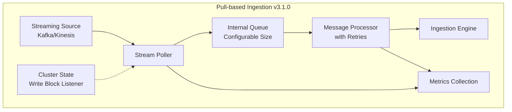

---
tags:
  - domain/core
  - component/server
  - indexing
  - observability
---
# Pull-based Ingestion Enhancements

## Summary

OpenSearch 3.1.0 enhances pull-based ingestion with comprehensive metrics, error handling improvements, cluster write block support, and consumer reset capabilities in the Resume API. These changes improve observability, reliability, and operational control for streaming data ingestion from sources like Apache Kafka and Amazon Kinesis.

## Details

### What's New in v3.1.0

#### Lag Metrics for Polling
PR #17977 adds lag metrics to monitor ingestion delay. The `Message` interface now includes a `getTimestamp()` method that returns the message timestamp for lag calculation.

#### Error Metrics and Configurable Queue Size
PR #18088 introduces detailed error metrics for both poller and processor components:

| Metric Category | Metrics Added |
|-----------------|---------------|
| Message Processor | `total_processed_count`, `total_invalid_message_count`, `total_version_conflicts_count`, `total_failed_count`, `total_failures_dropped_count`, `total_processor_thread_interrupt_count` |
| Consumer | `total_polled_count`, `total_consumer_error_count`, `total_poller_message_failure_count`, `total_poller_message_dropped_count`, `lag_in_millis` |

A new configurable setting `index.ingestion_source.internal_queue_size` controls the internal blocking queue size (default: 100, range: 1-100000).

#### Transient Failure Retries and Create Mode
PR #18250 adds:
- **Retry mechanism**: Failed messages are retried up to 2 times before being dropped (with DROP error strategy)
- **Create mode support**: New `_op_type: "create"` for insert-only operations that won't update existing documents

#### Cluster Write Block Support
PR #18280 enables the stream poller to respect cluster write blocks. When a write block is active (local or global), the poller automatically pauses and resumes when the block is removed. The `GetIngestionState` API now includes `write_block_enabled` status.

#### Consumer Reset in Resume API (Breaking Change)
PR #18332 adds consumer reset capability to the Resume API, allowing offset/timestamp-based repositioning:

```json
POST /<index>/ingestion/_resume
{
  "reset_settings": [
    {
      "shard": 0,
      "mode": "offset",
      "value": "100"
    }
  ]
}
```

**Breaking Change**: The `ResetState` enum values have been renamed:
- `REWIND_BY_OFFSET` → `RESET_BY_OFFSET`
- `REWIND_BY_TIMESTAMP` → `RESET_BY_TIMESTAMP`

### Technical Changes

#### Architecture Changes



#### New Configuration

| Setting | Description | Default |
|---------|-------------|---------|
| `index.ingestion_source.internal_queue_size` | Size of internal blocking queue between poller and processor | 100 |

#### API Changes

**GetIngestionState Response** now includes:
- `write_block_enabled`: Boolean indicating if write block is active
- `batch_start_pointer`: Current batch start position
- `total_duplicate_message_skipped_count`: Count of skipped duplicate messages

**Resume API** now accepts `reset_settings` for consumer repositioning with modes:
- `OFFSET`: Reset to specific offset/sequence number
- `TIMESTAMP`: Reset to position based on timestamp in milliseconds

### Usage Example

```json
// Resume ingestion with offset reset
POST /my-index/ingestion/_resume
{
  "reset_settings": [
    {
      "shard": 0,
      "mode": "offset",
      "value": "500"
    },
    {
      "shard": 1,
      "mode": "timestamp",
      "value": "1739459600000"
    }
  ]
}
```

### Migration Notes

Update any code using the old enum values:
- Change `rewind_by_offset` to `reset_by_offset` in index settings
- Change `rewind_by_timestamp` to `reset_by_timestamp` in index settings

## Limitations

- Consumer reset only works when ingestion is paused
- Retry mechanism applies only with DROP error strategy
- Write block detection requires ClusterApplierService registration

## References

### Documentation
- [Documentation](https://docs.opensearch.org/3.0/api-reference/document-apis/pull-based-ingestion/): Pull-based ingestion
- [Documentation](https://docs.opensearch.org/3.0/api-reference/document-apis/pull-based-ingestion-management/): Pull-based ingestion management

### Pull Requests
| PR | Description |
|----|-------------|
| [#17977](https://github.com/opensearch-project/OpenSearch/pull/17977) | Emit lag metric for pull-based ingestion poller |
| [#18088](https://github.com/opensearch-project/OpenSearch/pull/18088) | Add ingestion error metrics and configurable queue size |
| [#18250](https://github.com/opensearch-project/OpenSearch/pull/18250) | Support transient failure retries and create mode |
| [#18280](https://github.com/opensearch-project/OpenSearch/pull/18280) | Support cluster write blocks |
| [#18332](https://github.com/opensearch-project/OpenSearch/pull/18332) | Support consumer reset in Resume API |

### Issues (Design / RFC)
- [Issue #17442](https://github.com/opensearch-project/OpenSearch/issues/17442): Ingestion management APIs for pull-based ingestion
- [Issue #18279](https://github.com/opensearch-project/OpenSearch/issues/18279): Support cluster write block in pull-based ingestion

## Related Feature Report

- Full feature documentation
