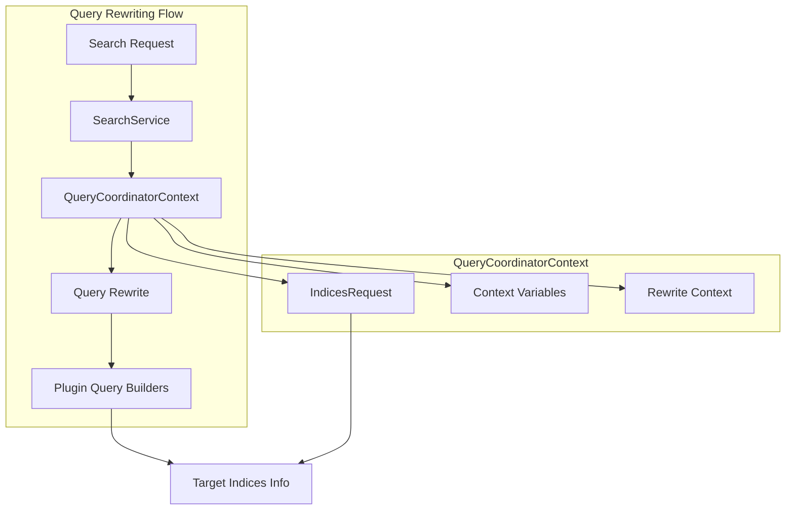

---
tags:
  - indexing
  - neural-search
  - search
---

# Query Coordinator Context

## Summary

This release enhances the `QueryCoordinatorContext` class to provide access to the search request and target indices information during query rewriting on the coordinator node. This enables plugins (particularly the neural-search plugin) to make index-aware decisions during query rewriting, which is essential for features like the semantic field type.

## Details

### What's New in v3.1.0

Two key improvements were made to the query rewriting infrastructure:

1. **Search Request Access** (PR #17890): The `QueryCoordinatorContext` now accepts any `IndicesRequest` (not just `PipelinedRequest`) and exposes a `getSearchRequest()` method, allowing plugins to access target indices during query rewriting.

2. **Validate API Integration** (PR #18272): The Validate Query API now uses `QueryCoordinatorContext` for query rewriting, ensuring consistent behavior with the search API and proper validation of neural queries against semantic fields.

### Technical Changes

#### Architecture Changes



#### Modified Components

| Component | Change | Description |
|-----------|--------|-------------|
| `QueryCoordinatorContext` | Modified | Now accepts `IndicesRequest` instead of `PipelinedRequest`, added `getSearchRequest()` method |
| `SearchService` | Modified | `getRewriteContext()` now accepts `IndicesRequest` parameter |
| `TransportExplainAction` | Modified | Uses `SearchService.getRewriteContext()` with request parameter |
| `TransportValidateQueryAction` | Modified | Uses `QueryCoordinatorContext` for query rewriting |

#### API Changes

```java
// QueryCoordinatorContext constructor change
// Before (v3.0.0)
public QueryCoordinatorContext(QueryRewriteContext rewriteContext, PipelinedRequest searchRequest)

// After (v3.1.0)
public QueryCoordinatorContext(QueryRewriteContext rewriteContext, IndicesRequest searchRequest)

// New method added
public IndicesRequest getSearchRequest()
```

### Usage Example

Plugins can now access target indices during query rewriting:

```java
@Override
protected QueryBuilder doRewrite(QueryRewriteContext queryRewriteContext) {
    // Convert to coordinator context to access search request
    QueryCoordinatorContext coordinatorContext = queryRewriteContext.convertToCoordinatorContext();
    
    if (coordinatorContext != null) {
        // Get target indices from the search request
        IndicesRequest searchRequest = coordinatorContext.getSearchRequest();
        String[] indices = searchRequest.indices();
        
        // Make index-aware rewriting decisions
        // e.g., check index mapping for semantic field configuration
    }
    
    return super.doRewrite(queryRewriteContext);
}
```

### Migration Notes

- Plugins using `QueryCoordinatorContext` should update to use the new `getSearchRequest()` method instead of casting to `PipelinedRequest`
- The `getContextVariables()` method still works but returns empty map for non-pipelined requests

## Limitations

- The `getContextVariables()` method only returns pipeline context variables when the request is a `PipelinedRequest`
- For other `IndicesRequest` types, context variables will be empty

## References

### Pull Requests
| PR | Description |
|----|-------------|
| [#17890](https://github.com/opensearch-project/OpenSearch/pull/17890) | Allow to get the search request from the QueryCoordinatorContext |
| [#18272](https://github.com/opensearch-project/OpenSearch/pull/18272) | Use QueryCoordinatorContext for the rewrite in validate API |

### Issues (Design / RFC)
- [Issue #1211](https://github.com/opensearch-project/neural-search/issues/1211): RFC - Support Semantic Field Type to Simplify Neural Search Set Up
- [Issue #803](https://github.com/opensearch-project/neural-search/issues/803): Semantic field feature request

## Related Feature Report

- [Full feature documentation](../../../../features/opensearch/query-coordinator-context.md)
