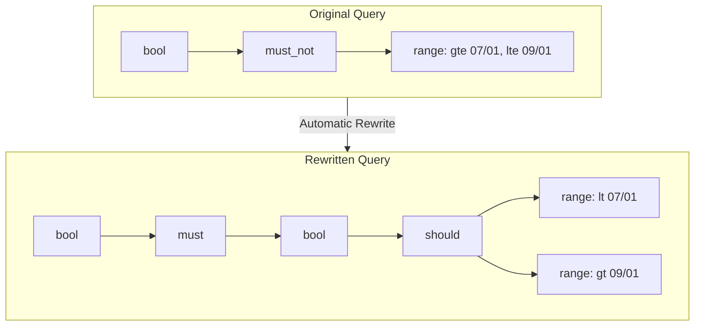

# Query Optimization

## Summary

OpenSearch v3.1.0 introduces two significant query optimization improvements that can dramatically improve search performance. The first optimization automatically rewrites `must_not` range queries in Boolean queries to use `should` clauses with the complement of the range, achieving 2-30x performance improvements. The second optimization improves sort-query performance for approximated `match_all` queries by retaining the default `totalHitsThreshold`, enabling earlier competitive iterator updates.

## Details

### What's New in v3.1.0

Two query optimization features were added:

1. **BooleanQuery Rewrite for must_not RangeQuery Clauses**: Automatically transforms slow `must_not` range queries into faster `should` clauses
2. **Sort-Query Performance for Approximated match_all**: Fixes `totalHitsThreshold` handling for better performance with sorted queries

### Technical Changes

#### BooleanQuery must_not Range Rewrite

When a Boolean query contains a `must_not` clause with a range query, OpenSearch now automatically rewrites it to use `should` clauses representing the complement of that range.



**Conditions for Rewrite:**
- Only applies when all documents have exactly one value for the field
- Only one range query per field in `must_not` clause
- Preserves original `minimumShouldMatch` semantics

#### New Components

| Component | Description |
|-----------|-------------|
| `BoolQueryBuilder.rewriteMustNotRangeClausesToShould()` | Performs the must_not to should rewrite during query rewrite phase |
| `RangeQueryBuilder.getComplement()` | Returns list of RangeQueryBuilder representing the complement of the range |
| `ApproximateScoreQuery.createWeight()` | New method to properly delegate weight creation to resolved query |

#### Performance Improvements

**must_not Range Rewrite Benchmarks (nyc_taxis dataset):**

| Excluded Range | Original p50 (ms) | Rewritten p50 (ms) | Improvement |
|----------------|-------------------|--------------------| ------------|
| Jul 1 - Sep 1 | 873 | 408 | ~2x |
| Jan 1 - Sep 1 | 1214 | 111 | ~11x |
| 1/1 12:00 - 1/1 12:01 | 599 | 19.5 | ~30x |

**http_logs dataset:**

| Excluded Range | Original p50 (ms) | Rewritten p50 (ms) | Improvement |
|----------------|-------------------|--------------------| ------------|
| 6/10 - 6/13 | 259 | 38.2 | ~7x |
| 6/9 - 6/10 | 269 | 30.8 | ~9x |

#### Sort-Query Optimization

For approximated `match_all` queries with sorting, the `totalHitsThreshold` is now correctly set to the `numHits` value (default 10) instead of 10,000. This allows Lucene's competitive iterator to update earlier and skip unnecessary document comparisons.

**Key Changes:**
- `TopDocsCollectorContext.shortcutTotalHitCount()` now handles `ApproximateScoreQuery` by extracting the original query
- `ApproximatePointRangeQuery.canApproximate()` uses `trackTotalHitsUpTo` without adding 1
- `ApproximateScoreQuery.rewrite()` returns `this` to maintain query identity

### Usage Example

The optimization is automatic. No configuration changes are required.

**Before (slow):**
```json
{
  "query": {
    "bool": {
      "must_not": [
        {
          "range": {
            "timestamp": {
              "gte": "2024-07-01",
              "lte": "2024-09-01"
            }
          }
        }
      ]
    }
  }
}
```

**Internally rewritten to (fast):**
```json
{
  "query": {
    "bool": {
      "must": {
        "bool": {
          "should": [
            {"range": {"timestamp": {"lt": "2024-07-01"}}},
            {"range": {"timestamp": {"gt": "2024-09-01"}}}
          ]
        }
      }
    }
  }
}
```

### Migration Notes

These optimizations are applied automatically. No migration steps are required.

## Limitations

- **must_not rewrite** only applies when:
  - All documents have exactly one value for the range field
  - Only one range query exists per field in `must_not` clause
  - The range query uses `INTERSECTS` relation (default)
- **Sort optimization** applies only to approximated `match_all` queries

## References

### Documentation
- [Boolean Query Documentation](https://docs.opensearch.org/3.0/query-dsl/compound/bool/): Official docs for Boolean queries

### Pull Requests
| PR | Description |
|----|-------------|
| [#18189](https://github.com/opensearch-project/OpenSearch/pull/18189) | Improve sort-query performance by retaining the default `totalHitsThreshold` for approximated `match_all` queries |
| [#17655](https://github.com/opensearch-project/OpenSearch/pull/17655) | Add BooleanQuery rewrite for must_not RangeQuery clauses |

### Issues (Design / RFC)
- [Issue #18206](https://github.com/opensearch-project/OpenSearch/issues/18206): Improve performance for approximated `match_all` sort queries
- [Issue #17586](https://github.com/opensearch-project/OpenSearch/issues/17586): Feature Request - Rewrites for BooleanQuery

## Related Feature Report

- [Full feature documentation](../../../../features/opensearch/query-optimization.md)
