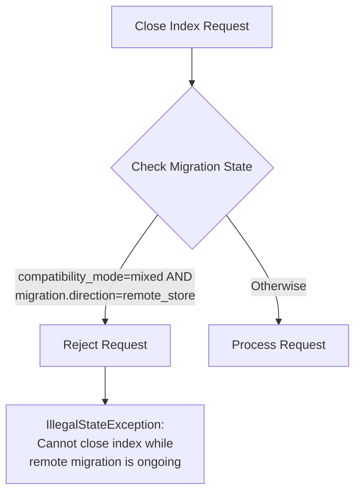

# Remote Store

## Summary

This release includes two improvements to Remote Store functionality: rejection of close index requests during remote store migration, and a bug fix for cluster state diff downloads during alias operations. These changes improve the stability and reliability of the remote store migration process.

## Details

### What's New in v3.1.0

#### 1. Close Index Request Rejection During Migration

When migrating from document replication to remote-backed storage (segment replication), the `_close` API is now blocked to prevent potential data inconsistencies. This validation occurs when:

- `cluster.remote_store.compatibility_mode` is set to `mixed`
- `cluster.migration.direction` is set to `remote_store`



#### 2. Cluster State Diff Download Fix

Fixed a bug where performing an `_aliases` request that removes an index and assigns its name as an alias to another index in the same request caused cluster state diff download failures. The error occurred because deleted indices and routing tables were not properly removed before building the updated cluster state.

**Before the fix:**
```
java.lang.IllegalStateException: index, alias, and data stream names need to be unique, 
but the following duplicates were found [index-2 (alias of [index-1/...]) conflicts with index]
```

**Impact of the bug:**
- Cluster manager stepping down due to publication failure
- Full cluster state download triggered by node-joins
- High latency for alias operations

### Technical Changes

#### New Validation in TransportCloseIndexAction

```java
private void validateRemoteMigration() {
    ClusterSettings clusterSettings = clusterService.getClusterSettings();
    CompatibilityMode compatibilityMode = clusterSettings.get(
        RemoteStoreNodeService.REMOTE_STORE_COMPATIBILITY_MODE_SETTING);
    Direction migrationDirection = clusterSettings.get(
        RemoteStoreNodeService.MIGRATION_DIRECTION_SETTING);
    if (compatibilityMode == CompatibilityMode.MIXED 
        && migrationDirection == Direction.REMOTE_STORE) {
        throw new IllegalStateException(
            "Cannot close index while remote migration is ongoing");
    }
}
```

#### RemoteClusterStateService Changes

The `readClusterStateInParallel` method now accepts transformers to handle deleted indices and routing tables before building the cluster state:

| Parameter | Description |
|-----------|-------------|
| `metadataTransformer` | Consumer to remove deleted indices from metadata |
| `routingTableTransformer` | Consumer to remove deleted routing tables |

### Configuration

| Setting | Description | Values |
|---------|-------------|--------|
| `cluster.remote_store.compatibility_mode` | Controls node compatibility during migration | `strict` (default), `mixed` |
| `cluster.migration.direction` | Specifies migration direction | `none` (default), `remote_store` |

### Usage Example

During remote store migration, attempting to close an index will fail:

```bash
# Set migration mode
PUT /_cluster/settings
{
  "persistent": {
    "cluster.remote_store.compatibility_mode": "mixed",
    "cluster.migration.direction": "remote_store"
  }
}

# This will fail during migration
POST /my-index/_close
# Response: 400 Bad Request
# "Cannot close index while remote migration is ongoing"
```

### Migration Notes

- Complete the remote store migration before closing any indexes
- The restriction is automatically lifted when migration completes and `compatibility_mode` returns to `strict`
- The alias operation fix is transparent and requires no user action

## Limitations

- Close index operations are blocked during the entire migration period
- No workaround available for closing indexes during migration - migration must complete first

## Related PRs

| PR | Description |
|----|-------------|
| [#18327](https://github.com/opensearch-project/OpenSearch/pull/18327) | Disabling _close API invocation during remote migration |
| [#18256](https://github.com/opensearch-project/OpenSearch/pull/18256) | Apply cluster state metadata and routing table diff when building cluster state from remote |

## References

- [Issue #18328](https://github.com/opensearch-project/OpenSearch/issues/18328): Reject close index requests during DocRep to SegRep migration
- [Issue #18045](https://github.com/opensearch-project/OpenSearch/issues/18045): Remote Cluster State Diff Download Failures during IndicesAliases Action
- [Migrating to remote-backed storage](https://docs.opensearch.org/3.0/tuning-your-cluster/availability-and-recovery/remote-store/migrating-to-remote/): Official migration documentation

## Related Feature Report

- [Full feature documentation](../../../features/opensearch/remote-store.md)
