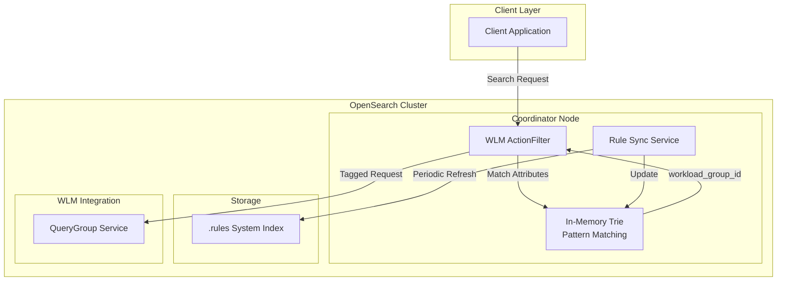

---
tags:
  - indexing
  - ml
  - search
---

# Rule-based Auto-tagging

## Summary

Rule-based auto-tagging is a new feature in v3.1.0 that automatically assigns workload group IDs to incoming search requests based on predefined rules. This eliminates the need for clients to manually supply `queryGroupId` HTTP headers, enabling automated request classification based on index patterns and other attributes. The feature integrates with Workload Management (WLM) to provide intelligent, rule-driven query routing.

## Details

### What's New in v3.1.0

This release introduces the complete rule-based auto-tagging framework with:

- Full CRUD API for rule management (`/_rules/workload_group`)
- WLM ActionFilter for automatic tagging at the transport layer
- Refresh-based synchronization service for in-memory rule updates
- Trie-based in-memory data structure for efficient pattern matching

### Technical Changes

#### Architecture Changes



#### New Components

| Component | Description |
|-----------|-------------|
| `WlmActionFilter` | Transport layer filter that intercepts search requests and applies auto-tagging |
| `RuleSyncService` | Periodically refreshes in-memory rules from the `.rules` system index |
| `Rule` | Data model representing a tagging rule with attributes and feature value |
| `RuleRoutingService` | Handles rule CRUD operations via REST API |
| `AttributeTrie` | Trie-based data structure for efficient prefix pattern matching |

#### New Configuration

| Setting | Description | Default |
|---------|-------------|---------|
| `wlm.rule_sync.interval` | Interval for refreshing rules from system index | - |

#### API Changes

**Create Rule:**
```
PUT /_rules/workload_group
{
  "description": "Route production logs to analytics group",
  "index_pattern": ["logs-prod-*", "events-prod-*"],
  "workload_group": "<workload_group_id>"
}
```

**Get Rules:**
```
GET /_rules/workload_group
GET /_rules/workload_group/{rule_id}
GET /_rules/workload_group?index_pattern=logs*
```

**Update Rule:**
```
PUT /_rules/workload_group/{rule_id}
{
  "description": "Updated description",
  "index_pattern": ["logs-prod-*"],
  "workload_group": "<workload_group_id>"
}
```

**Delete Rule:**
```
DELETE /_rules/workload_group/{rule_id}
```

### Usage Example

```bash
# 1. Create a workload group
PUT _wlm/query_group
{
  "name": "production_analytics",
  "resiliency_mode": "enforced",
  "resource_limits": { "cpu": 0.4, "memory": 0.2 }
}

# 2. Create an auto-tagging rule
PUT _rules/workload_group
{
  "description": "Route production logs",
  "index_pattern": ["logs-prod-*"],
  "workload_group": "<workload_group_id_from_step_1>"
}

# 3. Search requests to logs-prod-* are now automatically tagged
GET logs-prod-2025/_search
{
  "query": { "match_all": {} }
}
```

### Migration Notes

- No migration required for existing WLM configurations
- Rules can be created alongside existing HTTP header-based tagging
- HTTP header takes precedence if both rule and header are present

## Limitations

- Only `index_pattern` attribute is supported in v3.1.0
- Rules are stored in a system index and require cluster write permissions
- Pattern matching uses prefix-based wildcards only (e.g., `logs-*`)
- Rule changes may take up to one sync interval to propagate to all nodes

## References

### Documentation
- [Rule-based Auto-tagging Documentation](https://docs.opensearch.org/3.1/tuning-your-cluster/availability-and-recovery/rule-based-autotagging/autotagging/)
- [Rule Lifecycle API Documentation](https://docs.opensearch.org/3.1/tuning-your-cluster/availability-and-recovery/rule-based-autotagging/rule-lifecycle-api/)

### Pull Requests
| PR | Description |
|----|-------------|
| [#17336](https://github.com/opensearch-project/OpenSearch/pull/17336) | Add Get Rule API |
| [#17791](https://github.com/opensearch-project/OpenSearch/pull/17791) | Add WLM ActionFilter for automatic tagging |
| [#17792](https://github.com/opensearch-project/OpenSearch/pull/17792) | Add Create Rule API |
| [#17797](https://github.com/opensearch-project/OpenSearch/pull/17797) | Add Update Rule API |
| [#18128](https://github.com/opensearch-project/OpenSearch/pull/18128) | Add refresh-based rule synchronization service |
| [#18184](https://github.com/opensearch-project/OpenSearch/pull/18184) | Add Delete Rule API |
| [#18488](https://github.com/opensearch-project/OpenSearch/pull/18488) | Bug fix for update rule API duplicate detection |

### Issues (Design / RFC)
- [Issue #16797](https://github.com/opensearch-project/OpenSearch/issues/16797): RFC for automated labeling of search requests
- [Issue #13341](https://github.com/opensearch-project/OpenSearch/issues/13341): Related feature request

## Related Feature Report

- [Full feature documentation](../../../features/opensearch/opensearch-workload-management.md)
