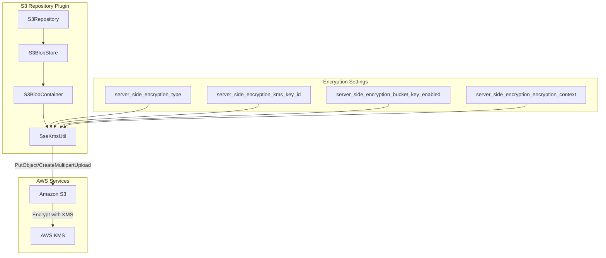

---
tags:
  - indexing
  - security
---

# S3 Repository Enhancements

## Summary

OpenSearch v3.1.0 introduces significant enhancements to the S3 repository plugin, adding support for AWS KMS server-side encryption (SSE-KMS) and S3 bucket owner verification. These features enable organizations to meet stricter security and compliance requirements when storing snapshots in Amazon S3. Additionally, the legacy `server_side_encryption` setting has been removed as it became ineffective after AWS S3's January 2023 change to apply SSE-S3 encryption by default.

## Details

### What's New in v3.1.0

#### 1. SSE-KMS Support

The S3 repository plugin now supports AWS Key Management Service (KMS) for server-side encryption, allowing users to encrypt snapshot data with customer-managed KMS keys instead of S3-managed keys.

#### 2. Bucket Owner Verification

A new `expected_bucket_owner` setting verifies that the S3 bucket belongs to the expected AWS account before performing any operations, preventing accidental data exposure to wrong buckets.

#### 3. Removal of Legacy Setting

The `server_side_encryption` boolean setting has been removed. Since January 5, 2023, AWS S3 applies SSE-S3 (AES256) encryption by default to all objects, making this setting ineffective.

### Technical Changes

#### New Configuration Settings

| Setting | Description | Default |
|---------|-------------|---------|
| `server_side_encryption_type` | Encryption type: `AES256`, `aws:kms`, or `bucket_default` | `bucket_default` |
| `server_side_encryption_kms_key_id` | KMS key ARN for SSE-KMS encryption | None |
| `server_side_encryption_bucket_key_enabled` | Enable S3 Bucket Keys to reduce KMS costs | `true` |
| `server_side_encryption_encryption_context` | JSON key-value pairs for KMS encryption context | None |
| `expected_bucket_owner` | 12-digit AWS account ID for bucket ownership verification | None |

#### Encryption Type Options

| Value | Description |
|-------|-------------|
| `AES256` | SSE-S3 encryption with S3-managed keys |
| `aws:kms` | SSE-KMS encryption with customer-managed KMS keys |
| `bucket_default` | Use the bucket's default encryption configuration |

#### Architecture Changes



#### New Components

| Component | Description |
|-----------|-------------|
| `SseKmsUtil` | Utility class for configuring encryption settings on S3 requests |

### Usage Example

#### Register Repository with SSE-KMS

```json
PUT _snapshot/my-secure-repo
{
  "type": "s3",
  "settings": {
    "bucket": "my-snapshot-bucket",
    "base_path": "snapshots",
    "region": "us-east-1",
    "server_side_encryption_type": "aws:kms",
    "server_side_encryption_kms_key_id": "arn:aws:kms:us-east-1:123456789012:key/my-key-id",
    "server_side_encryption_bucket_key_enabled": true,
    "server_side_encryption_encryption_context": "{\"domainARN\": \"my-opensearch-domain\"}",
    "expected_bucket_owner": "123456789012"
  }
}
```

#### Register Repository with Bucket Default Encryption

```json
PUT _snapshot/my-repo
{
  "type": "s3",
  "settings": {
    "bucket": "my-snapshot-bucket",
    "server_side_encryption_type": "bucket_default",
    "expected_bucket_owner": "123456789012"
  }
}
```

### Migration Notes

1. **Legacy Setting Removal**: The `server_side_encryption` boolean setting is no longer recognized. Existing repositories using this setting will continue to work (the setting is silently ignored), but you should update configurations to use the new settings.

2. **Default Behavior Change**: The default encryption type is now `bucket_default`, which defers to the S3 bucket's encryption configuration rather than explicitly setting AES256.

3. **KMS Permissions**: When using SSE-KMS, ensure your IAM role has the following KMS permissions:
   - `kms:GenerateDataKey` - Required for encrypting objects
   - `kms:Decrypt` - Required for reading encrypted objects

## Limitations

- The `expected_bucket_owner` must be exactly 12 digits (AWS account ID format)
- KMS encryption context must be valid JSON representing a string-to-string map
- Cross-account KMS key access requires appropriate key policies
- S3 Bucket Keys are only effective with SSE-KMS encryption

## References

### Documentation
- [AWS SSE-KMS Documentation](https://docs.aws.amazon.com/AmazonS3/latest/userguide/UsingKMSEncryption.html): AWS KMS encryption guide
- [Register Snapshot Repository](https://docs.opensearch.org/3.0/api-reference/snapshots/create-repository/): OpenSearch documentation
- [AWS Bucket Owner Condition](https://docs.aws.amazon.com/AmazonS3/latest/userguide/bucket-owner-condition.html): Bucket owner verification guide

### Pull Requests
| PR | Description |
|----|-------------|
| [#18312](https://github.com/opensearch-project/OpenSearch/pull/18312) | Add support for SSE-KMS and S3 bucket owner verification |

### Issues (Design / RFC)
- [Issue #14606](https://github.com/opensearch-project/OpenSearch/issues/14606): Feature request for SSE-KMS support
- [Documentation Issue #9929](https://github.com/opensearch-project/documentation-website/issues/9929): Documentation update request

## Related Feature Report

- [Full feature documentation](../../../features/opensearch/s3-repository.md)
