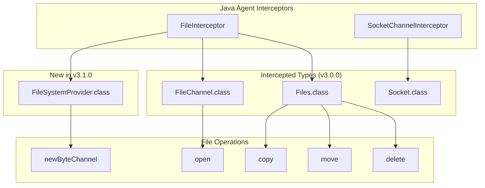

---
tags:
  - domain/core
  - component/server
  - ml
  - security
---
# Security Manager Replacement

## Summary

This release enhances the Java Agent to intercept `newByteChannel` method from `FileSystemProvider.class`, expanding the file operation interception coverage. This improvement ensures that file access through `Files.readAllLines()`, `Files.newOutputStream()`, and similar methods that internally use `FileSystemProvider.newByteChannel()` are properly monitored and authorized by the Java Agent security model.

## Details

### What's New in v3.1.0

The Java Agent's file interception capabilities have been expanded to cover additional file access patterns:

1. **FileSystemProvider Interception**: Added `FileSystemProvider.class` to the list of intercepted types
2. **newByteChannel Support**: The `FileInterceptor` now properly handles `newByteChannel` method calls
3. **Argument Type Handling**: Enhanced argument parsing to support `Set<OpenOption>` and `Object[]` in addition to `OpenOption[]`
4. **Policy Variable Expansion**: Fixed system property expansion in policy files using `${{property}}` syntax

### Technical Changes

#### Architecture Changes



#### New Components

| Component | Description |
|-----------|-------------|
| `FileSystemProvider` interception | Intercepts file operations via NIO FileSystemProvider |
| `Set<OpenOption>` handling | Supports Set-based open options from FileSystemProvider |
| Policy variable expansion | Expands `${{property}}` syntax in permission names |

#### API Changes

The `FileInterceptor` now handles three argument types for `newByteChannel` and `open` methods:

| Argument Type | Source | Example |
|---------------|--------|---------|
| `OpenOption[]` | `FileChannel.open()` | Direct array of options |
| `Set<OpenOption>` | `FileSystemProvider.newByteChannel()` | Set from Files API |
| `Object[]` | Generic fallback | Any object array |

### Usage Example

```java
// These operations are now properly intercepted:

// Via Files API (uses FileSystemProvider.newByteChannel internally)
List<String> lines = Files.readAllLines(path);
OutputStream os = Files.newOutputStream(path);

// Via FileChannel (already intercepted in v3.0.0)
FileChannel channel = FileChannel.open(path, StandardOpenOption.READ);
```

### Migration Notes

Plugin developers using `Files.readAllLines()`, `Files.newOutputStream()`, or similar methods should ensure their `plugin-security.policy` files include appropriate `FilePermission` grants:

```policy
grant {
  permission java.io.FilePermission "/path/to/file", "read";
  permission java.io.FilePermission "/path/to/file", "read,write";
}
```

## Limitations

- The Java Agent focuses on file and network operations; other JSM permission types (reflection, thread context) are not intercepted
- Performance overhead from bytecode instrumentation is minimal but present
- Policy files must use `${{property}}` syntax (double braces) for system property expansion

## References

### Documentation
- [JEP 411](https://openjdk.org/jeps/411): Deprecate the Security Manager for Removal
- [JEP 486](https://openjdk.org/jeps/486): Permanently Disable the Security Manager (JDK 24)

### Blog Posts
- [Blog: Finding a replacement for JSM in OpenSearch 3.0](https://opensearch.org/blog/finding-a-replacement-for-jsm-in-opensearch-3-0/)

### Pull Requests
| PR | Description |
|----|-------------|
| [#17989](https://github.com/opensearch-project/OpenSearch/pull/17989) | Enhance Java Agent to intercept newByteChannel from FileSystemProvider |
| [#17861](https://github.com/opensearch-project/OpenSearch/pull/17861) | Phase off SecurityManager usage in favor of Java Agent (v3.0.0) |
| [#17753](https://github.com/opensearch-project/OpenSearch/pull/17753) | Add policy parser for Java Agent (v3.0.0) |
| [#17894](https://github.com/opensearch-project/OpenSearch/pull/17894) | Limit stack walking to frames before AccessController.doPrivileged (v3.0.0) |

### Issues (Design / RFC)
- [Issue #1687](https://github.com/opensearch-project/OpenSearch/issues/1687): RFC - Replace Java Security Manager (JSM)

## Related Feature Report

- [Full feature documentation](../../../features/multi-plugin/multi-plugin-jdk-21-reporting-java-agent-migration.md)
