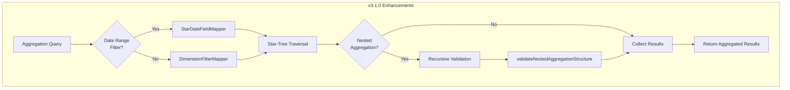

# Star-Tree Index Enhancements

## Summary

OpenSearch v3.1.0 graduates star-tree index from experimental to production-ready status. This release removes the experimental feature flag, adds index-level control for star-tree search, introduces date range query support in aggregations, and enables nested bucket aggregations for more complex analytics scenarios.

## Details

### What's New in v3.1.0

#### Production-Ready Status
Star-tree index is no longer experimental. The feature flag `opensearch.experimental.feature.composite_index.star_tree.enabled` has been removed, and star-tree functionality is now enabled by default.

#### New Index-Level Setting
A new setting `index.search.star_tree_index.enabled` allows per-index control over star-tree search optimization:

| Setting | Scope | Default | Description |
|---------|-------|---------|-------------|
| `index.search.star_tree_index.enabled` | Index | `true` | Enable/disable star-tree search for specific index |
| `indices.composite_index.star_tree.enabled` | Cluster | `true` | Enable/disable star-tree search cluster-wide |

#### Date Range Query Support
Star-tree aggregations now support date range queries with half-open intervals `[gte, lt)` aligned to calendar intervals. This enables time-based filtering in star-tree optimized aggregations.

#### Nested Bucket Aggregations
Star-tree now supports nested bucket aggregations up to 3-4 levels deep:
- Terms → Terms → Metric
- Date Histogram → Terms → Metric
- Range → Terms → Metric
- Terms → Range → Metric

### Technical Changes

#### Architecture Changes



#### New Components

| Component | Description |
|-----------|-------------|
| `StarDateFieldMapper` | Maps date dimension filters for star-tree traversal |
| `MatchAllFilter` | Dimension filter for match-all queries |
| `getDimensionFilters()` | New method in `StarTreePreComputeCollector` for nested aggregations |
| `RemapGlobalOrdsStarTree` | Collection strategy for global ordinals in nested terms aggregations |
| `validateNestedAggregationStructure()` | Recursive validation for nested aggregation compatibility |

#### New Configuration

| Setting | Description | Default |
|---------|-------------|---------|
| `index.search.star_tree_index.enabled` | Enable/disable star-tree search per index | `true` |

### Usage Example

```json
// Nested aggregation with date range filter
POST /logs/_search
{
  "size": 0,
  "query": {
    "range": {
      "@timestamp": {
        "gte": "2025-01-01",
        "lt": "2025-02-01"
      }
    }
  },
  "aggs": {
    "by_status": {
      "terms": { "field": "status" },
      "aggs": {
        "by_method": {
          "terms": { "field": "method" },
          "aggs": {
            "avg_latency": { "avg": { "field": "latency" } }
          }
        }
      }
    }
  }
}
```

```json
// Disable star-tree search for specific index
PUT /my-index/_settings
{
  "index.search.star_tree_index.enabled": false
}
```

### Migration Notes

- **No action required**: Star-tree indexes created in v3.0.0 continue to work
- **Feature flag removal**: Remove any JVM options setting `opensearch.experimental.feature.composite_index.star_tree.enabled`
- **Per-index control**: Use `index.search.star_tree_index.enabled` to disable star-tree search on specific indexes if needed

## Limitations

- Date range queries use half-open intervals `[gte, lt)` aligned to calendar intervals
- Nested aggregations limited to 3-4 levels (BUCKET → BUCKET → BUCKET → METRIC)
- Updates and deletions still not supported (append-only requirement remains)

## References

### Documentation
- [Documentation](https://docs.opensearch.org/3.1/search-plugins/star-tree-index/): Official star-tree index documentation

### Pull Requests
| PR | Description |
|----|-------------|
| [#17855](https://github.com/opensearch-project/OpenSearch/pull/17855) | Support date range queries in star-tree aggregations |
| [#18048](https://github.com/opensearch-project/OpenSearch/pull/18048) | Support nested bucket aggregations (terms, date histogram, range) |
| [#18070](https://github.com/opensearch-project/OpenSearch/pull/18070) | Remove feature flag, add index-level star-tree search setting |

### Issues (Design / RFC)
- [Issue #17443](https://github.com/opensearch-project/OpenSearch/issues/17443): Date range query support request
- [Issue #17274](https://github.com/opensearch-project/OpenSearch/issues/17274): Nested bucket aggregations request

## Related Feature Report

- [Full feature documentation](../../../features/opensearch/star-tree-index.md)
