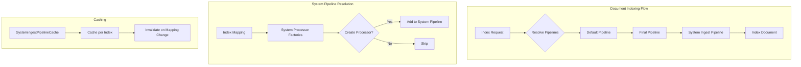

---
tags:
  - domain/core
  - component/server
  - indexing
  - ml
  - neural-search
  - performance
---
# System Ingest Pipeline

## Summary

OpenSearch 3.1 introduces the System Ingest Pipeline, a new capability that allows plugin developers to automatically process documents during ingestion based on index mappings. This feature enables plugins to embed processing logic directly without requiring users to manually configure ingest pipelines, simplifying the user experience for features like semantic field embedding generation.

## Details

### What's New in v3.1.0

The System Ingest Pipeline feature introduces:

1. **Automatic Pipeline Generation**: OpenSearch automatically generates ingest pipelines based on index mappings and registered system ingest processor factories
2. **Plugin Developer API**: New `AbstractBatchingSystemProcessor` base class and `SystemIngestProcessor.Factory` for creating custom system processors
3. **Bulk Update Support**: System pipelines are applied to all update operations including bulk updates (PR #18277)
4. **Pipeline Caching**: System ingest pipelines are cached per index for performance optimization
5. **Cluster Setting**: New `cluster.ingest.system_pipeline_enabled` setting to enable/disable system pipelines

### Technical Changes

#### Architecture Changes



#### New Components

| Component | Description |
|-----------|-------------|
| `AbstractBatchingSystemProcessor` | Base class for batch system processors |
| `SystemIngestPipelineCache` | Cache for system ingest pipelines per index |
| `IngestPipelineType` | Enum: DEFAULT, FINAL, SYSTEM_FINAL |
| `IngestPipelineInfo` | Holds pipeline ID and type information |
| `IndexRequestWrapper` | Wrapper for index requests with pipeline info and slot tracking |

#### New Configuration

| Setting | Description | Default |
|---------|-------------|---------|
| `cluster.ingest.system_pipeline_enabled` | Enable/disable system ingest pipelines | `true` |

#### API Changes

New methods in `IngestPlugin` interface:
```java
// Returns system ingest processor factories
Map<String, Processor.Factory> getSystemIngestProcessors(Processor.Parameters parameters);
```

New methods in `IngestService`:
```java
// Resolve only system ingest pipeline for an index request
boolean resolveSystemIngestPipeline(DocWriteRequest<?> originalRequest, 
                                     IndexRequest indexRequest, 
                                     Metadata metadata);
```

New methods in `UpdateRequest`:
```java
// Get all child index requests (doc and upsert)
List<IndexRequest> getChildIndexRequests();
```

### Pipeline Execution Order

System ingest pipelines execute after default and final pipelines:

1. **Default Pipeline** - User-defined or index default
2. **Final Pipeline** - User-defined final pipeline
3. **System Ingest Pipeline** - Auto-generated based on index mapping

### Update Operation Behavior

| Operation Type | Default/Final Pipeline | System Pipeline |
|----------------|------------------------|-----------------|
| Single Update | Always triggered | Always triggered |
| Bulk Update (doc only) | Not triggered | Always triggered |
| Bulk Update (doc_as_upsert=true) | Triggered | Always triggered |
| Bulk Update (upsert) | Triggered on upsert doc | Always triggered |

### Usage Example

Creating a custom system ingest processor:

```java
// 1. Create processor extending AbstractBatchingSystemProcessor
public class MySystemProcessor extends AbstractBatchingSystemProcessor {
    public static final String TYPE = "my_system_processor";
    
    protected MySystemProcessor(String tag, String description, int batchSize) {
        super(tag, description, batchSize);
    }
    
    @Override
    protected void subBatchExecute(List<IngestDocumentWrapper> docs, 
                                   Consumer<List<IngestDocumentWrapper>> handler) {
        // Process documents in batch
        handler.accept(docs);
    }
    
    @Override
    public IngestDocument execute(IngestDocument doc) {
        // Process single document
        return doc;
    }
    
    @Override
    public String getType() { return TYPE; }
}

// 2. Create factory extending AbstractBatchingSystemProcessor.Factory
public class MySystemProcessorFactory extends AbstractBatchingSystemProcessor.Factory {
    @Override
    protected AbstractBatchingSystemProcessor newProcessor(String tag, 
                                                           String description, 
                                                           Map<String, Object> config) {
        // Check index mapping and create processor if applicable
        Object mapping = config.get(INDEX_MAPPINGS);
        if (shouldCreateProcessor(mapping)) {
            return new MySystemProcessor(tag, description, 10);
        }
        return null;
    }
}

// 3. Register in plugin
public class MyPlugin extends Plugin implements IngestPlugin {
    @Override
    public Map<String, Processor.Factory> getSystemIngestProcessors(
            Processor.Parameters parameters) {
        return Map.of("my_factory", new MySystemProcessorFactory());
    }
}
```

### Migration Notes

- System ingest pipelines are enabled by default
- To disable: `PUT _cluster/settings {"persistent": {"cluster.ingest.system_pipeline_enabled": false}}`
- System processors must handle partial documents gracefully for bulk update operations
- Existing ingest pipelines continue to work unchanged

## Limitations

- System ingest processors receive partial documents during bulk updates (not full documents)
- Processors must validate field existence before accessing
- No simulation API support yet (planned for future release)
- No explain API for viewing generated pipelines yet (planned for future release)

## References

### Blog Posts
- [Blog: Making ingestion smarter](https://opensearch.org/blog/making-ingestion-smarter-system-ingest-pipelines-in-opensearch/): Official blog post

### Pull Requests
| PR | Description |
|----|-------------|
| [#17817](https://github.com/opensearch-project/OpenSearch/pull/17817) | Introduce system generated ingest pipeline |
| [#18277](https://github.com/opensearch-project/OpenSearch/pull/18277) | Support system ingest pipelines for bulk update operations |

### Issues (Design / RFC)
- [Issue #17509](https://github.com/opensearch-project/OpenSearch/issues/17509): RFC - Support System Generated Ingest Pipeline/Processor
- [Issue #18276](https://github.com/opensearch-project/OpenSearch/issues/18276): Support system ingest pipelines for bulk update operations
- [Issue #17742](https://github.com/opensearch-project/OpenSearch/issues/17742): Add configurability to run ingest pipelines during document update operations

## Related Feature Report

- [Full feature documentation](../../../features/opensearch/opensearch-system-ingest-pipeline.md)
