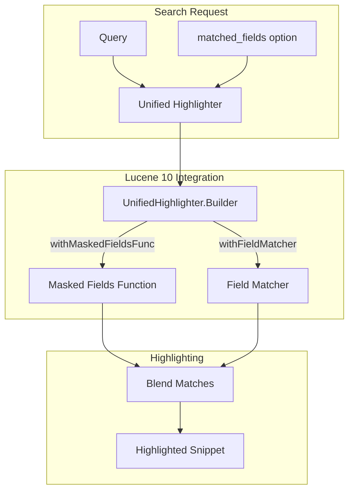

# Unified Highlighter: matched_fields Support

## Summary

OpenSearch 3.1.0 adds support for the `matched_fields` option in the unified highlighter. Previously, this option was silently ignored when using the unified highlighter and only worked with the Fast Vector Highlighter (FVH). This enhancement allows users to combine matches from multiple fields (such as multi-fields with different analyzers) into a single highlighted snippet without requiring term vectors.

## Details

### What's New in v3.1.0

The `matched_fields` option enables blending matches from multiple fields into a single highlighted result. This is particularly useful when a field is analyzed differently using sub-fields (multi-fields). For example, you might have a main field analyzed with a stemming analyzer and a sub-field with a standard analyzer to capture exact matches.

Before this change, achieving this functionality required using the FVH highlighter with term vectors stored (`term_vector: with_positions_offsets`), which significantly increases index size. Now, the unified highlighter supports this feature natively using Lucene 10's `withMaskedFieldsFunc` API.

### Technical Changes

#### Architecture Changes



#### Key Implementation Changes

| Component | Change |
|-----------|--------|
| `CustomUnifiedHighlighter` | Refactored to use `UnifiedHighlighter.Builder` pattern instead of direct constructor |
| `CustomFieldHighlighter` | Updated to accept `passageSortComparator` parameter |
| `UnifiedHighlighter` (OpenSearch) | Added `newBuilder()` method to configure `maskedFieldsFunc` and `fieldMatcher` |

#### API Usage

The `matched_fields` option can now be used with the unified highlighter:

```json
GET my-index/_search
{
  "query": {
    "multi_match": {
      "query": "running scissors",
      "fields": ["content", "content.english"]
    }
  },
  "highlight": {
    "type": "unified",
    "fields": {
      "content": {
        "matched_fields": ["content.english"]
      }
    }
  }
}
```

### Usage Example

Consider an index with a text field analyzed differently:

```json
PUT my-index
{
  "mappings": {
    "properties": {
      "content": {
        "type": "text",
        "analyzer": "standard",
        "fields": {
          "english": {
            "type": "text",
            "analyzer": "english"
          }
        }
      }
    }
  }
}
```

Index a document:

```json
POST my-index/_doc/1
{
  "content": "running with scissors is dangerous"
}
```

Search with `matched_fields` to highlight matches from both analyzers:

```json
GET my-index/_search
{
  "query": {
    "query_string": {
      "query": "content.english:run scissors",
      "fields": ["content"]
    }
  },
  "highlight": {
    "type": "unified",
    "fields": {
      "content": {
        "matched_fields": ["content.english"]
      }
    }
  }
}
```

The response highlights both "running" (matched via stemming in `content.english`) and "scissors":

```json
{
  "highlight": {
    "content": ["<em>running</em> with <em>scissors</em> is dangerous"]
  }
}
```

### Migration Notes

- No migration required for existing indices
- If you were using FVH solely for `matched_fields` support, you can now switch to the unified highlighter
- Switching to unified highlighter may reduce index size if term vectors were only stored for highlighting

### Comparison with FVH

| Aspect | Unified Highlighter | FVH |
|--------|---------------------|-----|
| `matched_fields` support | ✅ (v3.1.0+) | ✅ |
| Requires term vectors | ❌ | ✅ |
| Index size impact | Lower | Higher |
| Performance | Good (uses postings/reanalysis) | Fast (uses term vectors) |

## Limitations

- The unified highlighter still does not support span queries (same as before)
- Performance may vary compared to FVH depending on field size and offset source

## References

### Documentation
- [Documentation PR #9793](https://github.com/opensearch-project/documentation-website/pull/9793): Documentation update
- [Highlight Query Matches](https://docs.opensearch.org/3.0/search-plugins/searching-data/highlight/): Official highlighting documentation

### Pull Requests
| PR | Description |
|----|-------------|
| [#18166](https://github.com/opensearch-project/OpenSearch/pull/18166) | Add support for matched_fields with the unified highlighter |

### Issues (Design / RFC)
- [Issue #18164](https://github.com/opensearch-project/OpenSearch/issues/18164): Feature request for matched_fields support

## Related Feature Report

- [Full feature documentation](../../../../features/opensearch/unified-highlighter.md)
