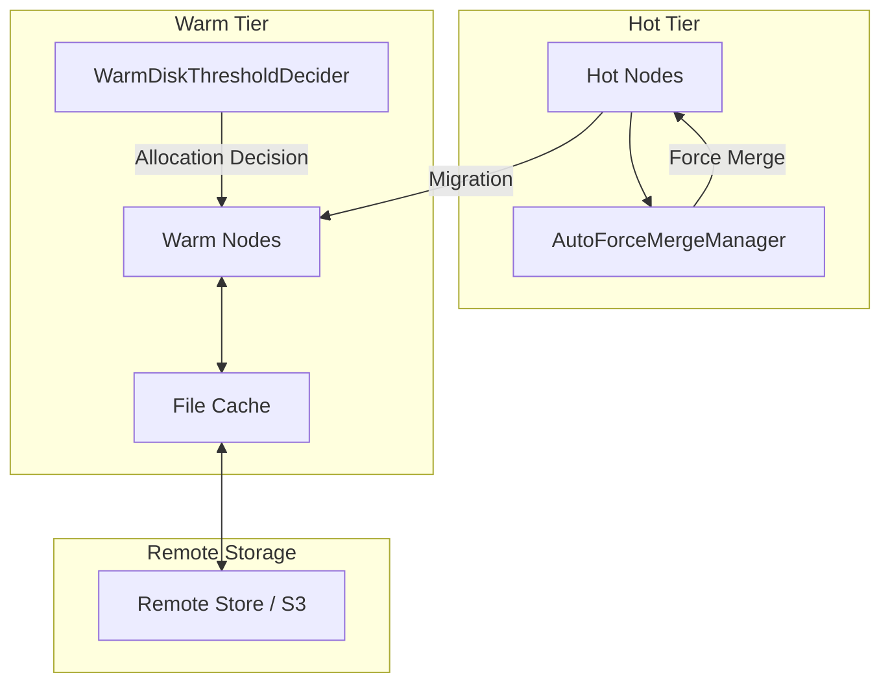

# Warm Storage Tiering

## Summary

OpenSearch v3.1.0 introduces significant enhancements to warm storage tiering with two key features: the WarmDiskThresholdDecider for intelligent shard allocation on warm nodes, and the AutoForceMergeManager for automated segment optimization during hot-to-warm data migration. These improvements enable more efficient data lifecycle management and better resource utilization for tiered storage architectures.

## Details

### What's New in v3.1.0

This release adds two major components to improve warm storage tiering:

1. **WarmDiskThresholdDecider**: A new allocation decider that manages shard placement on warm nodes based on remote addressable space and file cache capacity
2. **AutoForceMergeManager**: An automated force merge system that optimizes segments before data migrates from hot to warm tiers

### Technical Changes

#### Architecture Changes



#### New Components

| Component | Description |
|-----------|-------------|
| `WarmDiskThresholdDecider` | Allocation decider for warm shards based on remote addressable space calculated from file cache size and remote data ratio |
| `AutoForceMergeManager` | Manages automatic force merge operations on primary shards based on translog age and system conditions |
| `ForceMergeManagerSettings` | Configuration settings for auto force merge behavior including thresholds and scheduling |
| `ConfigurationValidator` | Validates node configuration requirements (data node, remote store enabled) |
| `NodeValidator` | Validates node-level conditions (CPU, JVM, disk usage, thread availability) |
| `ShardValidator` | Validates shard-level conditions (segment count, translog age) |

#### New Configuration

| Setting | Description | Default |
|---------|-------------|---------|
| `cluster.routing.allocation.disk.warm_threshold_enabled` | Enable/disable warm disk threshold decider | `true` |
| `cluster.auto_force_merge.enabled` | Enable/disable auto force merge feature | `false` |
| `node.auto_force_merge.scheduler.interval` | Interval between force merge checks | `30m` |
| `node.auto_force_merge.translog.age` | Minimum translog age before force merge | `30m` |
| `node.auto_force_merge.segment.count` | Target segment count after merge | `1` |
| `node.auto_force_merge.merge_delay` | Delay between shard merges | `10s` |
| `node.auto_force_merge.cpu.threshold` | CPU usage threshold to pause merges | `80%` |
| `node.auto_force_merge.disk.threshold` | Disk usage threshold to pause merges | `90%` |
| `node.auto_force_merge.jvm.threshold` | JVM heap usage threshold to pause merges | `75%` |
| `node.auto_force_merge.threads.concurrency_multiplier` | Multiplier for concurrent merge operations | `2` |
| `index.auto_force_merge.enabled` | Per-index setting to enable/disable auto force merge | `true` |

### WarmDiskThresholdDecider

The WarmDiskThresholdDecider replaces the previous file cache allocation logic in `DiskThresholdDecider` with a dedicated decider for warm/remote-capable shards. It calculates total addressable space using:

```
totalAddressableSpace = remoteDataRatio × fileCacheSize
```

Key behaviors:
- Uses low watermark threshold for `canAllocate` decisions
- Uses high watermark threshold for `canRemain` decisions
- Fails open when cluster info or file cache stats are unavailable
- Respects the `cluster.routing.allocation.disk.warm_threshold_enabled` setting

### AutoForceMergeManager

The AutoForceMergeManager runs as a background task on data nodes to automatically trigger force merge operations. It:

1. Validates cluster has warm nodes present
2. Checks node resource conditions (CPU, disk, JVM, thread availability)
3. Identifies eligible shards based on translog age and segment count
4. Executes force merges with configurable delays between shards
5. Respects per-index `index.auto_force_merge.enabled` setting

### Usage Example

Enable auto force merge cluster-wide:

```json
PUT _cluster/settings
{
  "persistent": {
    "cluster.auto_force_merge.enabled": true,
    "node.auto_force_merge.scheduler.interval": "15m",
    "node.auto_force_merge.translog.age": "1h"
  }
}
```

Disable auto force merge for a specific index:

```json
PUT /my-index/_settings
{
  "index.auto_force_merge.enabled": false
}
```

### Migration Notes

- The `search` node role no longer supports searchable snapshots as of OpenSearch 3.0; use the `warm` role instead
- Existing clusters using file cache allocation will automatically use the new `WarmDiskThresholdDecider`
- Auto force merge is disabled by default; enable it explicitly for hot-to-warm migration workflows

## Limitations

- Auto force merge only runs on data nodes with remote store enabled
- Requires warm nodes to be present in the cluster for auto force merge to trigger
- Force merge operations are resource-intensive and may impact query performance during execution
- The feature respects resource thresholds but may still cause temporary performance degradation

## Related PRs

| PR | Description |
|----|-------------|
| [#18082](https://github.com/opensearch-project/OpenSearch/pull/18082) | Add Warm Disk Threshold Allocation Decider for Warm shards |
| [#18229](https://github.com/opensearch-project/OpenSearch/pull/18229) | Added Auto Force Merge Manager to enhance hot to warm migration |

## References

- [Issue #8535](https://github.com/opensearch-project/OpenSearch/issues/8535): Add support for a FileCacheDecider
- [Searchable Snapshots Documentation](https://docs.opensearch.org/3.1/tuning-your-cluster/availability-and-recovery/snapshots/searchable_snapshot/)
- [Creating a Cluster - Warm Nodes](https://docs.opensearch.org/3.1/tuning-your-cluster/)

## Related Feature Report

- [Full feature documentation](../../../../features/opensearch/warm-storage-tiering.md)
