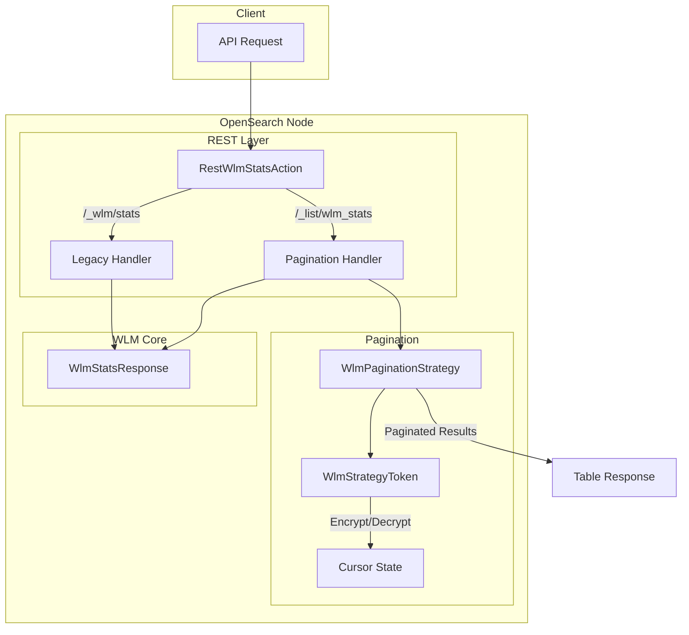

---
tags:
  - domain/core
  - component/server
  - search
---
# Paginated WLM Stats API

## Summary

This release adds pagination support to the Workload Management (WLM) Stats API through a new `/_list/wlm_stats` endpoint. The original `/_wlm/stats` API returns all statistics in a single response, which becomes inefficient as cluster size grows. The new paginated endpoint addresses scalability issues by allowing users to retrieve statistics in smaller chunks with token-based pagination.

## Details

### What's New in v3.1.0

- New `/_list/wlm_stats` API endpoint with pagination support
- Token-based pagination using `next_token` parameter
- Configurable page size (1-100 results per page, default: 10)
- Sorting by `node_id` (default) or `workload_group`
- Sort order support (`asc`/`desc`)
- Tabular output format similar to `_cat` APIs

### Technical Changes

#### Architecture Changes



#### New Components

| Component | Description |
|-----------|-------------|
| `WlmPaginationStrategy` | Implements pagination logic for WLM stats, handling sorting, page extraction, and token generation |
| `WlmStrategyToken` | Encapsulates pagination state including node ID, workload group ID, hash, sort order, and sort field |
| `SortBy` | Enum defining sortable fields: `NODE_ID`, `WORKLOAD_GROUP` |
| `SortOrder` | Enum for sort direction: `ASC`, `DESC` |

#### New API Endpoints

| Endpoint | Description |
|----------|-------------|
| `GET /_list/wlm_stats` | Paginated WLM stats for all nodes |
| `GET /_list/wlm_stats/{nodeId}/stats` | Paginated stats for specific node |
| `GET /_list/wlm_stats/stats/{workloadGroupId}` | Paginated stats for specific workload group |
| `GET /_list/wlm_stats/{nodeId}/stats/{workloadGroupId}` | Paginated stats for specific node and workload group |

#### API Parameters

| Parameter | Type | Description | Default |
|-----------|------|-------------|---------|
| `size` | int | Number of results per page (1-100) | 10 |
| `next_token` | string | Pagination token for next page | - |
| `sort` | string | Sort field: `node_id` or `workload_group` | `node_id` |
| `order` | string | Sort order: `asc` or `desc` | `asc` |
| `v` | boolean | Include column headers | false |

### Usage Example

**Fetch first page sorted by workload group:**
```
GET /_list/wlm_stats?size=50&sort=workload_group&order=asc&v=true
```

**Response:**
```
NODE_ID | WORKLOAD_GROUP_ID | TOTAL_COMPLETIONS | TOTAL_REJECTIONS | TOTAL_CANCELLATIONS | CPU_USAGE | MEMORY_USAGE
node-1  | analytics         | 1000              | 5                | 2                   | 0.45      | 0.30
node-1  | DEFAULT_WORKLOAD_GROUP | 5000         | 0                | 0                   | 0.10      | 0.05
...
next_token: <encrypted_token>
```

**Fetch next page:**
```
GET /_list/wlm_stats?size=50&sort=workload_group&order=asc&next_token=<encrypted_token>
```

### Pagination Token Design

The pagination token encodes:
- Current node ID and workload group ID (cursor position)
- Total workload group count (for state validation)
- SHA-256 hash of all (nodeId|workloadGroupId) pairs (for detecting state changes)
- Sort order and sort field (for consistent pagination)

If the cluster state changes during pagination (workload groups added/removed), the token becomes invalid and returns an error prompting the user to restart pagination.

## Limitations

- Sorting by CPU or memory usage is not supported because these values fluctuate frequently, causing inconsistent pagination results
- Maximum page size is 100 results
- Token becomes invalid if workload groups are added or removed during pagination

## References

### Documentation
- [Workload Management Documentation](https://docs.opensearch.org/3.0/tuning-your-cluster/availability-and-recovery/workload-management/wlm-feature-overview/)

### Pull Requests
| PR | Description |
|----|-------------|
| [#17638](https://github.com/opensearch-project/OpenSearch/pull/17638) | Add paginated wlm/stats API |

### Issues (Design / RFC)
- [Issue #17592](https://github.com/opensearch-project/OpenSearch/issues/17592): Feature request for paginating _wlm/stats API
- [Issue #14257](https://github.com/opensearch-project/OpenSearch/issues/14257): Pagination for _cat APIs
- [Issue #15014](https://github.com/opensearch-project/OpenSearch/issues/15014): Introduction of _list APIs

## Related Feature Report

- Full feature documentation
