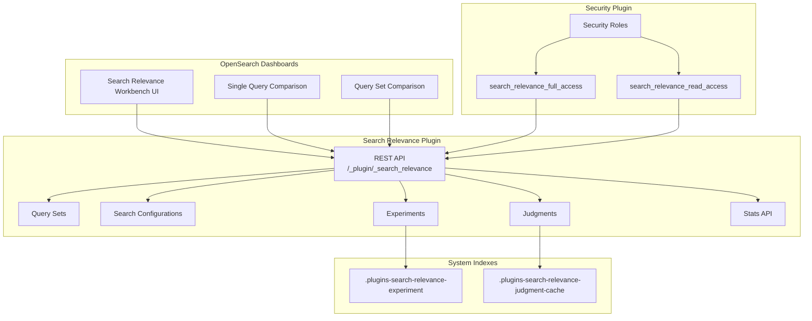

# Search Relevance Workbench

## Summary

OpenSearch 3.1 introduces the Search Relevance Workbench, a comprehensive toolkit for improving search relevance through experimentation. This release adds hybrid search experiment support, external judgment import, a new Stats API, security integration, and various improvements to the data model and API structure.

## Details

### What's New in v3.1.0

The Search Relevance Workbench is a new experimental feature in OpenSearch 3.1 that provides tools for:

- **Hybrid Search Experiments**: New experiment type for optimizing hybrid search queries combining keyword and neural search
- **Query Set Comparison**: Compare search results across different search configurations
- **External Judgment Import**: Import relevance judgments created externally for evaluation
- **Stats API**: Monitor Search Relevance plugin operations
- **Security Integration**: Role-based access control with read-only and full-access roles

### Technical Changes

#### Architecture



#### New Components

| Component | Description |
|-----------|-------------|
| Hybrid Search Experiment | New experiment type for optimizing hybrid search parameters |
| Stats API | Provides metrics on Search Relevance plugin operations |
| External Judgment Import | Support for importing judgments from external sources |
| Feature Flag | `plugins.search_relevance.workbench_enabled` setting |

#### New Configuration

| Setting | Description | Default |
|---------|-------------|---------|
| `plugins.search_relevance.workbench_enabled` | Enable/disable the Search Relevance Workbench backend | `false` |

#### Security Roles

| Role | Description |
|------|-------------|
| `search_relevance_full_access` | Full access to all Search Relevance functionalities |
| `search_relevance_read_access` | Read-only access to experiments, judgments, query sets, and search configurations |

#### API Changes

The plugin APIs have been moved to a new URL path:

| Old Path | New Path |
|----------|----------|
| `/_plugins/_search_relevance/*` | `/_plugin/_search_relevance/*` |

New Stats API endpoint:
```
GET /_plugin/_search_relevance/stats
```

### Usage Example

Enable the Search Relevance Workbench:
```json
PUT _cluster/settings
{
  "persistent": {
    "plugins.search_relevance.workbench_enabled": true
  }
}
```

Create a hybrid search experiment:
```json
POST _plugin/_search_relevance/experiments
{
  "querySetId": "<query_set_id>",
  "searchConfigurationList": ["<hybrid_config_id>"],
  "size": 10,
  "type": "HYBRID_SEARCH"
}
```

Import external judgments:
```json
PUT _plugin/_search_relevance/judgments
{
  "name": "External Judgments",
  "judgments": [
    {
      "queryText": "laptop",
      "documentId": "doc123",
      "rating": 3
    }
  ]
}
```

### Migration Notes

- Enable the feature flag `plugins.search_relevance.workbench_enabled` to use the workbench
- Update API calls to use the new URL path `/_plugin/_search_relevance`
- Assign appropriate security roles to users who need access

## Limitations

- Experimental feature - not recommended for production use
- Requires both frontend (Dashboards) and backend plugins to be enabled
- Feature must be explicitly enabled via cluster settings

## References

### Documentation
- [Search Relevance Documentation](https://docs.opensearch.org/3.0/search-plugins/search-relevance/index/)
- [Search Relevance Stats API](https://docs.opensearch.org/3.0/search-plugins/search-relevance/stats-api/)

### Blog Posts
- [Taking your first steps towards search relevance](https://opensearch.org/blog/taking-your-first-steps-towards-search-relevance/): Blog post introducing the Search Relevance Workbench

### Pull Requests
| PR | Repository | Description |
|----|------------|-------------|
| [#533](https://github.com/opensearch-project/opensearch-dashboards-search-relevance/pull/533) | dashboards | Add search relevance workbench features |
| [#26](https://github.com/opensearch-project/opensearch-search-relevance/pull/26) | search | Added new experiment type for hybrid search |
| [#34](https://github.com/opensearch-project/opensearch-search-relevance/pull/34) | search | Added feature flag for search relevance workbench |
| [#40](https://github.com/opensearch-project/opensearch-search-relevance/pull/40) | search | Added validation for hybrid query structure |
| [#42](https://github.com/opensearch-project/opensearch-search-relevance/pull/42) | search | Add support for importing judgments created externally |
| [#62](https://github.com/opensearch-project/opensearch-search-relevance/pull/62) | search | Changing URL for plugin APIs to /_plugin/_search_relevance |
| [#63](https://github.com/opensearch-project/opensearch-search-relevance/pull/63) | search | Add stats API |
| [#29](https://github.com/opensearch-project/opensearch-search-relevance/pull/29) | search | Extend data model to adopt different experiment options/parameters |
| [#5376](https://github.com/opensearch-project/security/pull/5376) | security | Integrate search-relevance functionalities with security plugin |

## Related Feature Report

- [Full feature documentation](../../../features/search-relevance/search-relevance-workbench.md)
