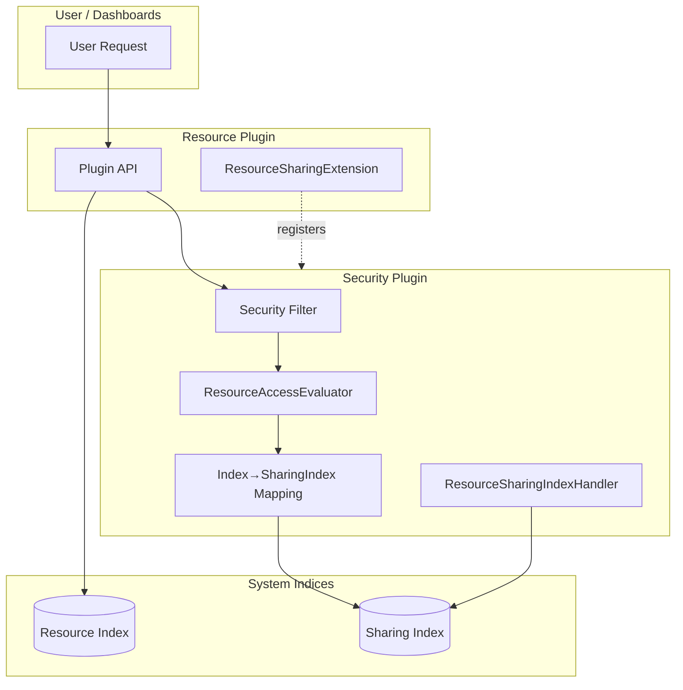

---
tags:
  - domain/security
  - component/server
  - dashboards
  - indexing
  - ml
  - security
---
# Resource Access Control Framework

## Summary

OpenSearch v3.1.0 introduces the **Resource Access Control Framework**, a centralized mechanism for managing fine-grained access control to plugin-defined resources. This framework enables document-level authorization for resources such as ML models, anomaly detectors, and reports, replacing the legacy backend-role-based access model with owner-controlled sharing capabilities.

## Details

### What's New in v3.1.0

The Resource Access Control Framework provides:

- **Centralized Resource Sharing SPI**: A new Service Provider Interface (`opensearch-security-spi`) that plugins can implement to declare themselves as resource plugins
- **1:1 Backing Sharing Indices**: Each resource index now has a dedicated sharing index (e.g., `.plugins-ml-model-group` → `.plugins-ml-model-group-sharing`)
- **Automatic Access Evaluation**: The `ResourceAccessEvaluator` automatically evaluates access permissions via the Security Filter
- **Owner-Controlled Sharing**: Resource owners can share and revoke access to their resources with specific users, roles, or backend roles

### Technical Changes

#### Architecture Changes



#### New Components

| Component | Description |
|-----------|-------------|
| `opensearch-security-spi` | Service Provider Interface for plugins to implement resource sharing |
| `ResourceSharingExtension` | Interface that plugins implement to declare resource types |
| `ResourceSharingClient` | Client API for plugins to perform access control operations |
| `ResourceAccessEvaluator` | Automatic access evaluation via Security Filter |
| `ResourceSharingIndexHandler` | Manages per-resource sharing indices |
| `ResourceIndexListener` | Listens for resource CRUD operations to maintain sharing metadata |

#### New Configuration

| Setting | Description | Default |
|---------|-------------|---------|
| `plugins.security.experimental.resource_sharing.enabled` | Enable/disable resource sharing feature | `false` |

#### API Changes

The framework introduces Java APIs for plugins:

| Method | Description |
|--------|-------------|
| `verifyResourceAccess()` | Check if current user has access to a resource |
| `share()` | Grant access to a resource for specified users/roles/backend_roles |
| `revoke()` | Remove access permissions for specified entities |
| `getAccessibleResourceIds()` | Retrieve IDs of all resources the current user can access |

### Data Model

Resource sharing information is stored in backing indices with the following structure:

```json
{
  "resource_id": "resource-123",
  "created_by": {
    "user": "owner_username"
  },
  "share_with": {
    "READ_ONLY": {
      "users": ["user1", "user2"],
      "roles": ["viewer_role"],
      "backend_roles": ["data_analyst"]
    },
    "READ_WRITE": {
      "users": ["admin_user"],
      "roles": ["editor_role"],
      "backend_roles": ["content_manager"]
    }
  }
}
```

### Access Scopes

Resources can have three access scopes:

- **Private**: No `share_with` entry exists - only owner and super-admins can access
- **Restricted**: `share_with` contains specific users/roles/backend_roles
- **Public**: `share_with` contains wildcard `*` for users/roles/backend_roles

### Usage Example

Plugin implementation to use the framework:

```java
// 1. Implement ResourceSharingExtension
public class SampleResourceExtension implements ResourceSharingExtension {
    @Override
    public Set<ResourceProvider> getResourceProviders() {
        return Set.of(new ResourceProvider(
            SampleResource.class.getCanonicalName(), 
            RESOURCE_INDEX_NAME
        ));
    }

    @Override
    public void assignResourceSharingClient(ResourceSharingClient client) {
        ResourceSharingClientAccessor.getInstance()
            .setResourceSharingClient(client);
    }
}

// 2. Register in META-INF/services
// src/main/resources/META-INF/services/org.opensearch.security.spi.ResourceSharingExtension
// org.opensearch.sample.SampleResourceExtension

// 3. Use the client for access control
resourceSharingClient.share(
    resourceId,
    RESOURCE_INDEX_NAME,
    shareWithRecipients,
    ActionListener.wrap(sharing -> {
        // Handle success
    }, listener::onFailure)
);
```

### Migration Notes

- Enable the feature flag: `plugins.security.experimental.resource_sharing.enabled: true`
- System index protection must be enabled: `plugins.security.system_indices.enabled: true`
- Plugins must declare `compileOnly` dependency on `opensearch-security-spi`
- Plugins must extend `opensearch-security` with optional flag

## Limitations

- Feature is marked as **experimental** and disabled by default
- Only resource owners and super-admins can share/revoke access
- No pattern matching for users/roles/backend_roles - each must be individually specified
- Resources must be stored in system indices with system index protection enabled

## References

### Blog Posts
- [Blog: Introducing resource sharing](https://opensearch.org/blog/introducing-resource-sharing-a-new-access-control-model-for-opensearch/): Official announcement blog

### Pull Requests
| PR | Description |
|----|-------------|
| [#5281](https://github.com/opensearch-project/security/pull/5281) | Introduces Centralized Resource Access Control Framework |
| [#5358](https://github.com/opensearch-project/security/pull/5358) | Store resource sharing info in indices that map 1-to-1 with resource index |

### Issues (Design / RFC)
- [Issue #4500](https://github.com/opensearch-project/security/issues/4500): Resource Permissions and Sharing proposal

## Related Feature Report

- [Full feature documentation](../../../features/security/security-resource-access-control-framework.md)
