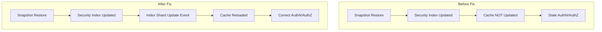

# Security Backend Bug Fixes

## Summary

OpenSearch v3.1.0 includes multiple bug fixes across the security plugin, security-dashboards-plugin, and security-analytics repositories. These fixes address critical issues including stale cache after snapshot restore, compliance audit log diff computation, DLS/FLS filter reader corrections, authentication header logging improvements, and various CI/CD workflow fixes.

## Details

### What's New in v3.1.0

This release addresses several important security-related bugs:

1. **Stale Cache Post Snapshot Restore** - Fixed an issue where the security index cache was not updated after snapshot restore, causing incorrect AuthN/AuthZ decisions
2. **Compliance Audit Log Diff Computation** - Fixed incorrect diff computation when writing to the security index
3. **DLS/FLS Filter Reader Corrections** - Fixed issues with PointValues and object-valued attributes in DlsFlsFilterLeafReader
4. **Authentication Header Logging** - Improved logging to only log invalid authorization headers when HTTP Basic auth challenge is called
5. **Password Reset UI Improvements** - Fixed page reload issue on invalid password and disabled reset button when fields are empty
6. **Forecasting Permissions** - Added forecasting transport actions to the static dropdown list
7. **Dependency Fixes** - Fixed guava dependency issues in security-analytics

### Technical Changes

#### Security Index Cache Fix

The fix adds a listener to index shard update events that triggers cache reload when the security index is updated via snapshot restore.

#### Compliance Audit Log Fix

The `ComplianceIndexingOperationListenerImpl` was incorrectly computing diffs when writing to the security index. The `getForUpdate` call was silently failing and returning an empty document, causing every update to appear as a full document creation rather than a partial change.

#### DLS/FLS Filter Reader Corrections

Fixed logic in `DlsFlsFilterLeafReader` related to field mappings based on PointValues and object-valued attributes, ensuring proper document-level and field-level security filtering.

#### Authentication Header Logging

Simplified the logic in the basic authenticator to only log "Invalid Authorization header" when:
- Request has invalid basic auth header (no header, not basic auth, or corrupted)
- There is exactly one challenging basic auth authenticator
- SAML is not configured with `challenge: true`

### Bug Fixes Summary

| Component | Issue | Fix |
|-----------|-------|-----|
| Security Plugin | Stale cache after snapshot restore | Added index shard update event listener |
| Security Plugin | Compliance audit log diff computation | Fixed `getForUpdate` to properly retrieve existing document state |
| Security Plugin | DLS/FLS PointValues handling | Corrected field mapping logic |
| Security Plugin | Invalid auth header logging | Conditional logging based on auth configuration |
| Security Dashboards | Page reload on invalid password | Prevented browser auth interceptor from triggering reload |
| Security Dashboards | Reset button enabled with empty fields | Disabled button when current/new password is empty |
| Security Analytics | Guava runtime dependency | Changed from compileOnly to implementation |

### CI/CD Fixes

| PR | Description |
|----|-------------|
| [#5331](https://github.com/opensearch-project/security/pull/5331) | Fixed dependabot changelog pull_request workflow by using pull_request_target event |
| [#5334](https://github.com/opensearch-project/security/pull/5334) | Fixed assemble workflow failure during Jenkins build by excluding sample plugin |

## Limitations

- The cache reload on snapshot restore adds a small overhead during restore operations
- The compliance audit log fix requires proper configuration of `write_log_diffs` and `write_metadata_only` settings

## References

### Pull Requests
| PR | Repository | Description |
|----|------------|-------------|
| [#5307](https://github.com/opensearch-project/security/pull/5307) | security | Fixes security index stale cache issue post snapshot restore |
| [#5279](https://github.com/opensearch-project/security/pull/5279) | security | Fixes issue computing diffs in compliance audit log |
| [#5303](https://github.com/opensearch-project/security/pull/5303) | security | Corrections in DlsFlsFilterLeafReader regarding PointValues |
| [#5377](https://github.com/opensearch-project/security/pull/5377) | security | Only log Invalid Authorization header when HTTP Basic auth challenge is called |
| [#5331](https://github.com/opensearch-project/security/pull/5331) | security | Fixes dependabot broken pull_request workflow |
| [#5334](https://github.com/opensearch-project/security/pull/5334) | security | Fixes assemble workflow failure during Jenkins build |
| [#2238](https://github.com/opensearch-project/security-dashboards-plugin/pull/2238) | security-dashboards-plugin | Prevents page reload on invalid current password |
| [#2253](https://github.com/opensearch-project/security-dashboards-plugin/pull/2253) | security-dashboards-plugin | Adds forecasting transport actions to static dropdown |
| [#1530](https://github.com/opensearch-project/security-analytics/pull/1530) | security-analytics | Switch guava deps from compileOnly to implementation |

### Issues (Design / RFC)
- [Issue #5308](https://github.com/opensearch-project/security/issues/5308): Stale cache post snapshot restore
- [Issue #5280](https://github.com/opensearch-project/security/issues/5280): Issue computing diffs in compliance audit log
- [Issue #2189](https://github.com/opensearch-project/security-dashboards-plugin/issues/2189): Page reload on invalid password

## Related Feature Report

- [Full feature documentation](../../../../features/security/security-backend.md)
