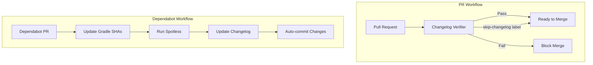

# Security CI/CD

## Summary

This release introduces automated changelog verification and Dependabot integration workflows to the OpenSearch Security plugin. These GitHub Actions workflows enforce changelog updates on every PR and automate dependency update housekeeping tasks, improving release note quality and reducing manual maintenance burden.

## Details

### What's New in v3.1.0

The Security plugin now includes two new GitHub Actions workflows:

1. **Changelog Verifier** - Enforces changelog updates on every pull request
2. **Dependabot PR Handler** - Automates SHA updates, formatting, and changelog entries for dependency PRs

### Technical Changes

#### Workflow Architecture



#### New Components

| Component | Description |
|-----------|-------------|
| `.github/workflows/changelog_verifier.yml` | Enforces changelog updates using [changelog-enforcer](https://github.com/dangoslen/changelog-enforcer) |
| `.github/workflows/dependabot_pr.yml` | Automates Dependabot PR housekeeping with SHA updates, Spotless formatting, and changelog entries |
| `CHANGELOG.md` | New changelog file following [Keep a Changelog](https://keepachangelog.com/en/1.0.0/) format |
| `CONTRIBUTING.md` | Updated with changelog contribution guidelines |

#### Changelog Verifier Workflow

Triggers on PR events: `opened`, `edited`, `review_requested`, `synchronize`, `reopened`, `ready_for_review`, `labeled`, `unlabeled`

Key features:
- Uses `dangoslen/changelog-enforcer@v3` action
- Skips verification for PRs with `autocut` or `skip-changelog` labels
- Only runs for `opensearch-project/security` repository

#### Dependabot PR Workflow

Automates three tasks for Dependabot PRs:
1. **Update Gradle SHAs** - Runs `./gradlew updateSHAs` to update dependency checksums
2. **Spotless Formatting** - Runs `./gradlew spotlessApply` for code formatting
3. **Changelog Update** - Uses `dangoslen/dependabot-changelog-helper@v4` to add entries under "Unreleased 3.x"

Uses GitHub App token for authentication to enable auto-commits.

### Usage Example

#### Adding a Changelog Entry

```markdown
## [Unreleased 3.x]
### Added
- Your new feature description ([#PR_NUMBER](https://github.com/opensearch-project/security/pull/PR_NUMBER))

### Changed
- Your change description ([#PR_NUMBER](https://github.com/opensearch-project/security/pull/PR_NUMBER))

### Fixed
- Your bug fix description ([#PR_NUMBER](https://github.com/opensearch-project/security/pull/PR_NUMBER))
```

#### Skipping Changelog Verification

For PRs that don't require changelog entries (tests, documentation, refactoring):
1. Add the `skip-changelog` label to the PR
2. The changelog verifier will pass automatically

### Migration Notes

Contributors to the Security plugin must now:
1. Update `CHANGELOG.md` with every PR (unless using `skip-changelog` label)
2. Follow the [Keep a Changelog](https://keepachangelog.com/en/1.0.0/) format
3. Reference the PR number in changelog entries

## Limitations

- Changelog verifier only runs for the `opensearch-project/security` repository
- Dependabot workflow requires GitHub App credentials (`APP_ID`, `APP_PRIVATE_KEY` secrets)
- Dependabot changelog helper targets "Unreleased 3.x" section specifically

## Related PRs

| PR | Description |
|----|-------------|
| [#5318](https://github.com/opensearch-project/security/pull/5318) | Add workflow for changelog verification |

## References

- [Issue #5095](https://github.com/opensearch-project/security/issues/5095): Add a CHANGELOG to assemble release notes as PRs are merged
- [Keep a Changelog](https://keepachangelog.com/en/1.0.0/): Changelog format specification
- [changelog-enforcer](https://github.com/dangoslen/changelog-enforcer): GitHub Action for enforcing changelog updates
- [dependabot-changelog-helper](https://github.com/dangoslen/dependabot-changelog-helper): GitHub Action for Dependabot changelog automation

## Related Feature Report

- [Full feature documentation](../../../../features/security/security-ci-cd.md)
