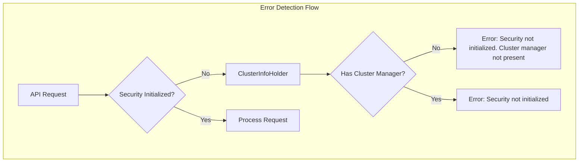

# Security Debugging

## Summary

This enhancement improves the debugging experience when encountering the "OpenSearch Security not initialized" error. Previously, this generic error message provided no context about the underlying cause. In v3.1.0, the error message now includes additional details about potential causes, starting with cluster manager availability status.

## Details

### What's New in v3.1.0

The security plugin now provides more informative error messages when security initialization fails. When the security index cannot be created during node bootup and API calls are made, users now receive contextual information about why initialization may have failed.

### Technical Changes

#### Architecture Changes



#### New Components

| Component | Description |
|-----------|-------------|
| `ClusterInfoHolder.hasClusterManager()` | New method to check if a cluster manager node is present |
| `ClusterInfoHolder.CLUSTER_MANAGER_NOT_PRESENT` | Constant for the "Cluster manager not present" message |

#### Modified Components

| Component | Change |
|-----------|--------|
| `BackendRegistry` | Now accepts `ClusterInfoHolder` to check cluster manager status during authentication |
| `SecurityFilter` | Enhanced to include cluster manager status in error messages for action filter failures |
| `PrivilegesEvaluator` | Updated `createContext()` and `evaluate()` methods to include cluster manager status in exceptions |
| `DynamicConfigFactory` | Added debug logging when config update notifications are dispatched |

### Usage Example

**Before v3.1.0:**
```bash
curl -X GET "https://localhost:9200/my-index/_search" -u admin:admin --insecure

# Response:
OpenSearch Security is not initialized
```

**After v3.1.0:**
```bash
curl -X GET "https://localhost:9200/my-index/_search" -u admin:admin --insecure

# Response (when cluster manager is missing):
OpenSearch Security is not initialized. Cluster manager not present
```

### How to Reproduce the Scenario

To test this enhanced error message, configure a node without the cluster manager role:

```yaml
# opensearch.yml
node.roles: [data, ingest]  # No master/cluster_manager role
```

When making API calls to this node before a cluster manager is elected, you'll see the enhanced error message.

### Migration Notes

No migration required. This is a backward-compatible enhancement that only affects error message content.

## Limitations

- Currently only detects missing cluster manager as a cause
- Future enhancements may add detection for other common causes of initialization failure
- The enhancement focuses on REST API and transport layer errors

## References

### Documentation
- [Security Settings Documentation](https://docs.opensearch.org/3.0/install-and-configure/configuring-opensearch/security-settings/): OpenSearch security configuration
- [PR #5370](https://github.com/opensearch-project/security/pull/5370): Main implementation

### Pull Requests
| PR | Description |
|----|-------------|
| [#5370](https://github.com/opensearch-project/security/pull/5370) | Adds details for debugging Security not initialized error |

## Related Feature Report

- [Full feature documentation](../../../../features/security/security-debugging.md)
