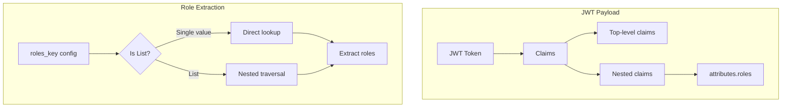

# Security JWT Enhancements

## Summary

OpenSearch v3.1.0 enhances JWT authentication by adding support for extracting backend roles from nested claims within JWT payloads. Previously, the `roles_key` configuration only supported top-level claims. This enhancement allows administrators to configure a path to roles stored in nested JSON structures, improving compatibility with identity providers that use complex JWT claim structures.

## Details

### What's New in v3.1.0

The `roles_key` configuration parameter for JWT authentication backends now accepts a list of strings to specify a path through nested JSON objects to reach the roles claim.

### Technical Changes

#### Configuration Change

The `roles_key` setting now supports two formats:

| Format | Example | Description |
|--------|---------|-------------|
| Simple (existing) | `roles_key: "roles"` | Extracts roles from top-level claim |
| Nested (new) | `roles_key: ["attributes", "roles"]` | Traverses nested objects to extract roles |

#### Architecture Changes



#### Implementation Details

The following classes were modified to support nested claim traversal:

| Component | Description |
|-----------|-------------|
| `AbstractHTTPJwtAuthenticator` | Base class for JWT authenticators - updated `extractRoles()` method |
| `HTTPJwtAuthenticator` | HTTP JWT authenticator - updated role extraction logic |

The `extractRoles()` method now iterates through the `roles_key` list, traversing nested Map objects until reaching the final key containing the roles value.

### Usage Example

**JWT Payload with nested roles:**
```json
{
  "sub": "user@example.com",
  "attributes": {
    "roles": "admin,developer"
  }
}
```

**Configuration in config.yml:**
```yaml
jwt_auth_domain:
  http_enabled: true
  transport_enabled: true
  order: 0
  http_authenticator:
    type: jwt
    challenge: false
    config:
      signing_key: "base64 encoded key"
      jwt_header: "Authorization"
      subject_key: null
      roles_key:
        - "attributes"
        - "roles"
  authentication_backend:
    type: noop
```

### Migration Notes

- Existing configurations using a single string for `roles_key` continue to work without changes
- To use nested claims, change `roles_key` from a string to a list of strings representing the path
- The feature works with all JWT-backed authentication backends (JWT, OpenID Connect)

## Limitations

- The nested path must consist of JSON objects (Maps) at each level except the final value
- If any intermediate key is missing or not a Map, role extraction fails gracefully with an empty role set
- The final value must be either a comma-separated string or a Collection of strings

## References

### Documentation
- [JWT Authentication Documentation](https://docs.opensearch.org/3.0/security/authentication-backends/jwt/): Official JWT configuration docs

### Pull Requests
| PR | Description |
|----|-------------|
| [#5355](https://github.com/opensearch-project/security/pull/5355) | Handle roles in nested claim for JWT auth backends |

### Issues (Design / RFC)
- [Issue #5343](https://github.com/opensearch-project/security/issues/5343): Original feature request

## Related Feature Report

- [Full feature documentation](../../../../features/security/jwt-authentication.md)
