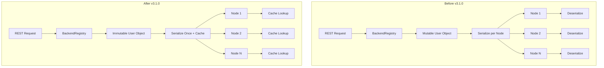

# Security Performance Improvements

## Summary

OpenSearch 3.1.0 introduces significant performance improvements to the security layer through an immutable User object implementation. This optimization reduces serialization overhead during inter-node communication, resulting in improved throughput for clusters with users having many roles and attributes.

## Details

### What's New in v3.1.0

The User object has been redesigned to be immutable, enabling several performance optimizations:

1. **Serialization Reuse**: Serialized binary data can be computed once and reused across multiple requests
2. **Deserialization Caching**: A cache maps serialized binary data to User objects, reducing deserialization operations
3. **Thread Safety**: Immutable objects are inherently thread-safe, eliminating synchronization overhead
4. **Reduced Memory Churn**: Fewer object allocations during request processing

### Technical Changes

#### Architecture Changes



#### New Components

| Component | Description |
|-----------|-------------|
| `UserFactory` | Factory for creating and deserializing User objects |
| `UserFactory.Caching` | Caching implementation that maps serialized data to User objects |
| `UserFactory.Simple` | Non-caching implementation for testing |
| `AuthenticationContext` | Context object for passing data between auth backends |
| `ImpersonationBackend` | New interface for user impersonation support |

#### New Configuration

| Setting | Description | Default |
|---------|-------------|---------|
| `plugins.security.user_cache.max_size` | Maximum number of cached User objects | 10000 |
| `plugins.security.user_cache.expire_after_access` | Cache entry expiration time | 1h |

#### API Changes

The `User` class now uses immutable builder-style methods:

```java
// Old mutable API (deprecated)
User user = new User("username");
user.addRoles(roles);
user.addAttributes(attributes);

// New immutable API
User user = new User("username")
    .withRoles(roles)
    .withAttributes(attributes)
    .withSecurityRoles(securityRoles);
```

The `AuthenticationBackend` interface signature changed:

```java
// Old signature
User authenticate(AuthCredentials credentials);
boolean exists(User user);

// New signature
User authenticate(AuthenticationContext context);
```

The `AuthorizationBackend` interface now returns a new User object:

```java
// Old signature
void fillRoles(User user, AuthCredentials credentials);

// New signature
User addRoles(User user, AuthenticationContext context);
```

### Performance Benchmarks

Based on benchmarks from the PR, users with many attributes see significant improvements:

| User Attributes | Throughput Improvement |
|-----------------|------------------------|
| 10 attributes | 21% |
| 100 attributes | 39% |

### Migration Notes

- Custom `AuthenticationBackend` implementations must be updated to use the new `AuthenticationContext` parameter
- Custom `AuthorizationBackend` implementations must return a new User object instead of modifying the input
- The `LdapUser` class is now only used for deserialization compatibility; new code should use the standard `User` class

## Limitations

- The caching mechanism adds memory overhead proportional to the number of unique users
- Custom authentication backends require code changes to support the new API

## References

### Blog Posts
- [Blog: Performance optimizations for the OpenSearch security layer](https://opensearch.org/blog/performance-optimizations-for-the-opensearch-security-layer/)

### Pull Requests
| PR | Description |
|----|-------------|
| [#5339](https://github.com/opensearch-project/security/pull/5339) | Remove support for unused custom User serialization |
| [#5212](https://github.com/opensearch-project/security/pull/5212) | Immutable user object |

### Issues (Design / RFC)
- [Issue #5168](https://github.com/opensearch-project/security/issues/5168): Make User object immutable
- [Issue #5200](https://github.com/opensearch-project/security/issues/5200): When to retire serialization backward compat code

## Related Feature Report

- [Full feature documentation](../../../../features/security/security-performance-improvements.md)
