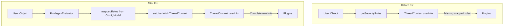

---
tags:
  - domain/security
  - component/server
  - security
---
# Security Role Mapping

## Summary

This enhancement fixes an issue where mapped roles were not being included when setting user information in the ThreadContext. After PR #5212 made the User object immutable, the code that temporarily added mapped roles before setting userInfo was inadvertently removed. This fix ensures that plugins like Anomaly Detection and SAP that rely on the ThreadContext user information can correctly access the user's mapped security roles.

## Details

### What's New in v3.1.0

The `setUserInfoInThreadContext` method now explicitly receives and uses the mapped roles instead of relying on `user.getSecurityRoles()`, which no longer contains the dynamically mapped roles after the User object became immutable.

### Technical Changes

#### Architecture Changes



#### Code Changes

| Component | Change |
|-----------|--------|
| `PrivilegesEvaluator.java` | Modified `setUserInfoInThreadContext` to accept `Set<String> mappedRoles` parameter |
| `PrivilegesEvaluator.java` | Updated call site to pass `mappedRoles` from the evaluation context |

#### Method Signature Change

```java
// Before
private void setUserInfoInThreadContext(User user)

// After  
private void setUserInfoInThreadContext(User user, Set<String> mappedRoles)
```

### Usage Example

The ThreadContext user info format remains unchanged:

```
username|backend_roles|mapped_roles|requested_tenant
```

Where `mapped_roles` now correctly contains the roles resolved through `roles_mapping.yml` or the REST API, rather than only the roles stored directly on the User object.

### Migration Notes

No migration required. This is a bug fix that restores expected behavior for plugins relying on ThreadContext user information.

## Limitations

- This fix specifically addresses the regression introduced by the immutable User object change in PR #5212
- The underlying role mapping configuration and resolution logic remains unchanged

## References

### Documentation
- [Defining users and roles](https://docs.opensearch.org/3.0/security/access-control/users-roles/): Official documentation on role mapping
- [PR #5369](https://github.com/opensearch-project/security/pull/5369): Main implementation
- [PR #5212](https://github.com/opensearch-project/security/pull/5212): Related immutable user object change

### Pull Requests
| PR | Description |
|----|-------------|
| [#5369](https://github.com/opensearch-project/security/pull/5369) | Include mapped roles when setting userInfo in ThreadContext |
| [#5212](https://github.com/opensearch-project/security/pull/5212) | Immutable user object (introduced the regression) |

## Related Feature Report

- Full feature documentation
