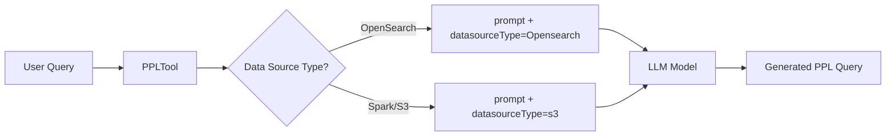

---
tags:
  - indexing
  - ml
  - search
  - sql
---

# ML Skills Text2Spark PPL

## Summary

This release adds data source type information to the PPL tool's request body when communicating with the target model endpoint. The enhancement enables the LLM model to understand the data source context (e.g., OpenSearch vs Spark) and generate appropriate PPL queries accordingly.

## Details

### What's New in v3.1.0

The PPLTool now includes a `datasourceType` parameter in the request sent to the LLM model. This allows the model to differentiate between OpenSearch and Spark data sources and generate PPL queries with the correct syntax and functions for each platform.

### Technical Changes

#### Code Change

The change modifies how the PPLTool constructs the input data for the remote inference request:

**Before:**
```java
RemoteInferenceInputDataSet inputDataSet = RemoteInferenceInputDataSet
    .builder()
    .parameters(Collections.singletonMap("prompt", prompt))
    .build();
```

**After:**
```java
RemoteInferenceInputDataSet inputDataSet = RemoteInferenceInputDataSet
    .builder()
    .parameters(Map.of("prompt", prompt, "datasourceType", parameters.getOrDefault("type", "Opensearch")))
    .build();
```

#### New Parameter

| Parameter | Description | Default |
|-----------|-------------|---------|
| `datasourceType` | Indicates the type of data source being queried | `Opensearch` |

The `datasourceType` value is extracted from the `type` parameter in the tool's input parameters. If not specified, it defaults to `"Opensearch"`.

### Data Flow



### Usage Example

When using the PPLTool with a Spark data source:

```json
{
  "type": "PPLTool",
  "parameters": {
    "model_id": "<llm_model_id>",
    "index": "my-spark-table",
    "question": "Show me the top 10 records",
    "type": "s3"
  }
}
```

The LLM model receives:
```json
{
  "prompt": "...",
  "datasourceType": "s3"
}
```

This enables the model to generate Spark-compatible PPL syntax when needed.

### Backward Compatibility

This change is backward compatible:
- The `datasourceType` parameter defaults to `"Opensearch"` if not specified
- Existing PPLTool configurations continue to work without modification
- Models that don't use the `datasourceType` parameter can ignore it

## Limitations

- The model must be trained or prompted to understand and utilize the `datasourceType` parameter
- Only two data source types are currently supported: `Opensearch` (default) and `s3` (Spark)

## References

### Documentation
- [PPL Tool Documentation](https://docs.opensearch.org/3.0/ml-commons-plugin/agents-tools/tools/ppl-tool/): Official PPL tool reference
- [Skills Repository](https://github.com/opensearch-project/skills): Source code

### Pull Requests
| PR | Description |
|----|-------------|
| [#587](https://github.com/opensearch-project/skills/pull/587) | Add data source type in the request body from PPL tool to model endpoint |

## Related Feature Report

- [Full feature documentation](../../../../features/skills/skills-tools.md)
