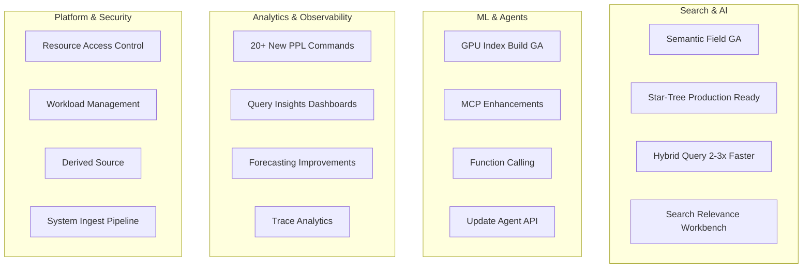

---
tags:
  - dashboards
  - indexing
  - ml
  - neural-search
  - observability
  - performance
  - search
  - security
  - sql
---

# OpenSearch v3.1.0 Release Summary

## Summary

OpenSearch 3.1.0 delivers significant advancements across search, AI/ML, observability, and performance. Key highlights include the GA release of the semantic field type for simplified semantic search, production-ready star-tree indexes with up to 100x aggregation speedup, GPU-accelerated vector index builds, and a new Search Relevance Workbench for tuning search quality. The release also introduces the Resource Access Control Framework for fine-grained plugin resource sharing, major PPL/SQL enhancements with 20+ new commands, and comprehensive improvements to the ML Commons Agent Framework including function calling support.

## Highlights

## New Features

| Feature | Description | Report |
|---------|-------------|--------|
| Semantic Field | GA release with automatic embedding generation, chunking, and search analyzers | [Details](features/neural-search/neural-search-semantic-field.md) |
| Star-Tree Index | Production-ready with date range queries and nested aggregations | [Details](features/opensearch/opensearch-star-tree-index.md) |
| Search Relevance Workbench | Experimental toolkit for search algorithm comparison and quality evaluation | [Details](features/search-relevance/search-relevance-workbench.md) |
| Resource Access Control Framework | Centralized plugin resource sharing with owner-controlled access | [Details](features/security/security-resource-access-control-framework.md) |
| System Ingest Pipeline | Automatic pipeline generation for plugin developers | [Details](features/opensearch/opensearch-system-ingest-pipeline.md) |
| Derived Source | Storage optimization by reconstructing _source from doc_values | [Details](features/opensearch/opensearch-derived-source.md) |
| QAT-Accelerated Zstandard | Hardware-accelerated compression using Intel QAT | [Details](features/custom-codecs/qat-accelerated-zstandard-compression.md) |
| Hybrid Query Collapse | Document grouping and deduplication in hybrid queries | [Details](features/neural-search/hybrid-query-collapse.md) |
| Live Queries Dashboard | Real-time query monitoring with cancellation support | [Details](features/query-insights/query-insights-enhancements.md) |
| Workload Management Dashboard | Full WLM UI for query group management | [Details](features/query-insights/query-insights-enhancements.md) |

## Improvements

| Area | Description | Report |
|------|-------------|--------|
| Hybrid Query Performance | 2-3x faster with custom bulk scorer | [Details](features/neural-search/hybrid-query-collapse.md) |
| GPU Vector Index Build | Production-ready with tuned buffer sizes and segment size limits | [Details](features/k-nn/k-nn-remote-vector-index-build.md) |
| PPL/SQL Calcite Engine | 15+ new commands including eventstats, flatten, expand, grok | [Details](features/sql/sql-ppl-calcite-engine.md) |
| ML Commons Agent Framework | Update Agent API, function calling, MCP tools persistence | [Details](features/ml-commons/ml-commons-agent-framework.md) |
| Pull-based Ingestion | Lag metrics, error metrics, consumer reset, write block support | [Details](features/opensearch/opensearch-pull-based-ingestion.md) |
| Warm Storage Tiering | WarmDiskThresholdDecider and AutoForceMergeManager | [Details](features/opensearch/opensearch-warm-storage-tiering.md) |
| Security Performance | Immutable User object reduces serialization overhead | [Details](features/security/security-performance-improvements.md) |
| gRPC Transport | 5-11% latency improvement with pass-by-reference optimization | [Details](features/opensearch/grpc-transport.md) |
| Query Insights | Metric labels, index exclusion, async operations | [Details](features/query-insights/query-insights-enhancements.md) |
| Percentiles Aggregation | Up to 30x performance improvement with MergingDigest | [Details](features/opensearch/opensearch-percentiles-aggregation.md) |

## Bug Fixes

| Fix | Description | PR |
|-----|-------------|-----|
| Forecasting Task State | Fix incorrect state handling in ForecastRunOnceTransportAction | [#1489](https://github.com/opensearch-project/anomaly-detection/pull/1489) |
| k-NN Quantization Cache | Fix invalid weight threshold in quantization state cache | [#2666](https://github.com/opensearch-project/k-NN/pull/2666) |
| Hybrid Query Validation | Add validation for invalid nested hybrid queries | [#1305](https://github.com/opensearch-project/neural-search/pull/1305) |
| Security Index Cache | Fix stale cache issue post snapshot restore | [#5307](https://github.com/opensearch-project/security/pull/5307) |
| SQL Long IN-lists | Fix crash caused by long IN-lists | [#3660](https://github.com/opensearch-project/sql/pull/3660) |
| IP2Geo Cache | Reset datasource metadata on update failure | [#761](https://github.com/opensearch-project/geospatial/pull/761) |
| Doc-level Monitor | Timebox execution and prevent dry run with index patterns | [#1850](https://github.com/opensearch-project/alerting/pull/1850) |
| MCP Python Client | Fix connection issues to MCP server | [#3822](https://github.com/opensearch-project/ml-commons/pull/3822) |
| Neural Radial Search | Fix serialization in multi-node clusters | [#1393](https://github.com/opensearch-project/neural-search/pull/1393) |

## Breaking Changes

| Change | Migration | Report |
|--------|-----------|--------|
| Pull-based Ingestion Reset API | Rename `rewind_by_offset` → `reset_by_offset`, `rewind_by_timestamp` → `reset_by_timestamp` | [Details](features/opensearch/opensearch-pull-based-ingestion.md) |
| Remote Vector Index Build Settings | Update setting names from feature flag pattern to GA naming | [Details](features/k-nn/k-nn-remote-vector-index-build.md) |
| Query Insights Grouping Settings | Move to `search.insights.top_queries.grouping.*` namespace | [Details](features/query-insights/query-insights-enhancements.md) |

## Experimental Features

| Feature | Description | Report |
|---------|-------------|--------|
| Resource Access Control | Centralized authorization framework for plugin resources | [Details](features/security/security-resource-access-control-framework.md) |
| MCP Tools Persistence | Store MCP tools in system index with update/list APIs | [Details](features/ml-commons/ml-commons-agent-framework.md) |
| Search Relevance Workbench | Search algorithm comparison and quality evaluation toolkit | [Details](features/search-relevance/search-relevance-workbench.md) |

## Dependencies

Notable dependency updates in this release:

- **Lucene**: 10.1.0 → 10.2.1
- **Bouncy Castle**: 1.80 → 1.81
- **Kafka**: 3.7.1 → 4.0.0
- **MCP SDK**: 0.10.0-SNAPSHOT → 0.9.0 (official release)
- **CVE-2025-27820**: Fixed in Apache HttpClient (opensearch-remote-metadata-sdk)
- **CVE-2024-52798**: Fixed in security-dashboards-plugin dev dependencies

## References

- [Official Release Notes](https://github.com/opensearch-project/opensearch-build/blob/main/release-notes/opensearch-release-notes-3.1.0.md)
- [OpenSearch 3.1.0 Downloads](https://opensearch.org/artifacts/by-version/#release-3-1-0)
- [OpenSearch Core Release Notes](https://github.com/opensearch-project/OpenSearch/blob/main/release-notes/opensearch.release-notes-3.1.0.md)
- [OpenSearch Dashboards Release Notes](https://github.com/opensearch-project/OpenSearch-Dashboards/blob/main/release-notes/opensearch-dashboards.release-notes-3.1.0.md)
- [Feature Reports](features/)
