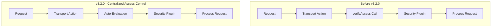
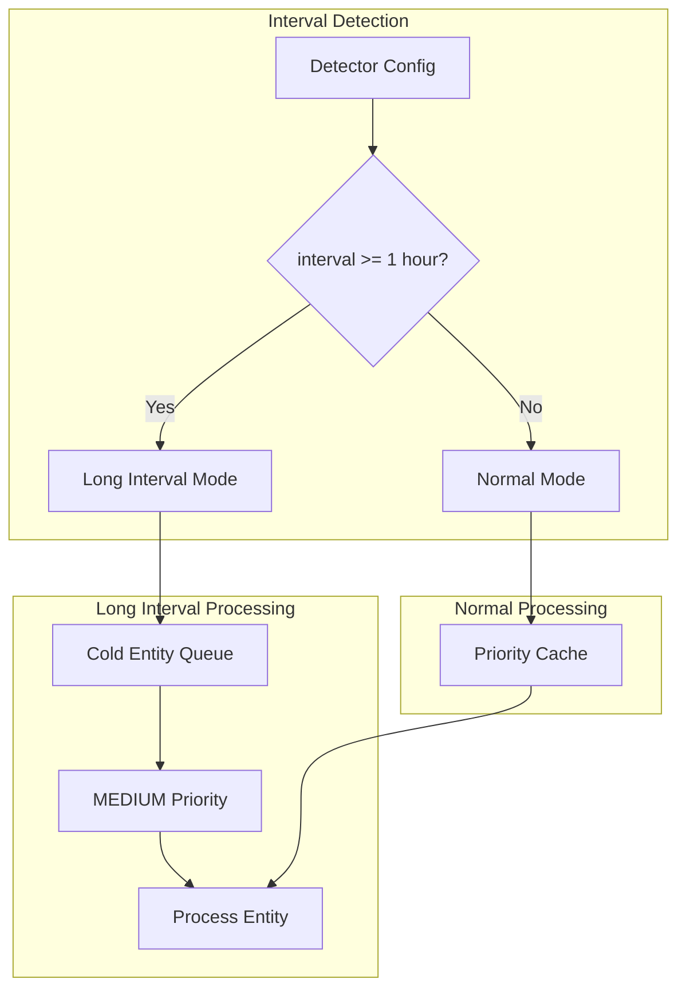

# Anomaly Detection Enhancements

## Summary

OpenSearch v3.2.0 introduces two significant enhancements to the Anomaly Detection plugin: support for detection intervals exceeding one hour (enabling daily and weekly anomaly detection) and integration with centralized resource access control for improved security management.

## Details

### What's New in v3.2.0

#### Long Interval Support (>1 Hour)

Previously, anomaly detection was limited to intervals of one hour or less. This release removes that limitation, enabling detection intervals of days or weeks for use cases like:

- Daily business metrics monitoring
- Weekly trend analysis
- Long-term pattern detection

#### Centralized Resource Access Control

The plugin now integrates with OpenSearch's centralized resource access control framework, replacing manual `verifyAccess` calls with automatic security plugin evaluation. This provides:

- Consistent access control across plugins
- Simplified security management
- Reduced code complexity in transport actions

### Technical Changes

#### Architecture Changes



#### Long Interval Processing Flow



#### New Components

| Component | Description |
|-----------|-------------|
| `isLongInterval()` | Method in `Config.java` to detect intervals >= 1 hour |
| Cold Entity Queue | Queue for processing long-interval entities with MEDIUM priority |
| Adaptive Interval Algorithm | New "zoom-in/zoom-out" algorithm for Suggest and Validate APIs |
| `DocRequest` Interface | Interface implemented by request classes for centralized access control |

#### Configuration Changes

| Setting | Description | Change |
|---------|-------------|--------|
| `detection_interval` | Time between detection runs | Now supports intervals > 1 hour |
| Resource access | Access control for detectors/forecasters | Now uses centralized auto-evaluation |

#### API Changes

The Suggest and Validate APIs now use an adaptive interval detection algorithm:

- **Before**: Median-based interval calculation
- **After**: "Zoom-in/zoom-out" algorithm that adapts to data patterns

### Usage Example

#### Create a Daily Detector

```json
POST _plugins/_anomaly_detection/detectors
{
  "name": "daily-sales-detector",
  "description": "Detect daily sales anomalies",
  "time_field": "timestamp",
  "indices": ["sales-*"],
  "feature_attributes": [
    {
      "feature_name": "total_sales",
      "feature_enabled": true,
      "aggregation_query": {
        "total_sales": {
          "sum": {
            "field": "amount"
          }
        }
      }
    }
  ],
  "detection_interval": {
    "period": {
      "interval": 1,
      "unit": "Days"
    }
  }
}
```

#### Create a Weekly Detector

```json
POST _plugins/_anomaly_detection/detectors
{
  "name": "weekly-traffic-detector",
  "description": "Detect weekly traffic pattern anomalies",
  "time_field": "timestamp",
  "indices": ["web-traffic-*"],
  "feature_attributes": [
    {
      "feature_name": "page_views",
      "feature_enabled": true,
      "aggregation_query": {
        "page_views": {
          "sum": {
            "field": "views"
          }
        }
      }
    }
  ],
  "detection_interval": {
    "period": {
      "interval": 7,
      "unit": "Days"
    }
  }
}
```

### Migration Notes

#### Long Interval Detectors

- Existing detectors with intervals <= 1 hour continue to work unchanged
- New detectors can specify intervals > 1 hour using the same API
- Long-interval entities are processed via cold entity queue instead of cache

#### Resource Access Control

- No API changes required for existing integrations
- Access control is now handled automatically by the security plugin
- Manual `verifyAccess` calls in custom code should be removed

## Limitations

- Long-interval detectors require more historical data for model training (shingle_size × detection_interval)
- Cold entity queue processing may have different latency characteristics than cached entities
- Centralized access control requires the security plugin to be enabled

## Related PRs

| PR | Description |
|----|-------------|
| [#1513](https://github.com/opensearch-project/anomaly-detection/pull/1513) | Support >1 hr intervals |
| [#1533](https://github.com/opensearch-project/anomaly-detection/pull/1533) | Onboards to centralized resource access control for detectors and forecasters |
| [#1400](https://github.com/opensearch-project/anomaly-detection/pull/1400) | Original resource permissions implementation (refactored by #1533) |

## References

- [Issue #1054](https://github.com/tkykenmt/opensearch-feature-explorer/issues/1054): Anomaly Detection Enhancements tracking issue
- [Anomaly Detection Documentation](https://docs.opensearch.org/3.0/observing-your-data/ad/index/): Official documentation
- [Anomaly Detection API](https://docs.opensearch.org/3.0/observing-your-data/ad/api/): API reference
- [Anomaly Detection Security](https://docs.opensearch.org/3.0/observing-your-data/ad/security/): Security configuration

## Related Feature Report

- [Full feature documentation](../../../../features/anomaly-detection/anomaly-detection.md)
