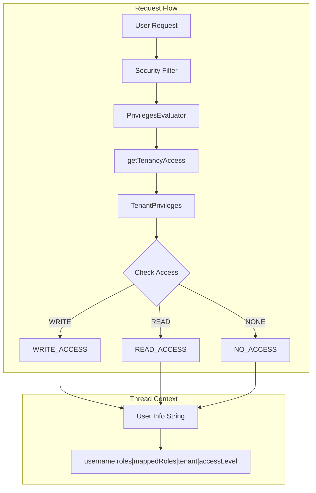

# Tenancy Access Control

## Summary

This enhancement adds tenancy access level information to the serialized user context in the thread context. When a user makes a request to OpenSearch, the security plugin now includes their access level (READ, WRITE, or NONE) for the requested tenant, enabling downstream components to make authorization decisions based on tenant permissions.

## Details

### What's New in v3.2.0

The security plugin now serializes the user's tenancy access level into the thread context alongside existing user information. This provides a standardized way for other components to determine what level of access a user has to a specific tenant without needing to re-evaluate permissions.

### Technical Changes

#### Architecture Changes



#### New Components

| Component | Description |
|-----------|-------------|
| `getTenancyAccess()` | New method in `PrivilegesEvaluator` that determines user's access level to the requested tenant |
| Access Level Constants | `READ_ACCESS`, `WRITE_ACCESS`, `NO_ACCESS` constants for standardized access levels |
| Tenant Constants | `USER_TENANT` (`__user__`) and `GLOBAL_TENANT` (`global_tenant`) for special tenant handling |

#### Thread Context Format Change

The user info string in thread context now includes two additional fields:

| Field | Position | Description |
|-------|----------|-------------|
| Username | 1 | User's name (escaped) |
| Roles | 2 | Comma-separated backend roles |
| Mapped Roles | 3 | Comma-separated security roles |
| Requested Tenant | 4 | The tenant being accessed |
| Access Level | 5 | `READ`, `WRITE`, or `NONE` |

**Before v3.2.0:**
```
username|role1,role2|mappedRole1,mappedRole2|tenantName
```

**After v3.2.0:**
```
username|role1,role2|mappedRole1,mappedRole2|tenantName|WRITE
```

### Access Level Determination

The access level is determined by checking tenant privileges in order:

1. **WRITE** - User has write access to the tenant (can save objects)
2. **READ** - User has read-only access to the tenant (can view objects)
3. **NONE** - User has no access to the tenant

If no tenant is specified in the request, the global tenant is used as the default.

### Usage Example

Downstream components can parse the user info from thread context:

```java
String userInfo = threadContext.getTransient(OPENDISTRO_SECURITY_USER_INFO_THREAD_CONTEXT);
String[] parts = userInfo.split("\\|");
String username = parts[0];
String roles = parts[1];
String mappedRoles = parts[2];
String requestedTenant = parts[3];
String accessLevel = parts[4];  // "READ", "WRITE", or "NONE"

if ("WRITE".equals(accessLevel)) {
    // User can modify saved objects in this tenant
} else if ("READ".equals(accessLevel)) {
    // User can only view saved objects
} else {
    // User has no access to this tenant
}
```

## Limitations

- The access level is determined at request time and cached in thread context
- Changes to tenant permissions during a long-running request won't be reflected
- The format change may affect components that parse the user info string with strict field expectations

## References

### Documentation
- [OpenSearch Dashboards multi-tenancy](https://docs.opensearch.org/3.0/security/multi-tenancy/tenant-index/): Multi-tenancy overview
- [Multi-tenancy configuration](https://docs.opensearch.org/3.0/security/multi-tenancy/multi-tenancy-config/): Configuration guide

### Pull Requests
| PR | Description |
|----|-------------|
| [#5519](https://github.com/opensearch-project/security/pull/5519) | Add tenancy access info to serialized user in threadcontext |
| [#5520](https://github.com/opensearch-project/security/pull/5520) | Backport to 2.19 branch |

## Related Feature Report

- [Full feature documentation](../../../../features/security/multi-tenancy.md)
