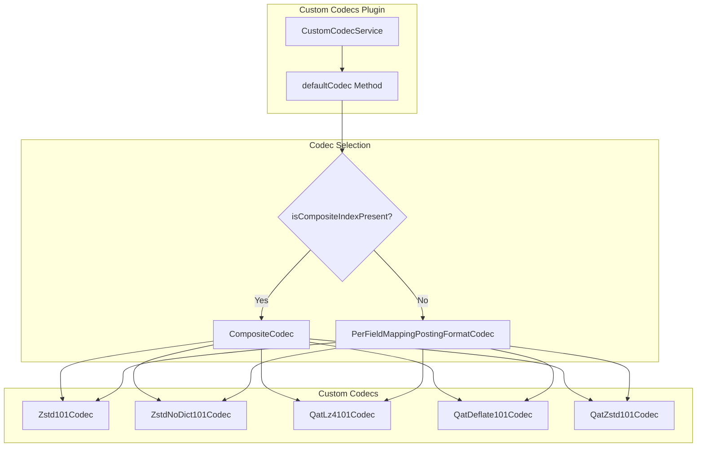

---
tags:
  - domain/data
  - component/server
  - indexing
  - performance
---
# Composite Index Support

## Summary

This release adds support for composite indexes (star-tree indexes) in the custom-codecs plugin. Previously, custom codecs always delegated to `PerFieldMappingPostingFormatCodec`, which didn't support composite index features. Now, when an index has composite field mappings (such as star-tree indexes), the custom codecs properly delegate to `CompositeCodec`, enabling users to combine custom compression algorithms with star-tree index functionality.

## Details

### What's New in v3.2.0

The custom-codecs plugin now dynamically selects the appropriate delegate codec based on whether the index contains composite fields:

- **Without composite fields**: Delegates to `PerFieldMappingPostingFormatCodec` (existing behavior)
- **With composite fields**: Delegates to `CompositeCodec` (new behavior)

This change enables users to use ZSTD compression or QAT hardware-accelerated compression on indexes that also leverage star-tree indexing for aggregation performance.

### Technical Changes

#### Architecture Changes



#### New Components

| Component | Description |
|-----------|-------------|
| `defaultCodec()` method | New method in `CustomCodecService` that returns the appropriate delegate codec based on mapper service state |
| `Supplier<Codec>` parameter | New constructor parameter in all codec classes to receive the default codec supplier |

#### API Changes

The codec constructors have been refactored to accept a `Supplier<Codec>` instead of `MapperService` and `Logger`:

**Before (v3.1.0):**
```java
public Zstd101Codec(MapperService mapperService, Logger logger, int compressionLevel)
```

**After (v3.2.0):**
```java
public Zstd101Codec(int compressionLevel, Supplier<Codec> defaultCodecSupplier)
```

This change applies to all custom codec classes:
- `Zstd101Codec`
- `ZstdNoDict101Codec`
- `QatLz4101Codec`
- `QatDeflate101Codec`
- `QatZstd101Codec`
- `Lucene101CustomCodec`
- `Lucene101QatCodec`

### Usage Example

Create an index with both star-tree indexing and ZSTD compression:

```json
PUT /logs-with-startree
{
  "settings": {
    "index": {
      "codec": "zstd",
      "codec.compression_level": 3,
      "number_of_shards": 1,
      "number_of_replicas": 0,
      "composite_index": true,
      "append_only.enabled": true
    }
  },
  "mappings": {
    "composite": {
      "request_aggs": {
        "type": "star_tree",
        "config": {
          "date_dimension": {
            "name": "@timestamp",
            "calendar_intervals": ["day", "hour"]
          },
          "ordered_dimensions": [
            { "name": "status" },
            { "name": "method" }
          ],
          "metrics": [
            { "name": "response_time", "stats": ["avg", "sum"] }
          ]
        }
      }
    },
    "properties": {
      "@timestamp": { "type": "date" },
      "status": { "type": "integer" },
      "method": { "type": "keyword" },
      "response_time": { "type": "long" }
    }
  }
}
```

### Migration Notes

This is a transparent enhancement. Existing indexes using custom codecs will continue to work without changes. New indexes with composite field mappings will automatically benefit from proper codec delegation.

## Limitations

- The composite index support inherits all limitations of star-tree indexes (append-only, specific query/aggregation support)
- ZSTD codecs still cannot be used with k-NN or Security Analytics indexes

## References

### Documentation
- [Star-tree Index Documentation](https://docs.opensearch.org/3.2/search-plugins/star-tree-index/): Official star-tree index documentation
- [Index Codecs Documentation](https://docs.opensearch.org/3.2/im-plugin/index-codecs/): Custom codecs documentation

### Pull Requests
| PR | Description |
|----|-------------|
| [#263](https://github.com/opensearch-project/custom-codecs/pull/263) | Adding support for composite index |

### Issues (Design / RFC)
- [Issue #209](https://github.com/opensearch-project/custom-codecs/issues/209): Feature request for composite codec support

## Related Feature Report

- [Full feature documentation](../../../features/custom-codecs/custom-codecs.md)
