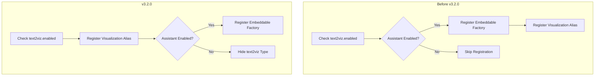

---
tags:
  - dashboards
---

# Dashboards Assistant

## Summary

This enhancement updates the dashboards-assistant plugin to support natural language visualization in the new dashboard ingress (Explore UI). The change ensures that the text-to-visualization feature is properly integrated with the new Explore interface while maintaining backward compatibility with the classic visualization workflow.

## Details

### What's New in v3.2.0

The text-to-visualization alias registration has been restructured to support both the classic visualization workflow and the new Explore UI:

1. **Always-registered visualization alias**: The `text2viz` visualization alias is now registered unconditionally when `text2viz.enabled` is true, allowing it to appear in the Explore UI
2. **Classic mode flag**: Added `isClassic: true` to the alias registration to indicate compatibility with the classic visualization workflow
3. **Conditional embeddable registration**: The embeddable factory is only registered when the assistant capability is enabled
4. **Graceful degradation**: When assistant is disabled, the text2viz type is hidden from the create visualization modal

### Technical Changes

#### Registration Flow Changes

#### New Configuration

| Setting | Description | Default |
|---------|-------------|---------|
| `isClassic` | Marks the visualization alias as compatible with classic workflow | `true` |

#### Behavior Changes

| Scenario | Before | After |
|----------|--------|-------|
| text2viz enabled, assistant enabled | Alias + Embeddable registered | Alias + Embeddable registered |
| text2viz enabled, assistant disabled | Nothing registered | Alias registered, type hidden |
| text2viz disabled | Nothing registered | Nothing registered |

### Usage Example

The natural language visualization option now appears in the Explore UI when enabled:

1. Navigate to Explore in OpenSearch Dashboards
2. Select "Natural language" from the visualization options
3. Enter a natural language question to generate a visualization

When assistant is disabled but text2viz is enabled, the visualization type is hidden from the modal to prevent user confusion.

### Migration Notes

No migration required. The change is backward compatible with existing configurations.

## Limitations

- The text-to-visualization feature still requires the assistant capability to be enabled for full functionality
- When assistant is disabled, saved NLQ visualizations cannot be rendered even though the alias is registered

## References

### Documentation
- [Documentation](https://docs.opensearch.org/3.0/dashboards/dashboards-assistant/text-to-visualization/): Text to visualization documentation

### Pull Requests
| PR | Description |
|----|-------------|
| [#589](https://github.com/opensearch-project/dashboards-assistant/pull/589) | Update dashboards-assistant for new dashboard ingress support |

## Related Feature Report

- [Full feature documentation](../../../../features/dashboards-assistant/text-to-visualization.md)
