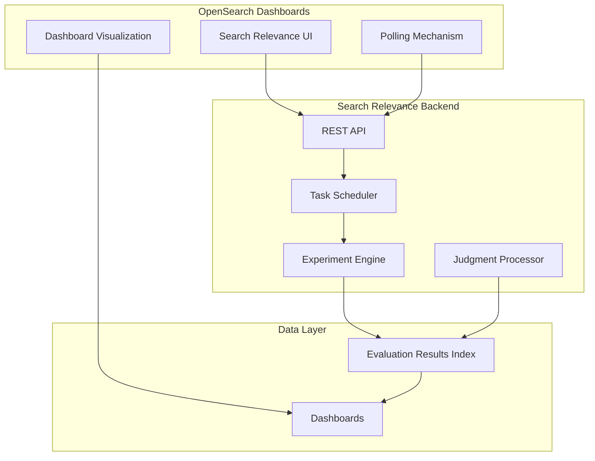

---
tags:
  - dashboards
  - indexing
  - performance
  - search
---

# Search Relevance Workbench

## Summary

OpenSearch v3.2.0 brings significant enhancements to the Search Relevance Workbench, including a new default UI interface, dashboard visualization for experiment results, automatic status polling, date filtering for implicit judgments, and improved task scheduling for experiments. These changes make the workbench more user-friendly and powerful for search relevance engineers.

## Details

### What's New in v3.2.0

This release focuses on three major areas:
1. **New Default UI**: The Search Relevance Workbench interface is now the default, with an opt-out option for the legacy UI
2. **Dashboard Visualization**: Experiment results can now be visualized directly in OpenSearch Dashboards
3. **UX Improvements**: Polling mechanisms, date filtering, and better experiment management

### Technical Changes

#### Architecture Changes



#### New Components

| Component | Description |
|-----------|-------------|
| Dashboard Visualization | Links to dashboards showing evaluation and hybrid experiment results |
| Polling Mechanism | Auto-refreshes experiment and judgment status every 15 seconds |
| Date Filter UI | Date picker fields for implicit judgment date range filtering |
| Task Scheduler | Queue-based task management for hybrid optimizer and pointwise experiments |

#### New Configuration

| Setting | Description | Default |
|---------|-------------|---------|
| `searchRelevance.workbench.enabled` | Enable new SRW interface | `true` |
| Polling interval | Status refresh interval | 15 seconds |
| Polling timeout | Maximum polling duration | 10 minutes |

#### API Changes

New fields added to `search-relevance-evaluation-result` index:

| Field | Description |
|-------|-------------|
| `experimentId` | Links results to parent experiment |
| `experimentVariantId` | Identifies hybrid experiment variant |
| `experimentVariantParameters` | Human-readable variant summary (e.g., "harmonic_mean, min_max, 0.3;0.7") |

### Usage Example

#### Visualizing Experiment Results

After running an experiment, click the visualization icon in the experiments listing page to view results in dashboards:

```json
// Example evaluation result with new fields
{
  "id": "cf21a986-7b6e-44d5-9f97-6f7e021a0bdc",
  "timestamp": "2025-07-07T07:28:21.800Z",
  "searchConfigurationId": "cafdbf7f-722e-455c-a4c2-6a217a2088a3",
  "searchText": "laptop",
  "metrics": [
    {"metric": "Coverage@10", "value": 0.2},
    {"metric": "Precision@10", "value": 0.2},
    {"metric": "MAP@10", "value": 0.02},
    {"metric": "NDCG@10", "value": 0}
  ],
  "experimentId": "cd8a7798-83be-4f7f-b78b-9284b559d2c8",
  "experimentVariantId": "60f13cbf-8a07-4af6-ba01-563e4a25a761",
  "experimentVariantParameters": "harmonic_mean, min_max, 0.3;0.7"
}
```

#### Date Filtering for Implicit Judgments

When creating implicit judgments from UBI events, specify date range:

```json
{
  "name": "Q4 User Behavior Judgments",
  "type": "implicit",
  "startDate": "2025-10-01",
  "endDate": "2025-12-31"
}
```

### Migration Notes

- The new SRW interface is now the default; users can opt out via settings
- Existing experiments continue to work; new fields are added automatically
- Dashboard installation is available via "Install Dashboards" button

## Limitations

- Dashboard visualization requires manual dashboard installation on first use
- Polling mechanism has a 10-minute timeout for long-running experiments
- Metrics stats endpoint is publicly accessible (no authentication required) for monitoring systems

## References

### Documentation
- [Search Relevance Documentation](https://docs.opensearch.org/3.0/search-plugins/search-relevance/index/)

### Blog Posts
- [Taking your first steps towards search relevance](https://opensearch.org/blog/taking-your-first-steps-towards-search-relevance/): Blog post

### Pull Requests
| PR | Description |
|----|-------------|
| [#570](https://github.com/opensearch-project/dashboards-search-relevance/pull/570) | Dashboard visualization for evaluation and hybrid experiments |
| [#577](https://github.com/opensearch-project/dashboards-search-relevance/pull/577) | AutoPopulated fields in Query Compare page via URL parameters |
| [#594](https://github.com/opensearch-project/dashboards-search-relevance/pull/594) | Polling mechanism for experiment and judgment listing |
| [#604](https://github.com/opensearch-project/dashboards-search-relevance/pull/604) | Date picker fields for implicit judgment filtering |
| [#614](https://github.com/opensearch-project/dashboards-search-relevance/pull/614) | Default to new SRW UI with opt-out option |
| [#567](https://github.com/opensearch-project/dashboards-search-relevance/pull/567) | Show names instead of IDs in experiment creation |
| [#574](https://github.com/opensearch-project/dashboards-search-relevance/pull/574) | Retrieve experiment results using experimentId field |
| [#573](https://github.com/opensearch-project/dashboards-search-relevance/pull/573) | Add tooltips for metrics |
| [#572](https://github.com/opensearch-project/dashboards-search-relevance/pull/572) | Remove IDs from experiment table, link type instead |
| [#593](https://github.com/opensearch-project/dashboards-search-relevance/pull/593) | Publish metrics stats without authorization |
| [#165](https://github.com/opensearch-project/search-relevance/pull/165) | Date filtering for UBI events in implicit judgments |
| [#174](https://github.com/opensearch-project/search-relevance/pull/174) | Enrich results index for dashboard visualization |
| [#139](https://github.com/opensearch-project/search-relevance/pull/139) | Task scheduling for hybrid optimizer experiments |
| [#167](https://github.com/opensearch-project/search-relevance/pull/167) | Task scheduling for pointwise experiments |

### Issues (Design / RFC)
- [Issue #556](https://github.com/opensearch-project/dashboards-search-relevance/issues/556): Polling mechanism request
- [Issue #591](https://github.com/opensearch-project/dashboards-search-relevance/issues/591): Date filtering for implicit judgments
- [Issue #605](https://github.com/opensearch-project/dashboards-search-relevance/issues/605): Default UI switch
- [Issue #143](https://github.com/opensearch-project/search-relevance/issues/143): Task scheduling for experiments
- [Issue #159](https://github.com/opensearch-project/search-relevance/issues/159): Throughput optimization RFC
- [Issue #162](https://github.com/opensearch-project/search-relevance/issues/162): Pointwise experiment scheduling
- [Issue #164](https://github.com/opensearch-project/search-relevance/issues/164): UBI date filtering

## Related Feature Report

- [Full feature documentation](../../../../features/search-relevance/search-relevance-workbench.md)
