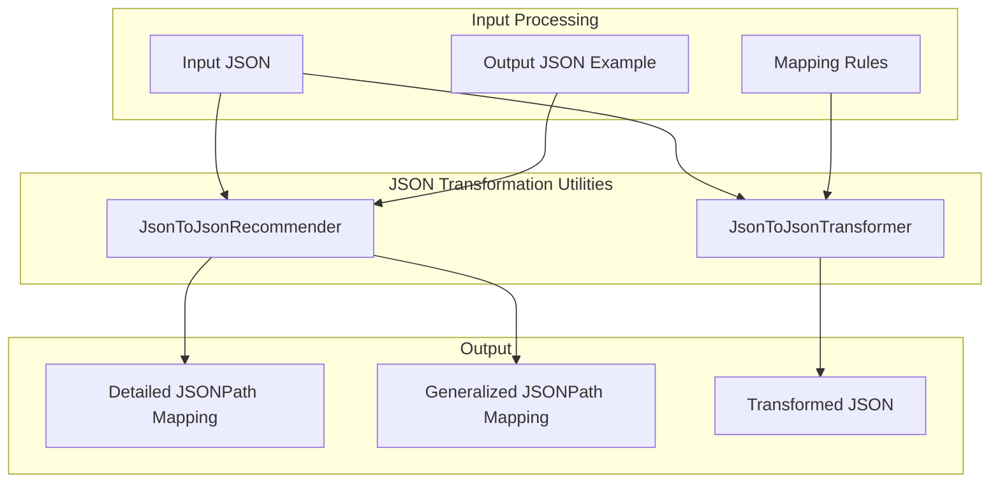

---
tags:
  - domain/ml
  - component/server
  - indexing
  - ml
  - search
---
# Flow Framework Utilities

## Summary

OpenSearch v3.2.0 introduces two new utility classes to the Flow Framework plugin: `JsonToJsonRecommender` and `JsonToJsonTransformer`. These utilities enable automatic JSON-to-JSON field mapping inference and transformation, simplifying the integration of heterogeneous data structures across OpenSearch components like ML inference pipelines, query processing, and workflow configurations.

## Details

### What's New in v3.2.0

This release adds foundational JSON transformation utilities that address structural incompatibility challenges when integrating different OpenSearch components:

1. **JsonToJsonRecommender**: Analyzes input/output JSON pairs and automatically generates JSONPath mapping recommendations
2. **JsonToJsonTransformer**: Applies JSONPath mappings to transform source JSON into target structures

### Technical Changes

#### Architecture Changes



#### New Components

| Component | Description |
|-----------|-------------|
| `JsonToJsonRecommender` | Utility class that builds an inverted index from input JSON values to their paths, then uses output JSON values to find matching input paths, producing JSONPath transformation mappings |
| `JsonToJsonTransformer` | Utility class that transforms input JSON into target JSON structure using JSONPath mapping rules, supporting both explicit indices and wildcard `[*]` patterns |
| `MapFormatResult` | Container class holding detailed and generalized JSONPath mappings as nested object structures |
| `StringFormatResult` | Container class holding JSONPath mappings as formatted JSON strings |

#### New Configuration

| Setting | Description | Default |
|---------|-------------|---------|
| `MAX_JSON_SIZE` | Maximum allowed JSON size in bytes | ~50MB |
| `MAX_JSON_NAME_LENGTH` | Maximum allowed name length for JSON keys | 50,000 |
| `MAX_JSON_NESTING_DEPTH` | Maximum allowed nesting depth for JSON structures | 1,000 |

### Usage Example

#### JsonToJsonRecommender

```java
// Analyze input/output JSON pair to generate mapping recommendations
String inputJson = """
    {
      "item": {
        "name": "Widget",
        "allocDetails": {
          "useful": {
            "items": [
              {"allocation": 0.2, "team": {"id": 90, "name": "Alpha"}},
              {"allocation": 0.9, "team": {"id": 80, "name": "Beta"}}
            ]
          }
        }
      }
    }
    """;

String outputJson = """
    {
      "name": "Widget",
      "allocDetails": [
        {"allocation": 0.2, "team": {"id": 90, "name": "Alpha"}},
        {"allocation": 0.9, "team": {"id": 80, "name": "Beta"}}
      ]
    }
    """;

// Get mapping recommendations
StringFormatResult result = JsonToJsonRecommender.getRecommendationInStringFormat(inputJson, outputJson);

// Detailed mapping (with explicit array indices)
System.out.println(result.detailedJsonPathString);

// Generalized mapping (with [*] wildcards for arrays)
System.out.println(result.generalizedJsonPathString);
```

**Generalized Output:**
```json
{
  "name": "$.item.name",
  "allocDetails[*]": {
    "allocation": "$.item.allocDetails.useful.items[*].allocation",
    "team": {
      "id": "$.item.allocDetails.useful.items[*].team.id",
      "name": "$.item.allocDetails.useful.items[*].team.name"
    }
  }
}
```

#### JsonToJsonTransformer

```java
// Transform input JSON using mapping rules
String inputJson = """
    {
      "user": {"firstName": "John", "lastName": "Doe", "age": 30}
    }
    """;

String mappingJson = """
    {
      "name": "$.user.firstName",
      "surname": "$.user.lastName",
      "years": "$.user.age"
    }
    """;

String result = JsonToJsonTransformer.transform(inputJson, mappingJson);
// Output: {"name":"John","surname":"Doe","years":30}
```

### Migration Notes

These utilities are new additions and do not require migration. They can be used programmatically within custom workflow steps or other Flow Framework extensions.

## Limitations

- Only `[*]` wildcards are supported for array generalization; explicit numeric indices are honored verbatim
- Nested wildcards are allowed but must follow consistent patterns across array elements
- Maximum JSON size is limited to ~50MB to prevent memory issues
- Maximum nesting depth is 1,000 levels
- Key names cannot exceed 50,000 characters
- The recommender only maps values that exist in both input and output; unmapped fields are skipped

## References

### Documentation
- [Workflow Templates Documentation](https://docs.opensearch.org/3.0/automating-configurations/workflow-templates/)
- [Flow Framework Plugin](https://github.com/opensearch-project/flow-framework)

### Pull Requests
| PR | Description |
|----|-------------|
| [#1168](https://github.com/opensearch-project/flow-framework/pull/1168) | Add JsonToJson Recommender as a utility function |
| [#1176](https://github.com/opensearch-project/flow-framework/pull/1176) | Add JsonToJson Transformer as a utility function |

### Issues (Design / RFC)
- [Issue #1167](https://github.com/opensearch-project/flow-framework/issues/1167): Feature request for JsonToJson utilities

## Related Feature Report

- [Full feature documentation](../../../features/flow-framework/flow-framework-utilities.md)
