# Geospatial Plugin Bugfixes

## Summary

This release includes two security and architecture improvements for the Geospatial plugin's IP2Geo feature:

1. **HTTP Redirect Blocking**: Blocks HTTP redirects in IP2Geo datasource manifest and GeoIP data fetching to prevent potential security vulnerabilities
2. **PluginSubject Migration**: Replaces `ThreadContext.stashContext` with `pluginSubject.runAs` for stricter system index ownership and improved security

These changes improve the security posture of the IP2Geo processor by enforcing stricter controls over external HTTP connections and system index access.

## Details

### What's New in v3.2.0

#### 1. HTTP Redirect Blocking (PR #782)

The IP2Geo feature now blocks HTTP redirects when fetching datasource manifests and GeoIP data files. This prevents potential Server-Side Request Forgery (SSRF) attacks where a malicious endpoint could redirect requests to internal resources.

**Key Changes:**
- Added `HttpRedirectValidator` utility class to validate HTTP connections
- Moved manifest validation from request validation to transport action execution
- Redirects (HTTP 3xx status codes) now throw `IllegalArgumentException`

#### 2. PluginSubject Migration (PR #715)

Replaced the deprecated `ThreadContext.stashContext` pattern with the new `IdentityAwarePlugin` mechanism using `pluginSubject.runAs`. This provides:
- Stricter ownership over system indices
- Better visibility into which plugin performs privileged actions
- Preparation for Java Security Manager permission enforcement in 3.0+

### Technical Changes

#### Architecture Changes

```mermaid
graph TB
    subgraph "Before v3.2.0"
        A1[Request] --> B1[Validate Manifest in Request]
        B1 --> C1[Transport Action]
        C1 --> D1[StashedThreadContext.run]
        D1 --> E1[System Index Access]
    end
    
    subgraph "After v3.2.0"
        A2[Request] --> B2[Basic URL Validation]
        B2 --> C2[Transport Action]
        C2 --> D2[Validate Manifest - No Redirects]
        D2 --> E2[PluginClient.doExecute]
        E2 --> F2[pluginSubject.runAs]
        F2 --> G2[System Index Access]
    end
```

#### New Components

| Component | Description |
|-----------|-------------|
| `HttpRedirectValidator` | Utility class that validates HTTP connections don't attempt redirects |
| `PluginClient` | FilterClient wrapper that executes transport actions as the plugin's system subject |

#### Removed Components

| Component | Description |
|-----------|-------------|
| `StashedThreadContext` | Helper class for running code with stashed thread context (replaced by PluginClient) |

#### New Configuration

| Setting | Description | Default |
|---------|-------------|---------|
| `plugin-additional-permissions.yml` | Declares additional cluster permissions for the plugin | `indices:data/read/mget` |

### Usage Example

No changes to user-facing APIs. The security improvements are transparent to users.

### Migration Notes

- No user action required
- Existing datasources continue to work
- Endpoints that rely on HTTP redirects will now fail with an error message indicating redirects are not allowed

## Limitations

- HTTP redirects are now blocked for all IP2Geo datasource endpoints
- If your GeoIP data provider uses redirects, you must use the final URL directly

## Related PRs

| PR | Description |
|----|-------------|
| [#782](https://github.com/opensearch-project/geospatial/pull/782) | Block redirect in IP2Geo and move validation to transport action |
| [#715](https://github.com/opensearch-project/geospatial/pull/715) | Replace usages of ThreadContext.stashContext with pluginSubject.runAs |

## References

- [Issue #238](https://github.com/opensearch-project/opensearch-plugins/issues/238): META - Remove usages of ThreadContext.stashContext
- [IP2Geo Documentation](https://docs.opensearch.org/3.0/ingest-pipelines/processors/ip2geo/): Official processor documentation

## Related Feature Report

- [Full IP2Geo documentation](../../../features/geospatial/ip2geo.md)
