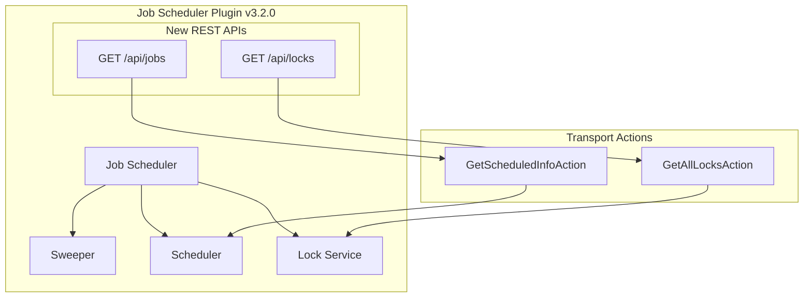

# Job Scheduler Enhancements

## Summary

OpenSearch v3.2.0 introduces significant enhancements to the Job Scheduler plugin, including new REST APIs for listing scheduled jobs and locks, support for second-level interval scheduling, and improved extensibility through LockService modifications. These changes provide cluster administrators with better visibility into scheduled job execution and enable more fine-grained job scheduling.

## Details

### What's New in v3.2.0

This release adds three major capabilities to Job Scheduler:

1. **REST API for Listing Jobs**: New endpoint to view all scheduled jobs across the cluster
2. **REST API for Listing Locks**: New endpoint to monitor job locks and identify running jobs
3. **Second-level Interval Scheduling**: Support for defining schedules in seconds (previously minimum was minutes)
4. **LockService Extensibility**: Removed `final` modifier to enable mocking and dependency injection

### Technical Changes

#### Architecture Changes



#### New REST APIs

| Endpoint | Method | Description |
|----------|--------|-------------|
| `/_plugins/_job_scheduler/api/jobs` | GET | List all scheduled jobs in the cluster |
| `/_plugins/_job_scheduler/api/jobs?by_node` | GET | List scheduled jobs grouped by node |
| `/_plugins/_job_scheduler/api/locks` | GET | List all job locks |
| `/_plugins/_job_scheduler/api/locks/{lock_id}` | GET | Get a specific lock by ID |

#### New Components

| Component | Description |
|-----------|-------------|
| `RestGetScheduledInfoAction` | REST handler for listing scheduled jobs |
| `RestGetLocksAction` | REST handler for listing locks |
| `TransportGetScheduledInfoAction` | Transport action for gathering job info across nodes |
| `TransportGetAllLocksAction` | Transport action for retrieving lock information |
| `GetScheduledInfoRequest/Response` | Request/response classes for job listing |
| `GetLocksRequest/Response` | Request/response classes for lock listing |

#### New Configuration

| Setting | Description | Default |
|---------|-------------|---------|
| `plugins.jobscheduler.sweeper.period` | Can now be set to seconds (e.g., `1s`) for faster job sweeping | `1m` |

### Usage Example

#### List All Scheduled Jobs

```bash
GET /_plugins/_job_scheduler/api/jobs
```

Response:
```json
{
  "jobs": [
    {
      "job_type": "reports-scheduler",
      "job_id": "Ch1gqJcBTMEkmCgKhetp",
      "index_name": ".opendistro-reports-definitions",
      "name": "daily-report",
      "descheduled": false,
      "enabled": true,
      "enabled_time": "2025-06-25T18:36:27.368Z",
      "last_update_time": "2025-06-25T18:36:27.368Z",
      "last_execution_time": "none",
      "next_expected_execution_time": "2025-06-26T18:36:12.053Z",
      "schedule": {
        "type": "interval",
        "start_time": "2025-06-25T18:36:12.053Z",
        "unit": "Days",
        "interval": 1
      },
      "delay": "none",
      "jitter": "none",
      "lock_duration": "no_lock"
    }
  ],
  "failures": [],
  "total_jobs": 1
}
```

#### List Jobs by Node

```bash
GET /_plugins/_job_scheduler/api/jobs?by_node
```

Response:
```json
{
  "nodes": [
    {
      "node_id": "RiTenTucTveJSPeBplLqIg",
      "node_name": "opensearch-node1",
      "scheduled_job_info": {
        "total_jobs": 1,
        "jobs": [...]
      }
    }
  ],
  "failures": [],
  "total_jobs": 1
}
```

#### List All Locks

```bash
GET /_plugins/_job_scheduler/api/locks
```

Response:
```json
{
  "total_locks": 2,
  "locks": {
    ".scheduler_sample_extension-jobid1": {
      "job_index_name": ".scheduler_sample_extension",
      "job_id": "jobid1",
      "lock_aquired_time": "2025-07-25T17:17:58.000Z",
      "lock_duration_seconds": 120,
      "released": false
    }
  }
}
```

#### Define Schedule in Seconds

```json
{
  "schedule": {
    "interval": {
      "start_time": 1625097600000,
      "period": 30,
      "unit": "Seconds"
    }
  }
}
```

### Migration Notes

- The new REST APIs are available immediately after upgrading to v3.2.0
- Existing jobs continue to work without modification
- To use second-level scheduling, update the `unit` field in interval schedules to `"Seconds"`
- For faster job sweeping with second-level schedules, configure `plugins.jobscheduler.sweeper.period` to a value in seconds

## Limitations

- Second-level scheduling increases cluster load; use judiciously for high-frequency jobs
- Lock listing API performs a scroll search on the lock index, which may impact performance with many locks
- Job listing aggregates data from all nodes, which may be slow in large clusters

## Related PRs

| PR | Title | Category | Repository |
|----|-------|----------|------------|
| [#849](https://github.com/opensearch-project/common-utils/pull/849) | Add Seconds as a supported unit for IntervalSchedule | feature | common-utils |
| [#786](https://github.com/opensearch-project/job-scheduler/pull/786) | Adds REST API to list jobs with an option to list them per node | feature | job-scheduler |
| [#796](https://github.com/opensearch-project/job-scheduler/pull/796) | Support defining IntervalSchedule in seconds | feature | job-scheduler |
| [#802](https://github.com/opensearch-project/job-scheduler/pull/802) | Rest API to list all locks with option to get a specific lock | feature | job-scheduler |
| [#792](https://github.com/opensearch-project/job-scheduler/pull/792) | Make Lock service not final | enhancement | job-scheduler |
| [#801](https://github.com/opensearch-project/job-scheduler/pull/801) | Move info about delay to the schedule portion in List Jobs API | enhancement | job-scheduler |
| [#793](https://github.com/opensearch-project/job-scheduler/pull/793) | Ensure that dates are serialized in TransportGetScheduledInfoAction | bugfix | job-scheduler |
| [#790](https://github.com/opensearch-project/job-scheduler/pull/790) | Use Text Blocks when defining multi-line strings | bugfix | job-scheduler |

## References

- [Issue #775](https://github.com/opensearch-project/job-scheduler/issues/775): Feature request for REST APIs to list jobs and running jobs
- [Job Scheduler GitHub Repository](https://github.com/opensearch-project/job-scheduler)
- [Official Documentation](https://docs.opensearch.org/3.0/monitoring-your-cluster/job-scheduler/index/)

## Related Feature Report

- [Full feature documentation](../../../features/job-scheduler/job-scheduler.md)
