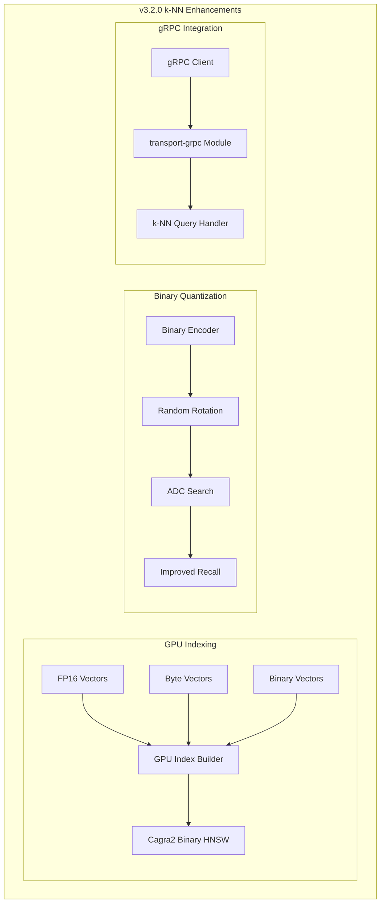

---
tags:
  - domain/search
  - component/server
  - indexing
  - k-nn
  - performance
  - search
---
# k-NN Vector Search

## Summary

OpenSearch v3.2.0 brings significant enhancements to the k-NN plugin, including GPU indexing support for additional vector types (FP16, Byte, Binary), improved recall through Asymmetric Distance Computation (ADC) and random rotation for binary quantization, gRPC support for k-NN queries, enhanced profiling capabilities, and performance optimizations for indexing on large machines.

## Details

### What's New in v3.2.0

This release introduces four major feature areas and several enhancements:

1. **GPU Indexing for FP16, Byte, and Binary Vectors** - Extends GPU acceleration to additional vector types
2. **Asymmetric Distance Computation (ADC)** - Improves recall for binary quantized indices
3. **Random Rotation for Binary Quantization** - Enhances recall on datasets with uneven variance
4. **gRPC Support for k-NN Queries** - Enables high-performance k-NN queries via gRPC

### Technical Changes

#### Architecture Changes



#### New Components

| Component | Description |
|-----------|-------------|
| `QuantizedKNNVectorValues` | Abstraction for quantized vector values for serialization and remote storage upload |
| `FaissIndexBQ` | Faiss struct supporting ADC with full-precision query vectors |
| `QFrameBitEncoder` | Encoder supporting random rotation setting for binary quantization |
| `OneBitScalarQuantizationState` | Stores rotation matrix and threshold means for 1-bit quantization |
| `MultiBitScalarQuantizationState` | Stores rotation matrix for multi-bit quantization |

#### New Configuration

| Setting | Description | Default |
|---------|-------------|---------|
| `encoder.parameters.enable_adc` | Enable Asymmetric Distance Computation for binary indices | `false` |
| `encoder.parameters.enable_random_rotation` | Enable random rotation for binary quantization | `false` |
| `knn.index_thread_qty` | Dynamic index thread quantity (4 for 32+ cores, 1 otherwise) | Dynamic |

### Usage Example

#### Binary Quantization with ADC and Random Rotation

```json
PUT /vector-index
{
  "settings": {
    "index": {
      "knn": true
    }
  },
  "mappings": {
    "properties": {
      "vector_field": {
        "type": "knn_vector",
        "dimension": 768,
        "method": {
          "name": "hnsw",
          "engine": "faiss",
          "space_type": "l2",
          "parameters": {
            "encoder": {
              "name": "binary",
              "parameters": {
                "bits": 1,
                "enable_adc": true,
                "enable_random_rotation": true
              }
            }
          }
        }
      }
    }
  }
}
```

#### GPU Indexing for FP16 Vectors

```json
PUT /gpu-vector-index
{
  "settings": {
    "index": {
      "knn": true
    }
  },
  "mappings": {
    "properties": {
      "my_vector": {
        "type": "knn_vector",
        "dimension": 128,
        "data_type": "float16",
        "method": {
          "name": "hnsw",
          "engine": "faiss",
          "space_type": "l2"
        }
      }
    }
  }
}
```

### Migration Notes

- ADC and random rotation are opt-in features; existing binary quantized indices continue to work without changes
- GPU indexing for FP16/Byte/Binary requires appropriate GPU hardware and drivers
- gRPC k-NN queries require the `transport-grpc` module to be enabled

## Limitations

- ADC is currently only supported for 1-bit Faiss binary indices
- Random rotation adds computational overhead during indexing and search
- gRPC integration tests require `OpenSearchGrpcTestCase` fixture (planned for future release)
- PR #1413 (collapse bug fix) was not accessible for investigation

## References

### Documentation
- [Binary Quantization Documentation](https://docs.opensearch.org/3.0/vector-search/optimizing-storage/binary-quantization/): Official docs

### Blog Posts
- [ADC Blog Post](https://opensearch.org/blog/asymmetric-distance-computation-for-binary-quantization/): Technical deep-dive

### Pull Requests
| PR | Description |
|----|-------------|
| [#2819](https://github.com/opensearch-project/k-NN/pull/2819) | Support GPU indexing for FP16, Byte and Binary |
| [#2718](https://github.com/opensearch-project/k-NN/pull/2718) | Add random rotation feature to binary encoder |
| [#2733](https://github.com/opensearch-project/k-NN/pull/2733) | Asymmetric Distance Computation (ADC) for binary quantized faiss indices |
| [#2817](https://github.com/opensearch-project/k-NN/pull/2817) | Extend transport-grpc module to support GRPC KNN queries |
| [#2824](https://github.com/opensearch-project/k-NN/pull/2824) | Add nested search support for IndexBinaryHNSWCagra |
| [#2806](https://github.com/opensearch-project/k-NN/pull/2806) | Dynamic index thread quantity defaults based on processor sizes |
| [#2810](https://github.com/opensearch-project/k-NN/pull/2810) | Fix @ collision in NativeMemoryCacheKeyHelper |

### Issues (Design / RFC)
- [Issue #2796](https://github.com/opensearch-project/k-NN/issues/2796): GPU indexing RFC
- [Issue #2714](https://github.com/opensearch-project/k-NN/issues/2714): ADC and Random Rotation RFC
- [Issue #2816](https://github.com/opensearch-project/k-NN/issues/2816): gRPC k-NN support
- [Issue #2747](https://github.com/opensearch-project/k-NN/issues/2747): Index thread quantity optimization
- [Issue #2809](https://github.com/opensearch-project/k-NN/issues/2809): NativeMemoryCacheKeyHelper @ collision

## Related Feature Report

- [Full feature documentation](../../../../features/k-nn/k-nn-vector-search-k-nn.md)
