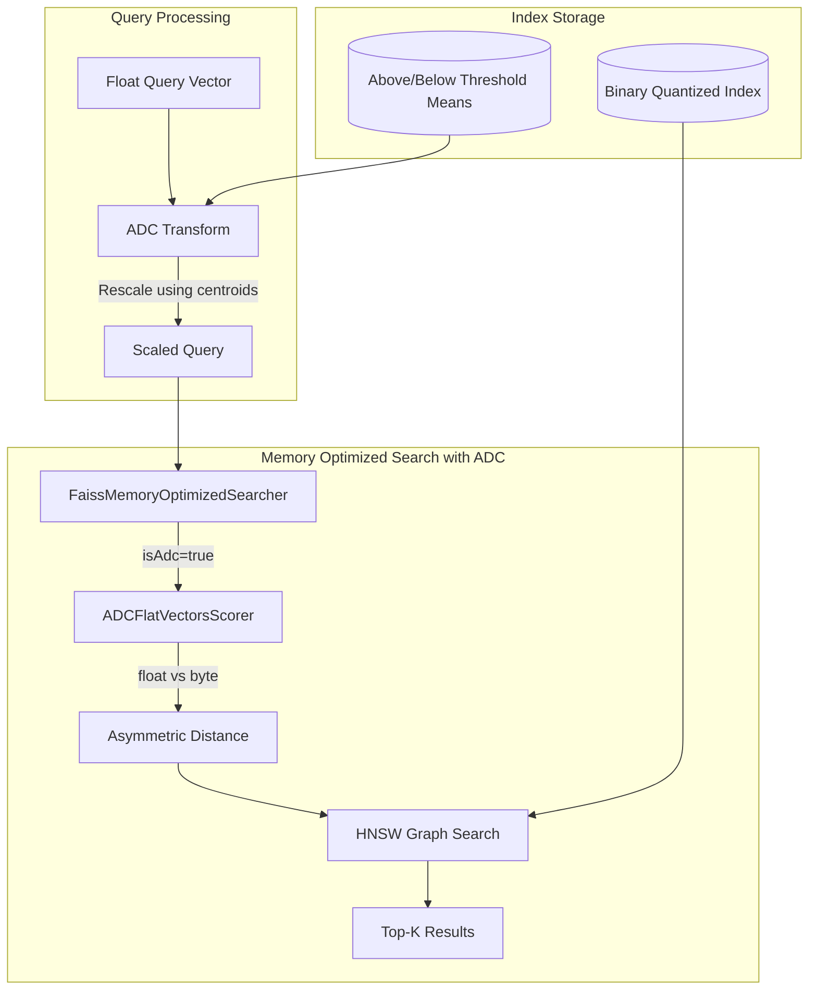

---
tags:
  - indexing
  - k-nn
  - performance
  - search
---

# Lucene-on-Faiss: ADC Support

## Summary

This release adds Asymmetric Distance Computation (ADC) support to Lucene-on-Faiss (memory-optimized search). ADC enables searching binary-quantized indexes using full-precision query vectors, improving recall for disk-based vector search while maintaining 32x memory compression.

Previously, ADC was only available when using the traditional FAISS JNI path. With this enhancement, users can now benefit from ADC's improved recall even when using memory-optimized search mode.

## Details

### What's New in v3.2.0

This release extends the Lucene-on-Faiss memory-optimized search to support ADC for binary quantized indexes. The key changes include:

1. **ADC-aware VectorSearcher**: The `FaissMemoryOptimizedSearcher` now extracts ADC configuration from field metadata and uses appropriate scorers
2. **New ADC Scorers**: Added `ADCFlatVectorsScorer` that computes distances between full-precision query vectors and binary-quantized document vectors
3. **Space Type Support**: ADC is supported for L2, Cosine, and Inner Product space types

### Technical Changes

#### Architecture Changes



#### New Components

| Component | Description |
|-----------|-------------|
| `ADCFlatVectorsScorer` | Scorer for asymmetric distance computation between float queries and byte vectors |
| `FlatVectorsScorerProvider.getFlatVectorsScorer(similarityFunction, isAdc, spaceType)` | Extended factory method to return ADC-aware scorers |

#### Modified Components

| Component | Change |
|-----------|--------|
| `VectorSearcherFactory.createVectorSearcher()` | Added `FieldInfo` parameter to extract ADC configuration |
| `FaissMemoryOptimizedSearcher` | Extracts ADC flag from quantization config, uses appropriate scorer |
| `MemoryOptimizedSearchSupportSpec` | Removed ADC exclusion - ADC is now supported |
| `MemoryOptimizedKNNWeight` | Added ADC vector handling in `doANNSearch` |

### Usage Example

ADC with memory-optimized search is automatically enabled when both features are configured:

```json
PUT /my-vector-index
{
  "settings": {
    "index.knn": true,
    "index.knn.memory_optimized_search": true
  },
  "mappings": {
    "properties": {
      "my_vector": {
        "type": "knn_vector",
        "dimension": 768,
        "method": {
          "name": "hnsw",
          "engine": "faiss",
          "space_type": "l2",
          "parameters": {
            "encoder": {
              "name": "binary",
              "parameters": {
                "bits": 1,
                "enable_adc": true
              }
            }
          }
        }
      }
    }
  }
}
```

### How ADC Works

ADC improves recall by preserving query vectors in full precision while comparing against binary-quantized document vectors:

1. **Document Quantization**: Documents are binary-quantized (32x compression) during indexing
2. **Centroid Computation**: Per-dimension means are computed for values quantized to 0 and 1
3. **Query Transformation**: At search time, query vectors are rescaled using the centroids but kept in full precision
4. **Asymmetric Distance**: Distance is computed between the full-precision query and binary document vectors

The rescaling formula transforms each query dimension `q_d` to:
```
q'_d = (q_d - below_mean_d) / (above_mean_d - below_mean_d)
```

This preserves subtle variations in the query that would be lost with symmetric (binary-to-binary) distance computation.

## Limitations

- ADC is only supported for 1-bit binary quantization
- Byte vector queries are not supported with ADC (only float queries)
- ADC adds computational overhead compared to symmetric Hamming distance

## References

### Blog Posts
- [Blog: Asymmetric Distance Computation](https://opensearch.org/blog/asymmetric-distance-computation-for-binary-quantization/): Detailed explanation of ADC
- [Blog: Lucene-on-Faiss](https://opensearch.org/blog/lucene-on-faiss-powering-opensearchs-high-performance-memory-efficient-vector-search/): Memory-optimized search overview

### Pull Requests
| PR | Description |
|----|-------------|
| [#2781](https://github.com/opensearch-project/k-NN/pull/2781) | Support ADC in Lucene-on-Faiss |

### Issues (Design / RFC)
- [Issue #2714](https://github.com/opensearch-project/k-NN/issues/2714): RFC for ADC and Random Rotation

## Related Feature Report

- [Full feature documentation](../../../../features/k-nn/lucene-on-faiss.md)
