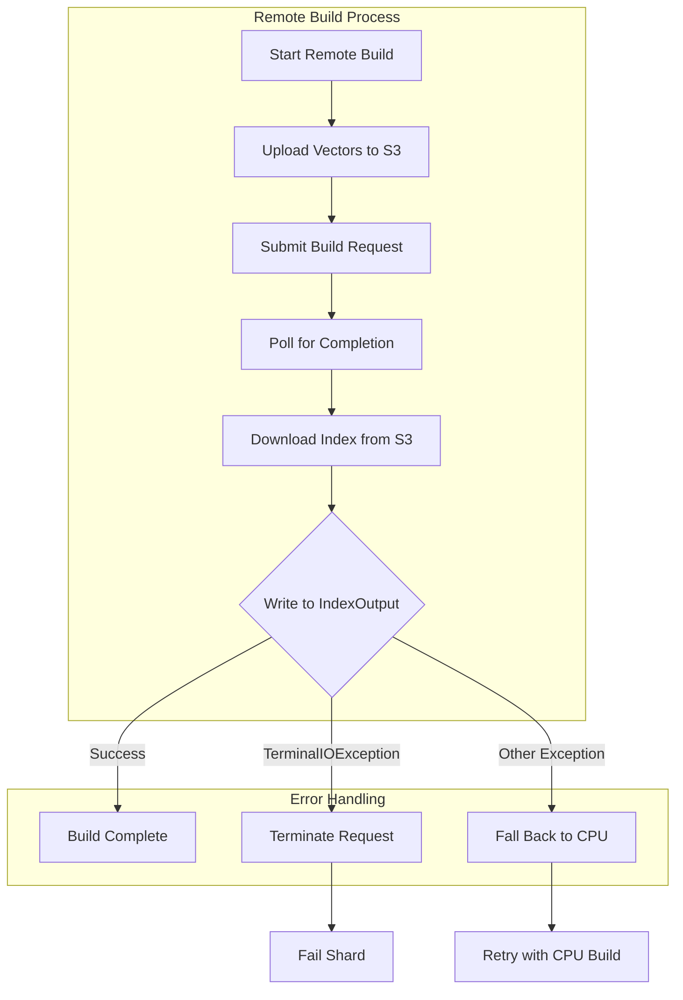

---
tags:
  - domain/search
  - component/server
  - indexing
  - k-nn
---
# Remote Vector Index Build

## Summary

This bugfix improves the error handling behavior of the Remote Vector Index Build feature when terminal failures occur during GPU-accelerated index construction. Previously, when hard failures like "IndexInput is closed" or "index is deleted" occurred, the system would unnecessarily fall back to CPU build, only to encounter the same failure again before ultimately failing the shard. This fix introduces a new `TerminalIOException` that signals the build process to terminate immediately without attempting a CPU fallback, avoiding wasted compute resources.

## Details

### What's New in v3.2.0

The fix addresses an inefficiency in the remote build fallback mechanism. When writing the downloaded index to the local segment fails due to terminal conditions (e.g., closed IndexOutput, deleted index), the system now properly terminates the request instead of attempting a futile CPU fallback.

### Technical Changes

#### New Exception Class

A new `TerminalIOException` class distinguishes between recoverable and terminal I/O failures:

```java
public class TerminalIOException extends IOException {
    public TerminalIOException(String message, Throwable cause) {
        super(message, cause);
    }
}
```

#### Exception Flow



#### Modified Components

| Component | Change |
|-----------|--------|
| `TerminalIOException` | New exception class for terminal I/O failures |
| `IndexOutputWithBuffer` | Wraps `IndexOutput.writeBytes()` failures in `TerminalIOException` |
| `RemoteIndexBuildStrategy` | Catches and rethrows `TerminalIOException` without fallback |
| `KNNRemoteIndexBuildValue` | Added `reset()` method for test cleanup |

#### Code Changes

The `IndexOutputWithBuffer.writeFromStreamWithBuffer()` method now wraps write failures:

```java
try {
    indexOutput.writeBytes(outputBuffer, 0, bytesRead);
} catch (IOException e) {
    throw new TerminalIOException("Failed to write to indexOutput", e);
}
```

The `RemoteIndexBuildStrategy.buildAndWriteIndex()` method catches and rethrows terminal exceptions:

```java
try {
    // ... remote build process
} catch (TerminalIOException e) {
    throw e;  // Don't fall back, terminate immediately
} catch (Exception e) {
    log.error("Failed to build index remotely: " + indexInfo, e);
    // Fall back to CPU build
}
```

### Usage Example

No configuration changes required. The fix is automatic and applies to all remote vector index builds. When a terminal failure occurs during the write phase, users will see the failure immediately rather than after an unnecessary CPU fallback attempt.

### Migration Notes

No migration required. This is a transparent bugfix that improves error handling behavior.

## Limitations

- Only applies to failures during the final write phase (downloading index from S3 to local segment)
- Other types of failures (S3 connectivity, build service errors) still trigger CPU fallback as before

## References

### Documentation
- [Documentation](https://docs.opensearch.org/3.0/vector-search/remote-index-build/): Remote index build documentation

### Pull Requests
| PR | Description |
|----|-------------|
| [#2773](https://github.com/opensearch-project/k-NN/pull/2773) | Don't fall back to CPU on terminal exceptions |

### Issues (Design / RFC)
- [Issue #2766](https://github.com/opensearch-project/k-NN/issues/2766): Bug report - Terminate Index build request if Failed to write index in segment

## Related Feature Report

- Full feature documentation
