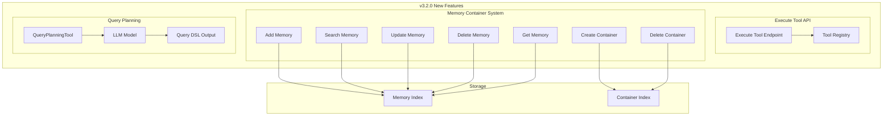

---
tags:
  - indexing
  - ml
  - search
---

# ML Commons Agent Tools & Memory

## Summary

OpenSearch v3.2.0 introduces significant enhancements to the ML Commons agent framework, including a new Execute Tool API for direct tool execution, AI-oriented memory container APIs for persistent user context, the QueryPlanningTool for intelligent query generation, and numerous bug fixes improving agent reliability and tool handling.

## Details

### What's New in v3.2.0

This release focuses on three major areas:

1. **Execute Tool API** - Direct tool execution without agent orchestration
2. **Agentic Memory System** - AI-oriented memory containers for persistent context
3. **QueryPlanningTool** - LLM-powered query generation for agentic search

### Technical Changes

#### Architecture Changes



#### New Components

| Component | Description |
|-----------|-------------|
| Execute Tool API | Direct tool execution endpoint without agent context |
| Memory Container | Persistent storage for AI-oriented user memories |
| Memory APIs | CRUD operations for memories within containers |
| QueryPlanningTool | LLM-based query DSL generation tool |
| Feature Flags | Agentic search and memory feature toggles |

#### New Configuration

| Setting | Description | Default |
|---------|-------------|---------|
| `plugins.ml_commons.agentic_search.enabled` | Enable agentic search feature | `false` |
| `plugins.ml_commons.agentic_memory.enabled` | Enable agentic memory feature | `false` |
| `plugins.ml_commons.delete_mem_container.enabled` | Enable memory container deletion | `false` |

#### API Changes

**Execute Tool API (Experimental)**
```
POST /_plugins/_ml/tools/_execute/{tool_name}
{
    "parameters": {
        "question": "...",
        "model_id": "...",
        ...
    }
}
```

**Memory Container APIs**
```
# Create container
POST /_plugins/_ml/memory_containers

# Add memories
POST /_plugins/_ml/memory_containers/{container_id}/memories

# Search memories
POST /_plugins/_ml/memory_containers/{container_id}/memories/_search

# Get memory
GET /_plugins/_ml/memory_containers/{container_id}/memories/{memory_id}

# Update memory
PUT /_plugins/_ml/memory_containers/{container_id}/memories/{memory_id}

# Delete memory
DELETE /_plugins/_ml/memory_containers/{container_id}/memories/{memory_id}

# Delete container
DELETE /_plugins/_ml/memory_containers/{container_id}
```

### Usage Example

**Execute Tool directly:**
```json
POST /_plugins/_ml/tools/_execute/PPLTool
{
    "parameters": {
        "question": "what's the population of Seattle in 2021?",
        "index": "test-population",
        "model_id": "your_model_id",
        "verbose": true
    }
}
```

**Create memory container and add memories:**
```json
POST /_plugins/_ml/memory_containers/{container_id}/memories
{
  "messages": [
    {
      "role": "user",
      "content": "I like green and brown, but I don't like red"
    }
  ],
  "session_id": "sess_475f9271-76f3-4bcd-a786-ab074832a5c4"
}

// Response - AI extracts facts automatically
{
  "results": [
    {
      "memory_id": "TPTneJgB1izWszNdKeXd",
      "memory": "User likes green and brown colors",
      "event": "ADD"
    },
    {
      "memory_id": "TfTneJgB1izWszNdKeXd",
      "memory": "User doesn't like red color",
      "event": "ADD"
    }
  ]
}
```

**Register QueryPlanningTool agent:**
```json
POST /_plugins/_ml/agents/_register
{
  "name": "Query Planner Agent",
  "type": "flow",
  "tools": [
    {
      "type": "QueryPlanningTool",
      "parameters": {
        "model_id": "your_llm_model_id",
        "response_filter": "$.output.message.content[0].text"
      }
    }
  ]
}
```

### Bug Fixes

| Issue | Fix |
|-------|-----|
| Class cast exception in execute API | Fixed type casting in MLExecuteTaskRunner |
| Delete connector/model group exception | Improved exception handling |
| Exposed connector URL in error messages | Sanitized error responses |
| Async status tracking for agent execution | Fixed is_async status reporting |
| Update model config validation | Fixed invalid error handling |
| Partial updates to LLM/memory fields | Allow partial MLAgentUpdateInput updates |
| Empty response error handling | Fixed status code and message |
| Chat agent max iterations | Ensure response when max iterations reached |
| Excessive logging in MLSyncUpCron | Changed info to debug level |

### Enhancements

| Enhancement | Description |
|-------------|-------------|
| Date/time injection | Add current date/time to agent system prompts |
| Message history limit | Expose configurable limit for PER Agent |
| Tool input parsing | Enhanced parsing with agentic RAG tutorial |
| PER Agent prompts | Tuned prompts for better performance |
| Output filter | Support tool output filtering |
| SearchIndexTool | Improved output parsing for aggregations |

## Limitations

- Execute Tool API is experimental in v3.2.0
- Memory container features require explicit feature flag enablement
- AI-oriented memory operations depend on LLM model quality for fact extraction
- QueryPlanningTool requires compatible LLM connector

## References

### Documentation
- [Agent APIs Documentation](https://docs.opensearch.org/3.0/ml-commons-plugin/api/agent-apis/index/)
- [Memory APIs Documentation](https://docs.opensearch.org/3.0/ml-commons-plugin/api/memory-apis/index/)

### Pull Requests
| PR | Description |
|----|-------------|
| [#4035](https://github.com/opensearch-project/ml-commons/pull/4035) | Add Execute Tool API |
| [#4050](https://github.com/opensearch-project/ml-commons/pull/4050) | Implement create and add memory container API |
| [#4055](https://github.com/opensearch-project/ml-commons/pull/4055) | Enable AI-Oriented memory operations |
| [#4006](https://github.com/opensearch-project/ml-commons/pull/4006) | Initiate QueryPlanningTool |
| [#4027](https://github.com/opensearch-project/ml-commons/pull/4027) | Delete memory container API |
| [#4069](https://github.com/opensearch-project/ml-commons/pull/4069) | GET memory API |
| [#4053](https://github.com/opensearch-project/ml-commons/pull/4053) | Support output filter and improve SearchIndexTool |
| [#4008](https://github.com/opensearch-project/ml-commons/pull/4008) | Add date/time injection for agents |
| [#4016](https://github.com/opensearch-project/ml-commons/pull/4016) | Expose message history limit for PER Agent |
| [#4023](https://github.com/opensearch-project/ml-commons/pull/4023) | Enhance tool input parsing |
| [#4046](https://github.com/opensearch-project/ml-commons/pull/4046) | Add default system prompt for QueryPlanningTool |
| [#4059](https://github.com/opensearch-project/ml-commons/pull/4059) | Tuning PER Agent prompts |
| [#4021](https://github.com/opensearch-project/ml-commons/pull/4021) | Add feature flag for agentic search |
| [#4067](https://github.com/opensearch-project/ml-commons/pull/4067) | Add feature flag for agentic memory |
| [#4072](https://github.com/opensearch-project/ml-commons/pull/4072) | Add feature flag for delete memory container |
| [#4010](https://github.com/opensearch-project/ml-commons/pull/4010) | Fix class cast exception for execute API |
| [#4044](https://github.com/opensearch-project/ml-commons/pull/4044) | Fix delete connector/model group exception |
| [#3953](https://github.com/opensearch-project/ml-commons/pull/3953) | Fix exposed connector URL in error message |
| [#3960](https://github.com/opensearch-project/ml-commons/pull/3960) | Fix is_async status of agent execution task |
| [#3994](https://github.com/opensearch-project/ml-commons/pull/3994) | Fix update model config invalid error |
| [#4040](https://github.com/opensearch-project/ml-commons/pull/4040) | Allow partial updates to LLM/memory fields |
| [#3968](https://github.com/opensearch-project/ml-commons/pull/3968) | Fix error status code and message for empty response |
| [#3948](https://github.com/opensearch-project/ml-commons/pull/3948) | Change MLSyncUpCron info log to debug |
| [#4031](https://github.com/opensearch-project/ml-commons/pull/4031) | Ensure chat agent returns response at max iterations |
| [#568](https://github.com/opensearch-project/ml-commons/pull/568) | Fetch models from ml-commons and add validation |
| [#4037](https://github.com/opensearch-project/ml-commons/pull/4037) | Fix unit test for user_requested_tenant_access |

### Issues (Design / RFC)
- [Issue #3979](https://github.com/opensearch-project/ml-commons/issues/3979): Memory container feature request
- [Issue #4005](https://github.com/opensearch-project/ml-commons/issues/4005): QueryPlanningTool feature request
- [Issue #4009](https://github.com/opensearch-project/ml-commons/issues/4009): Date/time injection feature request
- [Issue #4011](https://github.com/opensearch-project/ml-commons/issues/4011): Chat agent max iterations bug

## Related Feature Report

- [Full feature documentation](../../../features/ml-commons/ml-commons-agent-framework.md)
