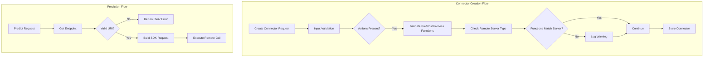

---
tags:
  - ml
---

# ML Commons Connectors

## Summary

OpenSearch v3.2.0 enhances ML Commons connector validation with two key improvements: validation of pre/post-process functions to ensure compatibility with the target LLM service, and improved URI validation during connector creation to provide clearer error messages when invalid endpoints are configured.

## Details

### What's New in v3.2.0

This release adds two validation enhancements to the ML Commons connector API:

1. **Pre/Post-Process Function Validation**: When creating a connector, the system now validates that the specified `pre_process_function` and `post_process_function` are compatible with the target LLM service (OpenAI, Cohere, Bedrock, SageMaker). If mismatched functions are detected, a warning is logged to help users identify potential configuration issues.

2. **URI Validation**: The connector creation API now validates the endpoint URI before attempting to use it. If the URI is invalid or the host cannot be determined, a clear error message is returned instead of a cryptic `NullPointerException`.

### Technical Changes

#### Architecture Changes



#### New Components

| Component | Description |
|-----------|-------------|
| `ConnectorAction.validatePrePostProcessFunctions()` | Validates that pre/post-process functions match the target LLM service |
| `ConnectorAction.getRemoteServerFromURL()` | Extracts the remote server type (openai, cohere, bedrock, sagemaker) from URL |
| `ConnectorUtils.buildSdkRequest()` URI validation | Validates URI and provides clear error messages for invalid endpoints |

#### Supported Remote Servers

| Server | URL Pattern | Pre-Process Functions | Post-Process Functions |
|--------|-------------|----------------------|------------------------|
| OpenAI | Contains `openai` | `connector.pre_process.openai.*` | `connector.post_process.openai.*` |
| Cohere | Contains `cohere` | `connector.pre_process.cohere.*` | `connector.post_process.cohere.*` |
| Bedrock | Contains `bedrock` | `connector.pre_process.bedrock.*` | `connector.post_process.bedrock.*` |
| SageMaker | Contains `sagemaker` | `connector.pre_process.default.*` | `connector.post_process.default.*` |

### Usage Example

#### Creating a Connector with Proper Function Matching

```json
POST /_plugins/_ml/connectors/_create
{
  "name": "OpenAI Embedding Connector",
  "description": "Connector for OpenAI embedding model",
  "version": "1",
  "protocol": "http",
  "parameters": {
    "model": "text-embedding-ada-002"
  },
  "credential": {
    "openAI_key": "<your-api-key>"
  },
  "actions": [
    {
      "action_type": "predict",
      "method": "POST",
      "url": "https://api.openai.com/v1/embeddings",
      "headers": {
        "Authorization": "Bearer ${credential.openAI_key}"
      },
      "request_body": "{ \"input\": ${parameters.input}, \"model\": \"${parameters.model}\" }",
      "pre_process_function": "connector.pre_process.openai.embedding",
      "post_process_function": "connector.post_process.openai.embedding"
    }
  ]
}
```

#### Error Message for Invalid URI

If an invalid endpoint is configured, the error message now clearly indicates the issue:

```
Encountered error when trying to create uri from endpoint in ml connector. 
Please update the endpoint in connection configuration.
```

### Migration Notes

- Existing connectors with mismatched pre/post-process functions will continue to work but will generate warning logs
- No breaking changes to the connector API
- Users should review connector configurations to ensure function compatibility

## Limitations

- Function validation only applies to built-in functions (those starting with `connector.`)
- Custom Painless script functions are not validated
- Warning messages are logged but do not prevent connector creation

## References

### Documentation
- [Connectors Documentation](https://docs.opensearch.org/3.0/ml-commons-plugin/remote-models/connectors/): Official connector documentation
- [Connector Blueprints](https://docs.opensearch.org/3.0/ml-commons-plugin/remote-models/blueprints/): Pre/post-process function reference

### Pull Requests
| PR | Description |
|----|-------------|
| [#3579](https://github.com/opensearch-project/ml-commons/pull/3579) | Enhance validation for create connector API - adds pre/post-process function validation |
| [#3972](https://github.com/opensearch-project/ml-commons/pull/3972) | Add validation for creating URI in connectors - improves error messages for invalid endpoints |

### Issues (Design / RFC)
- [Issue #2993](https://github.com/opensearch-project/ml-commons/issues/2993): Enhancement request for connector validation
- [Issue #3921](https://github.com/opensearch-project/ml-commons/issues/3921): Bug report for unclear error messages with invalid URLs

## Related Feature Report

- [Full feature documentation](../../../../features/ml-commons/ml-commons-connector-model-validation.md)
