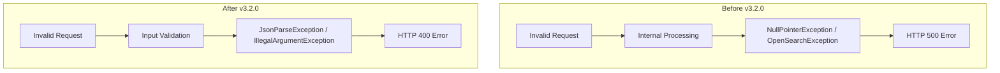

---
tags:
  - domain/ml
  - component/server
  - ml
---
# ML Commons Error Handling

## Summary

This enhancement improves error handling in ML Commons by returning proper HTTP 400 (Bad Request) errors instead of HTTP 500 (Internal Server Error) for invalid client inputs. This change affects agent execution and MCP tool registration APIs, providing clearer error messages and following REST API best practices.

## Details

### What's New in v3.2.0

The PR addresses two specific scenarios where invalid client input was incorrectly returning 500 errors:

1. **Agent Execution**: Invalid JSON values in agent execution requests (e.g., unquoted strings) now return 400 errors with `JsonParseException`
2. **MCP Tool Registration**: Attempting to register tools with duplicate names now returns 400 errors with `IllegalArgumentException`

### Technical Changes

#### Error Flow



#### Modified Components

| Component | File | Change |
|-----------|------|--------|
| MLCommonsClassLoader | `common/src/main/java/org/opensearch/ml/common/MLCommonsClassLoader.java` | Added `JsonParseException` handling in `init()`, `initConnector()`, and `initMLInput()` methods |
| TransportMcpToolsRegisterAction | `plugin/src/main/java/org/opensearch/ml/action/mcpserver/TransportMcpToolsRegisterAction.java` | Changed `OpenSearchException` to `IllegalArgumentException` for duplicate tool registration |

#### Exception Handling Changes

The `MLCommonsClassLoader.init()` method now properly propagates `JsonParseException`:

```java
private static <T, S> S init(Map<T, Class<?>> map, T type, Object[] initArgs, 
                              Class<?>... constructorParameterTypes) throws JsonParseException {
    // ...
    } catch (InvocationTargetException e) {
        Throwable cause = e.getCause();
        if (cause instanceof MLException) {
            throw (MLException) cause;
        } else if (cause instanceof IllegalArgumentException) {
            throw (IllegalArgumentException) cause;
        } else if (cause instanceof JsonParseException) {
            throw (JsonParseException) cause;  // NEW: Propagate JSON parse errors
        }
        // ...
    }
}
```

### Usage Example

#### Agent Execution - Invalid JSON

Request with invalid JSON value:
```json
POST /_plugins/_ml/agents/<agent_id>/_execute
{
  "parameters": {
    "question": "Give me statistics about my cluster",
    "is_async": random
  }
}
```

Before (v3.1.x):
```json
{
    "error": {
        "type": "null_pointer_exception",
        "reason": "Cannot invoke \"org.opensearch.ml.common.input.MLInput.setAlgorithm...\" because \"mlInput\" is null"
    },
    "status": 500
}
```

After (v3.2.0):
```json
{
    "error": {
        "type": "json_parse_exception",
        "reason": "Unrecognized token 'random': was expecting (JSON String, Number, Array, Object or token 'null', 'true' or 'false')"
    },
    "status": 400
}
```

#### MCP Tool Registration - Duplicate Tool

Request to register an already existing tool:
```json
POST /_plugins/_ml/mcp/tools/_register
{
  "tools": [
    {
      "type": "SearchIndexTool",
      "name": "existing_tool",
      "attributes": {
        "type": "search"
      }
    }
  ]
}
```

Before (v3.1.x):
```json
{
    "error": {
        "type": "exception",
        "reason": "Unable to register tools: [existing_tool] as they already exist"
    },
    "status": 500
}
```

After (v3.2.0):
```json
{
    "error": {
        "type": "illegal_argument_exception",
        "reason": "Unable to register tools: [existing_tool] as they already exist"
    },
    "status": 400
}
```

### Migration Notes

This is a non-breaking change that improves API behavior. Client applications that rely on HTTP status codes for error handling will now receive more accurate status codes:

- Applications checking for 4xx errors to identify client-side issues will now correctly catch these cases
- Error messages remain the same, only the HTTP status code and exception type change

## Limitations

- This PR addresses specific error scenarios; other edge cases may still return 500 errors
- Only affects agent execution and MCP tool registration APIs

## References

### Documentation
- [Execute Agent API](https://docs.opensearch.org/3.0/ml-commons-plugin/api/agent-apis/execute-agent/): Official documentation
- [Register MCP Tools API](https://docs.opensearch.org/3.0/ml-commons-plugin/api/mcp-server-apis/register-mcp-tools/): Official documentation

### Pull Requests
| PR | Description |
|----|-------------|
| [#3988](https://github.com/opensearch-project/ml-commons/pull/3988) | Throw proper 400 errors instead of 500 for agent execute and MCP |

### Issues (Design / RFC)
- [Issue #3987](https://github.com/opensearch-project/ml-commons/issues/3987): Original feature request

## Related Feature Report

- [ML Commons Error Handling](../../../features/ml-commons/ml-commons-error-handling.md)
