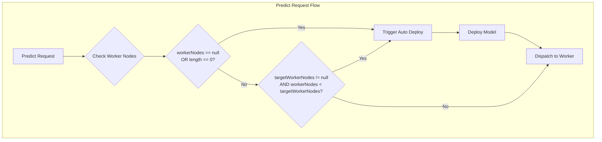

---
tags:
  - domain/ml
  - component/server
  - ml
  - performance
---
# ML Commons Model Deployment

## Summary

This enhancement improves the auto-deployment behavior for remote models in ML Commons. Previously, auto-deploy only triggered when a model had zero running worker nodes. With this change, auto-deploy now also triggers when a model is in `PARTIALLY_DEPLOYED` status, ensuring models are fully deployed across all eligible nodes.

## Details

### What's New in v3.2.0

The auto-deployment logic has been enhanced to handle partially deployed models. When a model is configured to deploy to all nodes but only some nodes have the model deployed, the system now automatically triggers deployment to the remaining nodes.

### Technical Changes

#### Architecture Changes



#### New Components

| Component | Description |
|-----------|-------------|
| `MLModelCache.syncPlanningWorkerNodes()` | Syncs planning/target worker nodes for a model |
| `MLModelCacheHelper.getTargetWorkerNodes()` | Retrieves target worker nodes for a model |
| `MLModelCacheHelper.syncPlanningWorkerNodes()` | Syncs planning worker nodes across all models |
| `MLModelManager.getTargetWorkerNodes()` | Gets target worker nodes from cache helper |
| `MLModelManager.syncModelPlanningWorkerNodes()` | Syncs planning worker nodes based on eligible nodes |
| `MLPredictTaskRunner.requiresAutoDeployment()` | Determines if auto-deployment is needed |

#### Key Logic Change

The `requiresAutoDeployment()` method now checks three conditions:

```java
private boolean requiresAutoDeployment(String[] workerNodes, String[] targetWorkerNodes) {
    return workerNodes == null
        || workerNodes.length == 0
        || (targetWorkerNodes != null && workerNodes.length < targetWorkerNodes.length);
}
```

This ensures auto-deployment triggers when:
1. No worker nodes exist (original behavior)
2. Worker nodes array is empty (original behavior)
3. **NEW**: Current worker nodes count is less than target worker nodes count

### Usage Example

When a model is registered with `deploy_to_all_nodes: true` and some nodes fail to deploy:

```json
// Model status before fix
{
  "model_id": "abc123",
  "model_state": "PARTIALLY_DEPLOYED",
  "planning_worker_nodes": ["node1", "node2", "node3"],
  "worker_nodes": ["node1"]  // Only 1 of 3 nodes deployed
}

// With this enhancement, a predict request will:
// 1. Detect workerNodes.length (1) < targetWorkerNodes.length (3)
// 2. Trigger auto-deployment to remaining nodes
// 3. Route prediction to available nodes while deployment completes
```

### Migration Notes

No migration required. This is a backward-compatible enhancement that improves reliability of model deployment.

## Limitations

- Auto-deployment must be enabled via `plugins.ml_commons.model_auto_deploy.enable` setting
- Only applies to models configured with `deploy_to_all_nodes: true`
- Planning worker nodes are synced in memory, so cluster restarts may require re-sync

## References

### Documentation
- [Deploy Model API](https://docs.opensearch.org/3.0/ml-commons-plugin/api/model-apis/deploy-model/)
- [Connecting to externally hosted models](https://docs.opensearch.org/3.0/ml-commons-plugin/remote-models/index/)

### Pull Requests
| PR | Description |
|----|-------------|
| [#3423](https://github.com/opensearch-project/ml-commons/pull/3423) | Run auto deploy remote model in partially deployed status |

## Related Feature Report

- Full feature documentation
