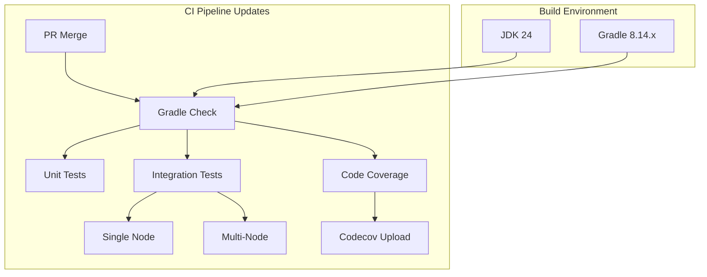

# Build Infrastructure (Gradle/JDK)

## Summary

OpenSearch v3.2.0 includes a coordinated infrastructure upgrade across 17+ repositories, updating Gradle to 8.14/8.14.3 and JDK to 24 for CI workflows. This release also updates Maven snapshot publishing endpoints and improves code coverage reporting with Codecov integration.

## Details

### What's New in v3.2.0

This release standardizes the build infrastructure across the OpenSearch ecosystem with three main categories of changes:

1. **Gradle 8.14+ and JDK 24 Support**: All plugins upgraded to Gradle 8.14 (or 8.14.3) with JDK 24 support in CI workflows
2. **Maven Snapshot Publishing**: Updated Maven snapshot publishing endpoints and credential retrieval mechanisms
3. **CI/CD Improvements**: Enhanced testing infrastructure including multi-node integration tests and Codecov integration

### Technical Changes

#### Build Tool Upgrades

| Component | Previous | New |
|-----------|----------|-----|
| Gradle | Various (8.x) | 8.14 / 8.14.3 |
| JDK (CI) | 21 | 24 |
| Kotlin | Various | 2.2.0 (index-management) |
| Lombok | Previous | Updated for JDK 24 compatibility |

#### Affected Repositories

| Repository | Changes |
|------------|---------|
| opensearch-project/OpenSearch | Gradle 8.14, JDK 24, Codecov |
| opensearch-project/k-NN | Gradle 8.14 → 8.14.3, JDK 24, Faiss bumps |
| opensearch-project/ml-commons | Gradle 8.14, JDK 24, Lombok update |
| opensearch-project/neural-search | Multi-node integration tests |
| opensearch-project/index-management | Gradle 8.14, Kotlin 2.2.0, JDK 24 |
| opensearch-project/security | Gradle 8.14.3, JDK 24, security integ tests |
| opensearch-project/alerting | Gradle 8.14, JDK 24, backport fixes |
| opensearch-project/sql | Maven snapshot endpoint updates |
| opensearch-project/reporting | Gradle 8.14.3, JDK 24, integTestRemote |
| opensearch-project/job-scheduler | Gradle 8.14, multi-node tests, watcher tests |
| opensearch-project/cross-cluster-replication | Gradle 8.14, JDK 24, backport-deletion fix |
| opensearch-project/custom-codecs | Gradle 8.14, JDK 24, Codecov |
| opensearch-project/performance-analyzer | Gradle 8.14, JDK 24, backport-deletion fix |
| opensearch-project/query-insights | Maven endpoint, Gradle/JDK updates, Codecov |
| opensearch-project/opensearch-system-templates | Gradle 8.14, JDK 24 |
| opensearch-project/user-behavior-insights | Gradle 8.14, JDK 24, e2e tests |
| opensearch-project/common-utils | Maven snapshot endpoint update |

#### CI/CD Improvements

#### Key Dependency Updates

- **Faiss** (k-NN): Bumped to commits 2929bf4 and 5617caa for improved vector search performance
- **Lombok**: Updated for JDK 24 compatibility in ml-commons
- **Kotlin**: Updated to 2.2.0 in index-management for language improvements

### Migration Notes

For plugin developers:

1. Update `gradle/wrapper/gradle-wrapper.properties` to use Gradle 8.14 or 8.14.3
2. Update CI workflow files to use JDK 24 for build and test jobs
3. If using Lombok, ensure version is compatible with JDK 24
4. Update Maven snapshot publishing configuration if applicable

## Limitations

- JDK 24 is used for CI builds; runtime JDK requirements remain unchanged
- Some repositories may require additional dependency updates for full JDK 24 compatibility

## Related PRs

| PR | Repository | Description |
|----|------------|-------------|
| [#2792](https://github.com/opensearch-project/k-NN/pull/2792) | k-NN | Bump JDK to 24, Gradle to 8.14 |
| [#2828](https://github.com/opensearch-project/k-NN/pull/2828) | k-NN | Bump Gradle to 8.14.3 |
| [#2815](https://github.com/opensearch-project/k-NN/pull/2815) | k-NN | Bump Faiss commit to 2929bf4 |
| [#2824](https://github.com/opensearch-project/k-NN/pull/2824) | k-NN | Bump Faiss commit to 5617caa |
| [#3983](https://github.com/opensearch-project/ml-commons/pull/3983) | ml-commons | Bump Gradle to 8.14, JDK to 24 |
| [#4026](https://github.com/opensearch-project/ml-commons/pull/4026) | ml-commons | Update Lombok for JDK 24 |
| [#4064](https://github.com/opensearch-project/ml-commons/pull/4064) | ml-commons | Gradle version update |
| [#1445](https://github.com/opensearch-project/index-management/pull/1445) | index-management | Gradle 8.14, Kotlin 2.2.0, JDK 24 |
| [#1320](https://github.com/opensearch-project/neural-search/pull/1320) | neural-search | Multi-node integration tests |
| [#795](https://github.com/opensearch-project/job-scheduler/pull/795) | job-scheduler | Multi-node sample plugin tests |
| [#797](https://github.com/opensearch-project/job-scheduler/pull/797) | job-scheduler | Watcher job disable test |
| [#798](https://github.com/opensearch-project/job-scheduler/pull/798) | job-scheduler | Gradle 8.14, JDK 24 |
| [#1911](https://github.com/opensearch-project/alerting/pull/1911) | alerting | Gradle 8.14, JDK 24, backport fixes |
| [#1563](https://github.com/opensearch-project/cross-cluster-replication/pull/1563) | cross-cluster-replication | Gradle 8.14, JDK 24 |
| [#831](https://github.com/opensearch-project/performance-analyzer/pull/831) | performance-analyzer | Gradle 8.14, JDK 24 |

## References

- [OpenSearch automated build system blog](https://opensearch.org/blog/public-jenkins/): Public Jenkins infrastructure
- [Gradle 8.14 Release Notes](https://docs.gradle.org/8.14/release-notes.html): Gradle improvements
- [JDK 24 Release](https://openjdk.org/projects/jdk/24/): JDK 24 features

## Related Feature Report

- [Full feature documentation](../../../../features/multi-plugin/build-infrastructure-gradle-jdk.md)
