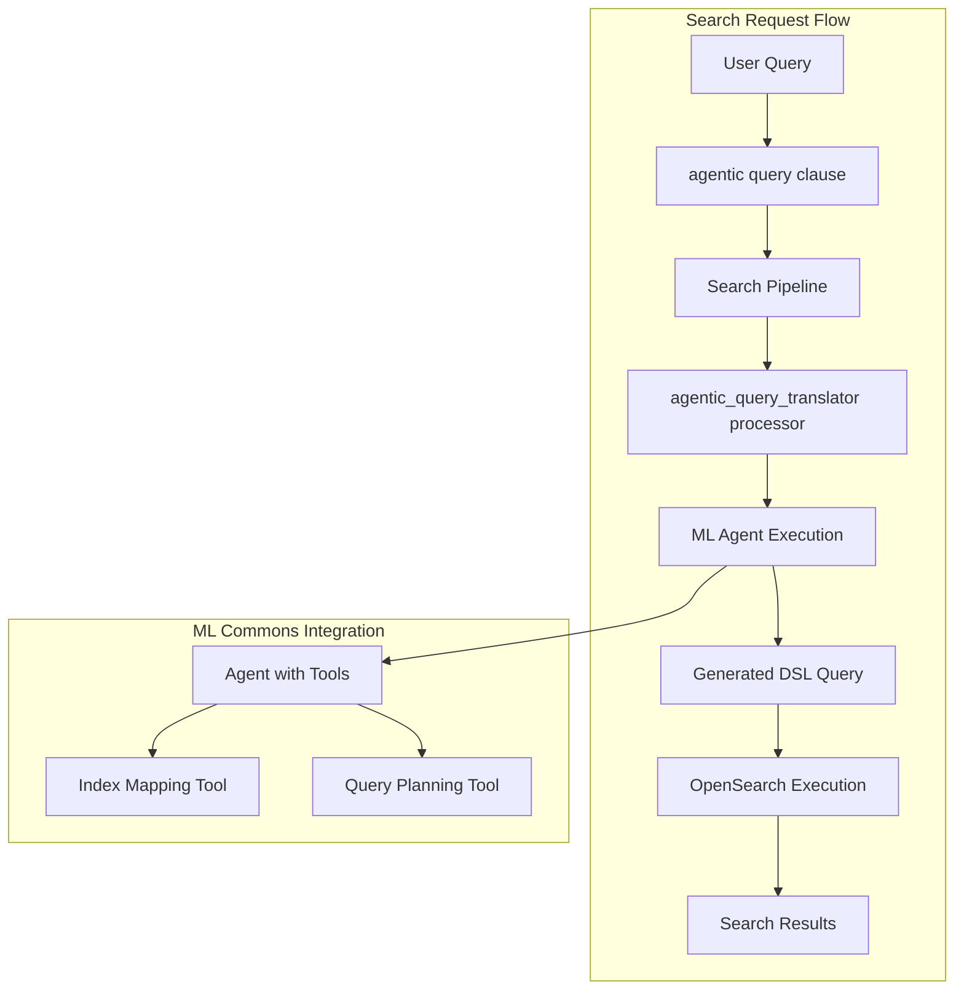

# Agentic Search

## Summary

Agentic Search is an experimental feature introduced in OpenSearch v3.2.0 that enables natural language search queries. Users can interact with their data using plain language questions instead of constructing complex DSL queries manually. The feature uses an LLM-powered agent to interpret user intent, plan query execution, and generate optimized OpenSearch queries automatically.

## Details

### What's New in v3.2.0

This release introduces the foundational components for agentic search:

- **New `agentic` query clause**: A new query type that accepts natural language input
- **`agentic_query_translator` search request processor**: Translates natural language queries to OpenSearch DSL using ML agents
- **Feature flag control**: Disabled by default, enabled via cluster setting

### Technical Changes

#### Architecture



#### New Components

| Component | Description |
|-----------|-------------|
| `AgenticSearchQueryBuilder` | Query builder for the `agentic` query clause |
| `AgenticQueryTranslatorProcessor` | Search request processor that invokes ML agents |
| `MLCommonsClientAccessor.executeAgent()` | New method to execute ML agents with parameters |
| `NeuralSearchClusterUtil.getIndexMapping()` | Utility to retrieve index mappings for agent context |

#### New Configuration

| Setting | Description | Default |
|---------|-------------|---------|
| `plugins.neural_search.agentic_search_enabled` | Feature flag to enable/disable agentic search | `false` |

### Usage Example

1. Enable the feature:
```json
PUT _cluster/settings
{
  "transient": {
    "plugins.neural_search.agentic_search_enabled": "true"
  }
}
```

2. Create a search pipeline with the agentic query translator:
```json
PUT _search/pipeline/agentic_pipeline
{
  "request_processors": [
    {
      "agentic_query_translator": {
        "agent_id": "<your-agent-id>"
      }
    }
  ]
}
```

3. Execute a natural language search:
```json
GET /<index_name>/_search?search_pipeline=agentic_pipeline
{
  "query": {
    "agentic": {
      "query_text": "Find me a red car",
      "query_fields": ["title", "description", "location"]
    }
  }
}
```

#### Query Parameters

| Parameter | Required | Description |
|-----------|----------|-------------|
| `query_text` | Yes | Natural language query string |
| `query_fields` | No | List of fields to consider (max 25 fields) |

### Migration Notes

This is a new experimental feature. To adopt:

1. Enable the feature flag in cluster settings
2. Create an ML agent with appropriate tools (ListIndexTool, IndexMappingTool, QueryPlanningTool)
3. Create a search pipeline with the `agentic_query_translator` processor
4. Use the `agentic` query clause in search requests

## Limitations

- **Experimental status**: Feature is marked experimental and may change in future releases
- **Must be top-level query**: The `agentic` query cannot be nested inside other queries (e.g., bool query)
- **Cannot combine with other search features**: Agentic search cannot be used with aggregations, sort, highlighters, post_filter, suggest, rescores, or collapse
- **Requires ML agent setup**: An ML agent must be configured with appropriate tools before use
- **Single query type**: The processor only handles `AgenticSearchQueryBuilder` queries

## Related PRs

| PR | Description |
|----|-------------|
| [#1484](https://github.com/opensearch-project/neural-search/pull/1484) | [Experimental] Adds agentic search query clause and agentic query translator search request processor |

## References

- [Issue #1479](https://github.com/opensearch-project/neural-search/issues/1479): RFC - Design for Agentic Search
- [Blog: Introducing agentic search in OpenSearch](https://opensearch.org/blog/introducing-agentic-search-in-opensearch-transforming-data-interaction-through-natural-language/): Official announcement
- [Agentic AI Documentation](https://docs.opensearch.org/3.0/tutorials/gen-ai/agents/index/): Agent tutorials

## Related Feature Report

- [Full feature documentation](../../../features/neural-search/agentic-search.md)
