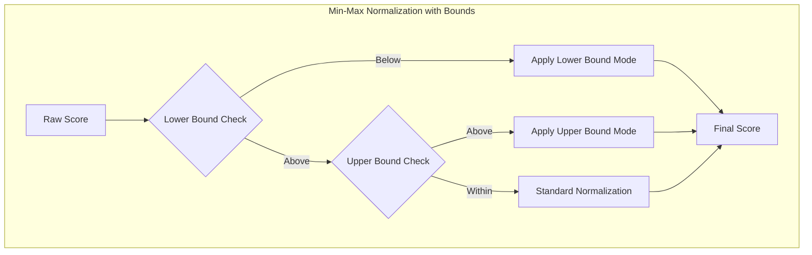

---
tags:
  - indexing
  - k-nn
  - neural-search
  - search
---

# Hybrid Query Normalization

## Summary

OpenSearch v3.2.0 introduces significant enhancements to hybrid query functionality in the neural-search plugin. This release adds upper bound parameters for min-max normalization, enables inner hits within collapse for hybrid queries, adds a configurable setting for documents stored per group in collapsed results, and fixes a bug in the HybridQueryDocIdStream.

## Details

### What's New in v3.2.0

#### Upper Bound Parameter for Min-Max Normalization

The min-max normalization technique now supports an `upper_bounds` parameter, complementing the existing `lower_bounds` feature. This allows users to define maximum score thresholds for each sub-query, providing finer control over score normalization.

**Use Case**: When using k-NN/neural queries where scores are always in a known interval (e.g., [0.75, 1.0]), setting an upper bound prevents artificially inflated normalized scores. For example, if actual scores are [0.77, 0.77, 0.76, 0.75, 0.75], standard min-max normalization would produce [1.0, 1.0, 0.5, 0.0, 0.0]. With an upper bound of 1.0, scores normalize to [0.08, 0.08, 0.04, 0.0, 0.0], better reflecting actual relevance.

**Modes**:
| Mode | Description |
|------|-------------|
| `apply` | Use actual score value if it exceeds upper bound score |
| `clip` | Clip score to 1.0 if it exceeds the upper bound |
| `ignore` | No upper bound applied to this sub-query |

#### Inner Hits Support for Collapse

Hybrid queries now support inner hits within the collapse parameter. Previously, using inner hits with collapse resulted in an error because OpenSearch wrapped the hybrid query in a boolean query for the inner hits request. This enhancement allows users to retrieve collapsed results along with their inner hits.

#### Configurable Collapse Document Storage

A new index-level setting `index.neural_search.hybrid_collapse_docs_per_group_per_subquery` controls the number of documents stored per group per sub-query in `HybridCollapsingTopDocsCollector`. This setting allows users to balance latency vs. recall:
- Lower values prioritize latency
- Higher values prioritize recall

Default: `0` (uses the query size parameter, matching non-collapse hybrid search behavior)
Range: `0` to `1000`

### Technical Changes

#### Architecture Changes



#### New Components

| Component | Description |
|-----------|-------------|
| `UpperBound` | Represents upper boundary constraint for score normalization |
| `LowerBound` | Refactored lower boundary constraint (extracted from inner class) |
| `ScoreBound` | Abstract base class for score boundary constraints |
| `BoundMode` | Enum for boundary modes (APPLY, CLIP, IGNORE) |

#### New Configuration

| Setting | Description | Default |
|---------|-------------|---------|
| `index.neural_search.hybrid_collapse_docs_per_group_per_subquery` | Documents stored per group per sub-query in collapse | `0` |
| `upper_bounds` (normalization parameter) | Upper bound configuration per sub-query | None |
| `upper_bounds.mode` | How upper bound is applied (`apply`, `clip`, `ignore`) | `apply` |
| `upper_bounds.max_score` | Upper bound threshold value | `1.0` |

### Usage Example

```json
PUT /_search/pipeline/hybrid-pipeline-with-bounds
{
  "description": "Hybrid search with both lower and upper bounds",
  "phase_results_processors": [
    {
      "normalization-processor": {
        "normalization": {
          "technique": "min_max",
          "parameters": {
            "lower_bounds": [
              { "mode": "apply", "min_score": 0.1 },
              { "mode": "clip", "min_score": 0.0 }
            ],
            "upper_bounds": [
              { "mode": "apply", "max_score": 0.99 },
              { "mode": "clip", "max_score": 1.0 }
            ]
          }
        },
        "combination": {
          "technique": "arithmetic_mean",
          "parameters": {
            "weights": [0.3, 0.7]
          }
        }
      }
    }
  ]
}
```

**Collapse with Inner Hits**:
```json
GET /my-index/_search?search_pipeline=hybrid-pipeline
{
  "query": {
    "hybrid": {
      "queries": [
        { "match": { "text": "search terms" } },
        { "neural": { "embedding": { "query_text": "semantic query", "model_id": "model-id", "k": 10 } } }
      ]
    }
  },
  "collapse": {
    "field": "category",
    "inner_hits": [
      {
        "name": "top_items",
        "size": 3,
        "sort": [{ "price": "asc" }]
      }
    ]
  }
}
```

**Configuring Collapse Document Storage**:
```json
PUT /my-index/_settings
{
  "index.neural_search.hybrid_collapse_docs_per_group_per_subquery": 50
}
```

### Migration Notes

- Existing pipelines using `lower_bounds` continue to work unchanged
- The `upper_bounds` parameter is optional and can be added to existing pipelines
- The collapse document storage setting is index-level and can be adjusted dynamically

## Limitations

- Both `lower_bounds` and `upper_bounds` arrays must match the number of sub-queries in the hybrid query
- Valid score range for bounds is [-10000.0, 10000.0]
- The collapse document storage setting only affects hybrid queries with collapse enabled

## References

### Documentation
- [Normalization Processor Documentation](https://docs.opensearch.org/3.0/search-plugins/search-pipelines/normalization-processor/)
- [Hybrid Search Documentation](https://docs.opensearch.org/3.0/vector-search/ai-search/hybrid-search/index/)

### Pull Requests
| PR | Description |
|----|-------------|
| [#1431](https://github.com/opensearch-project/neural-search/pull/1431) | Add upper bound parameter for min-max normalization technique |
| [#1447](https://github.com/opensearch-project/neural-search/pull/1447) | Enable inner hits within collapse parameter for hybrid query |
| [#1471](https://github.com/opensearch-project/neural-search/pull/1471) | Add setting for number of documents stored by HybridCollapsingTopDocsCollector |
| [#1414](https://github.com/opensearch-project/neural-search/pull/1414) | Fix the HybridQueryDocIdStream to properly handle upTo value |

### Issues (Design / RFC)
- [Issue #1210](https://github.com/opensearch-project/neural-search/issues/1210): Feature request for upper bound in min-max normalization
- [Issue #1379](https://github.com/opensearch-project/neural-search/issues/1379): Feature request for inner hits compatibility with collapse
- [Issue #1381](https://github.com/opensearch-project/neural-search/issues/1381): Feature request for collapse document storage setting
- [Issue #1344](https://github.com/opensearch-project/neural-search/issues/1344): Flaky test bug in HybridQueryDocIdStream

## Related Feature Report

- [Full feature documentation](../../../features/neural-search/neural-search-hybrid-query.md)
