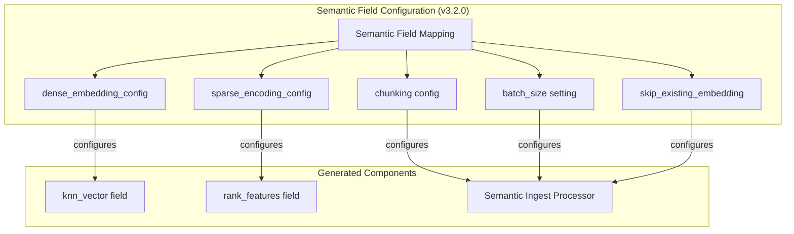

# Semantic Field Enhancements

## Summary

OpenSearch v3.2.0 introduces significant enhancements to the semantic field type, providing users with greater control over embedding generation and vector field configuration. These improvements allow fine-tuning of batch processing, sparse encoding pruning strategies, text chunking algorithms, embedding reuse, and knn_vector field parameters—all directly through the semantic field mapping.

## Details

### What's New in v3.2.0

This release adds five new configuration capabilities to the semantic field:

1. **knn_vector Field Configuration**: Configure the auto-generated knn_vector field parameters directly through the semantic field
2. **Ingest Batch Size**: Control the number of documents processed per batch during embedding generation
3. **Sparse Encoding Prune Strategies**: Configure pruning strategies for sparse vector embeddings
4. **Chunking Strategies**: Define custom text chunking algorithms for long documents
5. **Embedding Reuse**: Skip embedding regeneration when document content hasn't changed

### Technical Changes

#### Architecture Changes



#### New Configuration Parameters

| Parameter | Description | Default | PR |
|-----------|-------------|---------|-----|
| `dense_embedding_config` | Custom settings for auto-generated knn_vector field (dimension, space_type, method, etc.) | Auto from model | [#1420](https://github.com/opensearch-project/neural-search/pull/1420) |
| `index.neural_search.semantic_ingest_batch_size` | Documents per batch during ingestion (1-100) | `10` | [#1438](https://github.com/opensearch-project/neural-search/pull/1438) |
| `sparse_encoding_config.prune_type` | Pruning strategy: `max_ratio`, `alpha_mass`, `top_k`, `abs_value`, `none` | `max_ratio` | [#1434](https://github.com/opensearch-project/neural-search/pull/1434) |
| `sparse_encoding_config.prune_ratio` | Ratio for pruning strategy | `0.1` | [#1434](https://github.com/opensearch-project/neural-search/pull/1434) |
| `chunking` | Array of chunking algorithm configurations | `false` | [#1446](https://github.com/opensearch-project/neural-search/pull/1446) |
| `skip_existing_embedding` | Reuse existing embeddings when content unchanged | `false` | [#1480](https://github.com/opensearch-project/neural-search/pull/1480) |

### Usage Examples

#### Configure knn_vector Field Parameters

```json
PUT /my-semantic-index
{
  "settings": {
    "index.knn": true
  },
  "mappings": {
    "properties": {
      "content": {
        "type": "semantic",
        "model_id": "my-embedding-model",
        "dense_embedding_config": {
          "space_type": "cosinesimil",
          "method": {
            "name": "hnsw",
            "engine": "faiss",
            "parameters": {
              "ef_construction": 256,
              "m": 16
            }
          }
        }
      }
    }
  }
}
```

#### Configure Ingest Batch Size

```json
PUT /my-semantic-index
{
  "settings": {
    "index.knn": true,
    "index.neural_search.semantic_ingest_batch_size": 20
  },
  "mappings": {
    "properties": {
      "content": {
        "type": "semantic",
        "model_id": "my-embedding-model"
      }
    }
  }
}
```

#### Configure Sparse Encoding Pruning

```json
PUT /my-sparse-index
{
  "mappings": {
    "properties": {
      "content": {
        "type": "semantic",
        "model_id": "my-sparse-model",
        "sparse_encoding_config": {
          "prune_type": "top_k",
          "prune_ratio": 50
        }
      }
    }
  }
}
```

#### Configure Chunking Strategies

```json
PUT /my-chunked-index
{
  "settings": {
    "index.knn": true
  },
  "mappings": {
    "properties": {
      "content": {
        "type": "semantic",
        "model_id": "my-embedding-model",
        "chunking": [
          {
            "algorithm": "delimiter",
            "parameters": { "delimiter": "\n\n" }
          },
          {
            "algorithm": "fixed_token_length",
            "parameters": { "token_limit": 256, "overlap_rate": 0.2 }
          }
        ]
      }
    }
  }
}
```

#### Enable Embedding Reuse

```json
PUT /my-semantic-index
{
  "settings": {
    "index.knn": true
  },
  "mappings": {
    "properties": {
      "content": {
        "type": "semantic",
        "model_id": "my-embedding-model",
        "skip_existing_embedding": true
      }
    }
  }
}
```

### Migration Notes

- Existing semantic field indexes continue to work without changes
- New configuration parameters are optional and have sensible defaults
- To use new features, update index mappings or create new indexes with the desired configuration

## Limitations

- `dense_embedding_config` cannot override the dimension (determined by model)
- `skip_existing_embedding` requires the document to have existing embeddings to reuse
- Chunking configuration cannot be changed after index creation

## Related PRs

| PR | Description |
|----|-------------|
| [#1420](https://github.com/opensearch-project/neural-search/pull/1420) | Support configuring the auto-generated knn_vector field through the semantic field |
| [#1438](https://github.com/opensearch-project/neural-search/pull/1438) | Support configuring the ingest batch size for the semantic field |
| [#1434](https://github.com/opensearch-project/neural-search/pull/1434) | Allow configuring prune strategies for sparse encoding in semantic fields |
| [#1446](https://github.com/opensearch-project/neural-search/pull/1446) | Support configuring the chunking strategies through the semantic field |
| [#1480](https://github.com/opensearch-project/neural-search/pull/1480) | Support configuring reusing existing embedding for the semantic field |
| [#1427](https://github.com/opensearch-project/neural-search/pull/1427) | Handle remote dense model properly during mapping transform |
| [#1475](https://github.com/opensearch-project/neural-search/pull/1475) | Fix minimal supported version for neural sparse query analyzer field |

## References

- [Issue #1349](https://github.com/opensearch-project/neural-search/issues/1349): Configure batch size for embedding generation
- [Issue #1350](https://github.com/opensearch-project/neural-search/issues/1350): Allow to reuse existing embedding
- [Issue #1351](https://github.com/opensearch-project/neural-search/issues/1351): Allow to configure prune for embedding generation
- [Issue #1354](https://github.com/opensearch-project/neural-search/issues/1354): Allow to configure chunking
- [Issue #803](https://github.com/opensearch-project/neural-search/issues/803): Neural Search field type proposal

## Related Feature Report

- [Full feature documentation](../../../../features/neural-search/semantic-field.md)
